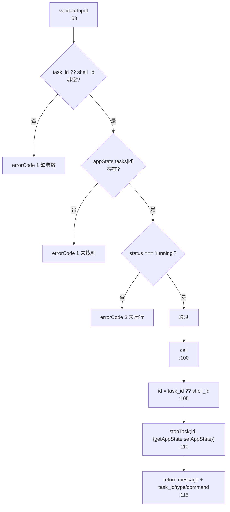
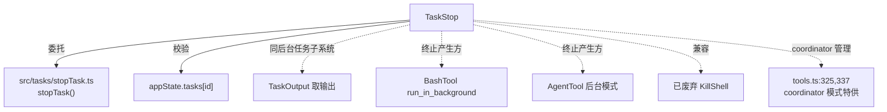

# TaskStop 工具详解

> 这是后台任务子系统系列的第二篇（与 TaskOutput 同属后台任务系统，不是 TodoV2）。`TaskStop`（125 行）按 task_id 终止运行中的后台 shell/agent/远程任务。它保留了旧名 `KillShell` 作为别名以兼容历史记录和 SDK 用户，并严格校验"任务必须处于 running 态"才允许停止。

---

## 一、工具定位（一句话总结）

**`TaskStop` = 按 task_id 终止处于 running 状态的后台任务。**

| 维度 | 值 |
|---|---|
| 工具名 | `TaskStop`（常量 `TASK_STOP_TOOL_NAME`，`prompt.ts:1`） |
| 一句话 | 输入 task_id（或已废弃的 shell_id），停止运行中的后台任务 |
| 别名 | `aliases: ['KillShell']`（`:37`，向后兼容旧工具名） |
| 是否进 system prompt | ✅ **无条件注册**（`tools.ts:236`）；在 `CORE_TOOLS`（`constants/tools.ts:151`） |
| 只读 / 破坏性 | **写入/破坏性**（终止进程/取消任务） |
| 是否可并发 | ✅ `true`（`:47`） |
| 核心依赖 | `src/tasks/stopTask.ts` 的 `stopTask()` |
| 协作方 | `TaskOutput`（取输出）、BashTool/AgentTool（产生后台任务） |

**为什么需要它？** 后台任务（长跑 shell、agent）可能失控、卡住或不再需要。模型/用户需要主动终止。TaskStop 是这个"紧急刹车"。在 coordinator 模式下，它还被特别加入简化工具集（`tools.ts:325,337`），让 coordinator 能管理 worker 任务。

---

## 二、关键文件清单

```
TaskStopTool/
├── TaskStopTool.ts   ← 主体（125 行）
├── prompt.ts         ← TASK_STOP_TOOL_NAME + DESCRIPTION（内联，非独立 DESCRIPTION 文件）
└── UI.tsx            ← Ink 渲染（renderToolUseMessage + renderToolResultMessage，51 行）
```

| 文件 | 角色 | 必看行号 |
|---|---|---|
| `TaskStopTool.ts` | 主体：schema + validateInput + call + 结果映射 | `buildTool:33`、`validateInput:53`、`call:100`、`mapToolResultToToolResultBlockParam:91` |
| `prompt.ts` | 工具名 + 描述 | `TASK_STOP_TOOL_NAME:1`、`DESCRIPTION:3-8` |
| `UI.tsx` | 渲染：命令截断 + "已停止"后缀 | `renderToolUseMessage:7`、`renderToolResultMessage:29`、`truncateCommand:14` |

> **结构特点**：三件套里唯一有独立 UI.tsx 的 Task 工具（TaskOutput 把渲染内联在 .tsx 里，TaskStop 拆出来了）。prompt.ts 同时导出工具名常量和描述（其他工具常量在 constants.ts、描述在 prompt.ts）。

---

## 三、Tool 接口字段实现（`buildTool` 逐字段）

### 标识字段

```ts
name: TASK_STOP_TOOL_NAME,
searchHint: 'kill a running background task',
aliases: ['KillShell'],                  // :37 兼容旧名
maxResultSizeChars: 100_000,
userFacingName: () => (process.env.USER_TYPE === 'ant' ? '' : 'Stop Task'),  // :39
shouldDefer: true,
isConcurrencySafe() { return true },     // :47
```

> **`userFacingName` 的 ant 分支**（`:39`）：ant 用户返回空字符串——内部用户不显示工具名标签。这是内部/外部差异化的细节。

### 模型面字段

```ts
async description() { return `根据 ID 停止运行中的后台任务` },   // :86
async prompt() { return DESCRIPTION },                          // :89，来自 prompt.ts
get inputSchema() { return inputSchema() },
```

**输入 schema**（`:10-16`）：
```ts
{
  task_id:  string?,   // 要停止的后台任务 ID
  shell_id: string?,   // 已废弃：KillShell 兼容，改用 task_id
}
```

> 两个都 optional，但 `validateInput` 会校验至少一个非空（`:55-56`）。`shell_id` 纯为向后兼容保留。

**输出 schema**（`:19-28`）：
```ts
{
  message: string,      // "成功停止任务：${id} (${command})"
  task_id: string,
  task_type: string,
  command?: string,     // 可选：旧会话记录无此字段（:26 注释）
}
```

### 行为字段

| 字段 | 实现 | 说明 |
|---|---|---|
| `call()` | `:100` | 核心（见下节） |
| `validateInput()` | `:53` | 三重校验（见下节） |
| `toAutoClassifierInput()` | `:50` | 返回 `task_id ?? shell_id ?? ''` |
| `renderToolUseMessage` / `renderToolResultMessage` | `:98-99` | 来自 UI.tsx |
| 无 `isReadOnly` | — | 默认非只读（破坏性操作） |

---

## 四、核心执行流程：`call()`

`call()`（`:100-123`）很简洁，但前置 `validateInput`（`:53-84`）做了重要校验。



**关键点逐条**：

1. **三重 validateInput 校验**（`:53-84`）：
   - 参数非空（`:55-56`）：`task_id ?? shell_id` 为空 → errorCode 1。
   - 任务存在（`:64-73`）：`appState.tasks[id]` 不存在 → errorCode 1。
   - **必须是 running 态**（`:75-81`）：status !== 'running' → errorCode 3。这是关键——只允许停止正在运行的任务，防止对已完成/已失败的任务误操作。

2. **`call()` 委托 stopTask**（`:110-113`）：核心逻辑全在 `src/tasks/stopTask.ts` 的 `stopTask()`（`:37`）。它返回 `{taskId, taskType, command}`（`stopTask.ts:27-29,95-97`）——command 根据 `isLocalShellTask` 取 `task.command` 否则取 `task.description`。

3. **`id = task_id ?? shell_id`**（`:105`）：call 里再次兼容旧参数，和 validateInput 一致。

4. **结果固定文案**（`:117`）：`成功停止任务：${result.taskId} (${result.command})`，连同 task_type/command 一起返回。

**`mapToolResultToToolResultBlockParam`**（`:91-97`）：直接 `jsonStringify(output)`——把整个 Output 对象 JSON 化给模型。这和 TaskOutput 的 XML 标签风格不同，是另一种结构化输出选择。

---

## 五、权限与安全

- **三重 validateInput 是核心安全防线**（`:53-84`）：① 参数非空 ② 任务存在 ③ 必须 running。尤其第 3 条——防止停止已完成任务引发未定义行为。
- **委托底层 stopTask**：实际的进程终止/任务取消逻辑在 `src/tasks/stopTask.ts`，工具层只做校验和参数适配。关注点分离。
- **无 checkPermissions**：停止后台任务被视为模型自主操作（任务本身是模型起的后台进程），不需要额外权限审批。
- **abortController 接收但未使用**（`:102`）：call 签名解构了 `abortController` 但函数体未用——stopTask 本身是同步快操作，不需中断支持。

---

## 六、与其他系统/工具的关系



- **与 TaskOutput 的关系**：同属后台任务系统（注意：不是 TodoV2）。TaskStop 终止运行中任务，TaskOutput 读取任务输出。两者都读 `appState.tasks`，是后台任务生命周期的两端。
- **与 BashTool/AgentTool 的关系**：这俩的后台模式产生可被停止的任务。TaskStop 是它们的"取消"配套。
- **与 coordinator 模式的关系**：`tools.ts:325` 和 `:337` 显示——在 CLAUDE_CODE_SIMPLE + REPL + coordinator 模式下，TaskStop 被特别加入简化工具集。这让 coordinator 能管理 worker 起的后台任务，而 worker 只拿到 Bash/Read/Edit。
- **与 KillShell 的关系（向后兼容）**：`aliases: ['KillShell']`（`:37`）+ `shell_id` 参数（`:14`）。旧版 Claude Code 有个独立 `KillShell` 工具，重命名后用别名让历史会话记录和 SDK 用户不破坏。`mapToolResultToToolResultBlockParam` 的结果会持久化，`--resume` 回放时不重新校验，所以 command 字段设为 optional（`:26` 注释）兼容老记录。

---

## 七、亮点与设计取舍

1. **严格的三重校验**（`:53-84`）：参数非空 + 任务存在 + 必须 running。尤其"必须 running"防止误停已完成任务。errorCode 3 专门给"未运行"——区分"找不到"（1）和"状态不对"（3）。
2. **KillShell 别名 + shell_id 兼容**（`:14, :37`）：重命名工具时不破坏老记录/SDK。这是工具演进的标准做法。
3. **userFacingName 的 ant 分支**（`:39`）：ant 用户返回空串不显示标签——内部/外部体验差异化。
4. **关注点分离**：工具层只校验+适配参数，实际终止逻辑全在 `stopTask.ts`。这让 stopTask 可被其他地方（如会话清理）复用。
5. **command 字段 optional**（`:26`）：为兼容 `--resume` 回放老记录（那时没有 command 字段）。注释明确说明持久化结果不重新校验。
6. **JSON 化结果输出**（`:91-97`）：和 TaskOutput 的 XML 标签风格不同，直接 `jsonStringify`。简单直接，适合结构化字段少的场景。
7. **coordinator 模式特供**（`tools.ts:325,337`）：在简化工具集里仍保留 TaskStop，体现"coordinator 必须能管 worker 任务"的设计意图。

---

## 八、源码导航（书签速查）

| 想看什么 | 去哪里 |
|---|---|
| 工具名常量 + DESCRIPTION | `TaskStopTool/prompt.ts:1,3` |
| `buildTool` 字段 | `TaskStopTool/TaskStopTool.ts:33-124` |
| 输入 schema（含 shell_id 兼容） | `TaskStopTool.ts:10-16` |
| 三重 `validateInput` | `TaskStopTool.ts:53-84` |
| `call()` 委托 stopTask | `TaskStopTool.ts:100-123` |
| 结果 JSON 映射 | `TaskStopTool.ts:91-97` |
| KillShell 别名 | `TaskStopTool.ts:37` |
| 渲染（命令截断 + 已停止） | `TaskStopTool/UI.tsx:14,29` |
| 注册（无条件 + coordinator 特供） | `src/tools.ts:236,325,337` |
| CORE_TOOLS 白名单 | `src/constants/tools.ts:151` |
| 底层 stopTask 实现 | `src/tasks/stopTask.ts:37` |

---

## 九、学习建议与验证清单

**怎么读这章**：和 TaskOutput 对照读，两者构成后台任务系统（区别于 TodoV2）。重点看"四、call()"的**前置三重校验**——这是 TaskStop 安全性的核心。然后理解"六、关系"里 KillShell 别名的向后兼容逻辑，以及为什么 coordinator 模式特别保留它。

**验证清单（读完自测）**：
- [ ] 能区分 TaskStop（后台任务系统）和 TodoV2 的 Task* 工具是完全不同的系统
- [ ] 能列出 validateInput 的三重校验（参数非空 + 任务存在 + 必须 running）
- [ ] 能说出 errorCode 1 和 errorCode 3 分别对应什么情况（找不到 vs 未运行）
- [ ] 能解释 `shell_id` 参数和 `KillShell` 别名为何保留（向后兼容旧工具/记录/SDK）
- [ ] 能指出 command 字段为何是 optional（兼容 --resume 回放的老记录，`:26`）
- [ ] 能说出 coordinator 模式为何在简化工具集里仍保留 TaskStop（让 coordinator 管 worker 任务，`tools.ts:325`）
- [ ] 能解释为什么 TaskStop 没有 isReadOnly（破坏性终止操作，非只读）

**配合动作**：
1. 用 BashTool 起一个 `sleep 100` 后台任务，用 TaskStop 终止它，观察 message 返回
2. 对一个已完成的任务调 TaskStop，验证 errorCode 3"未运行"
3. 用 `shell_id`（旧参数）调 TaskStop，验证兼容路径生效
4. 在 coordinator 模式下确认 worker 起的后台任务能被 coordinator 的 TaskStop 停掉
