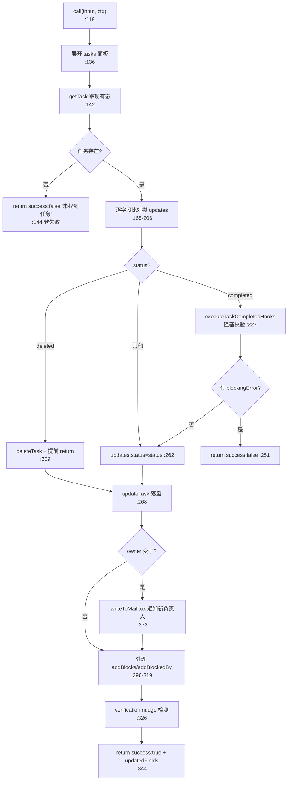
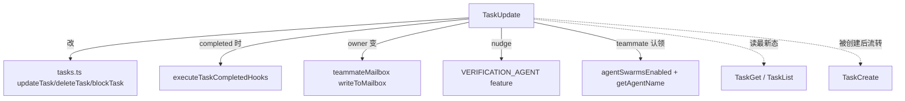

# TaskUpdate 工具详解

> 这是 Task 子系统系列的第二篇，也是**最复杂的一个**。`TaskUpdate`（398 行）不只是改字段：它处理 `pending→in_progress→completed` 状态机、`deleted` 软删除、`blocks`/`blockedBy` 依赖图、owner 变更时的 teammate mailbox 通知、TaskCompleted hooks 的阻塞校验，以及在"关闭最后一个任务且无验证步骤"时触发 verification nudge。它是任务生命周期的中枢。

---

## 一、工具定位（一句话总结）

**`TaskUpdate` = 任务列表的全功能 UPDATE：改字段、流转状态、建依赖、分配负责人、删任务，全部在一个工具里。**

| 维度 | 值 |
|---|---|
| 工具名 | `TaskUpdate`（常量 `TASK_UPDATE_TOOL_NAME`，`constants.ts:1`） |
| 一句话 | 按 taskId 更新任意子集字段；status 含特殊值 `deleted` 实现删除 |
| 是否进 system prompt | ⚠️ **条件注册**——`isTodoV2Enabled()` 为真时（`tools.ts:247-249`）；在 `CORE_TOOLS` 白名单（`constants/tools.ts:155`） |
| 只读 / 破坏性 | **写入**（改磁盘 + 可能触发 hook + 写 mailbox + 可能删文件） |
| 是否可并发 | ✅ `isConcurrencySafe() → true`（底层文件锁） |
| 核心依赖 | `tasks.ts` 的 `updateTask`/`deleteTask`/`blockTask`/`listTasks`；`hooks.ts` 的 `executeTaskCompletedHooks`；`teammateMailbox.ts` |
| 协作方 | `TaskCreate`（产 pending）、`TaskList`/`TaskGet`（读最新态再改） |

**为什么需要它？** TodoV2 把"创建"和"修改"拆成两个工具，是为了让 TaskCreate 保持极简（只 INSERT），而把所有状态机和副作用集中到 TaskUpdate。这样 hook 系统（TaskCompleted）只需要挂在一个地方。

---

## 二、关键文件清单

```
TaskUpdateTool/
├── TaskUpdateTool.ts   ← 主体（398 行），最长的一个 Task 工具
├── prompt.ts           ← DESCRIPTION + PROMPT（中文使用指南，含状态工作流示例）
└── constants.ts        ← TASK_UPDATE_TOOL_NAME = 'TaskUpdate'
```

| 文件 | 角色 | 必看行号 |
|---|---|---|
| `TaskUpdateTool.ts` | 主体：schema + call（巨型）+ 结果映射 | `buildTool:84`、`call:119`、删除分支 `:209`、completed+hook `:227`、mailbox `:272`、verification `:326`、结果映射 `:357` |
| `prompt.ts` | 中文 prompt，含状态工作流 + 4 个 JSON 示例 | `DESCRIPTION:3`、`PROMPT:3-77` |
| `constants.ts` | 工具名 | `:1` |

> **结构特点**：无独立 UI.tsx（`renderToolUseMessage → null`）。所有逻辑塞在单个 `call()` 里（`:119-356`，约 240 行），是 Task 系列里 call 最长的。

---

## 三、Tool 接口字段实现（`buildTool` 逐字段）

### 标识字段

```ts
name: TASK_UPDATE_TOOL_NAME,
searchHint: '更新任务',
shouldDefer: true,
isEnabled() { return isTodoV2Enabled() },   // :104
isConcurrencySafe() { return true },        // :107
```

### 输入 schema（`:33-62`，字段最多）

```ts
{
  taskId:        string,                     // 必填
  subject?:      string,                     // 改标题
  description?:  string,
  activeForm?:   string,
  status?:       TaskStatus | 'deleted',     // 扩展：加 'deleted' 特殊值（:35）
  addBlocks?:    string[],                   // 增量添加，非覆盖
  addBlockedBy?: string[],
  owner?:        string,
  metadata?:     Record<string, unknown>,    // 合并语义，null=删 key（:60）
}
```

> **三个值得注意的 schema 设计**：
> 1. `status` 用 `TaskStatusSchema().or(z.literal('deleted'))`（`:35`）——把"删除"塞进 status 字段而非独立参数，统一了"状态变更"的入口。
> 2. `addBlocks`/`addBlockedBy` 是**增量**语义（名字带 `add`），内部去重后调用 `blockTask`，不覆盖现有依赖。
> 3. `metadata` 是**合并**语义：`null` 值表示删除该 key（`:198-203`）。

### 输出 schema（`:65-79`）

```ts
{
  success: boolean,
  taskId: string,
  updatedFields: string[],        // 实际变更的字段名列表
  error?: string,
  statusChange?: { from: string, to: string },
  verificationNudgeNeeded?: boolean,  // @internal，不进公共 SDK
}
```

### 行为字段

| 字段 | 实现 | 说明 |
|---|---|---|
| `call()` | `:119` | 巨型核心（见下节） |
| `toAutoClassifierInput()` | `:110` | 拼接 `taskId + status + subject` 供自动审批分类 |
| `renderToolUseMessage()` | `:116` → `null` | 不显示调用摘要 |
| 无 `validateInput` / `checkPermissions` | — | 任务不存在时在 call 内返回 `success:false`（软失败） |

---

## 四、核心执行流程：`call()`

`call()`（`:119-356`）是 7 段顺序逻辑。用流程图概括主路径：



**逐段关键点**：

1. **软失败而非 throw**（`:142-152`）：任务不存在时返回 `success:false, error:'未找到任务'`，**不抛异常**。`mapToolResultToToolResultBlockParam`（`:366-374`）注释解释：避免在 `StreamingToolExecutor` 触发兄弟工具取消——"未找到任务"是良性情况（列表可能已被清理），模型可自行处理。

2. **字段级 diff 攒 updates**（`:165-206`）：只有"新值 ≠ 旧值"才进 `updates` 并 push 到 `updatedFields`。这避免了无谓的磁盘写入，也让输出能精确报告"改了哪些字段"。

3. **teammate 自动认领**（`:183-194`）：当 swarm 启用、status 改为 `in_progress`、但没显式给 owner、且任务当前无 owner 时，**自动把当前 agent 名设为 owner**。这样任务面板能把 todo 项匹配到正在干活的 teammate。

4. **`deleted` 特殊路径**（`:209-222`）：status='deleted' 时调用 `deleteTask` 并**提前 return**，跳过后续所有逻辑。`deleteTask`（`tasks.ts:393-441`）会更新高水位（防 ID 复用）并清理其他任务里对它的 blocks/blockedBy 引用。

5. **TaskCompleted hooks 阻塞校验**（`:227-260`）：仅当 status→completed 时执行。和 TaskCreate 一样是 async generator + blockingError 收集，但失败时**返回 success:false 而非回滚**（因为这里没有"刚创建"的东西要删，任务保持原状态）。

6. **owner 变更 → mailbox 通知**（`:272-293`）：swarm 模式下，若 owner 变了，向新 owner 的 mailbox 写一条 `task_assignment` JSON 消息。这是 teammate 间任务分派的通知机制。

7. **依赖增量添加**（`:296-319`）：`addBlocks`/`addBlockedBy` 先 filter 掉已存在的，再逐个调 `blockTask`（`tasks.ts:458-486`，双向更新双方的 blocks/blockedBy 数组）。

8. **verification nudge**（`:326-342`）：一个精巧的启发式——当主线程 agent（`!context.agentId`）刚把一个任务标记为 completed，且：① VERIFICATION_AGENT feature 开，② growthbook flag `tengu_hive_evidence` 开，③ 全部任务都 completed，④ 任务数 ≥3，⑤ 没有任何任务 subject 匹配 `/verif/i`——则置 `verificationNudgeNeeded=true`。结果映射（`:388-390`）会追加提醒让模型启动验证 agent。这是"循环退出瞬间"的检查。

**`mapToolResultToToolResultBlockParam`**（`:357-397`）：三段拼接——失败时非错误返回；成功时基础文案 `已更新任务 #${id} ${fields}`；teammate 完成时追加"调用 TaskList 找下一个"；verification nudge 时追加"启动验证 agent"长提示。

---

## 五、权限与安全

和 TaskCreate 一样，**无 `checkPermissions` / `validateInput`**。安全靠底层：

- **文件锁**：`updateTask`（`tasks.ts:370-391`）对单个任务文件加锁；`createTask`/`resetTaskList` 对 list 级锁文件加锁。
- **存在性预检**（`tasks.ts:379-382`）：`updateTask` 先 `getTask` 判存在再上锁——`proper-lockfile` 对不存在文件会抛错，预检避免此问题。
- **删除的引用清理**（`tasks.ts:420-434`）：`deleteTask` 遍历所有任务，清理对被删任务的 blocks/blockedBy 引用，防止悬空依赖。
- **teammate mailbox 写入**：受 `isAgentSwarmsEnabled()` 门控，非 swarm 模式不触发跨 agent 通信。

> 软失败设计（success:false 而非 throw）是**显式的安全取舍**：防止"任务不存在"这类良性错误连锁取消并发的兄弟工具调用。

---

## 六、与其他系统/工具的关系



- **与 TaskCreate 的协作**：Create 产出 pending，Update 负责全部后续流转。prompt（`prompt.ts:49`）明确要求"更新前用 TaskGet 读最新状态"——因为多 agent 并发下任务可能已被他人改过。
- **与 TaskList/TaskGet 的协作**：teammate 完成 TaskUpdate(completed) 后，结果文案（`:385`）主动提示"调用 TaskList 找下一个任务"，形成工作循环。
- **与 hooks 系统**：`TaskCompleted` 是任务从 in_progress→completed 的唯一埋点，供验证/审计 agent 介入。
- **与 verification agent**：`verificationNudgeNeeded` 字段（`@internal`，不进公共 SDK）是 CLI 侧对 V1 TodoWrite 提醒的等价实现，引导模型在收尾前做独立验证。
- **与 swarm/teammate 系统**：owner 自动认领 + mailbox 通知是 swarm 协作的核心——leader 分派、teammate 认领、完成通知全经 TaskUpdate。

---

## 七、亮点与设计取舍

1. **`deleted` 塞进 status 字段**（`:35`）：而非独立 `deleteTaskId` 参数。好处是 schema 统一、模型只需记一个 status 工作流；代价是 status 类型变成 `TaskStatus | 'deleted'` 联合，output 的 statusChange 要处理 'deleted' 分支。
2. **字段级 diff 而非整体覆盖**（`:165-206`）：只写真正变化的字段。省 IO、输出精确、避免并发覆盖未传字段。
3. **metadata 合并 + null 删除语义**（`:195-206`）：`{...existing, ...new}` 但 `null` 触发 `delete`。比"整体替换 metadata"更精细，支持单 key 增删。
4. **软失败设计**（`:144, :366`）：任务不存在/删除失败返回 success:false 而非 throw，避免连锁取消。注释（`:367`）明确说明这是为 `StreamingToolExecutor` 的兄弟取消机制做的规避。
5. **verification nudge 的"循环退出瞬间"检测**（`:326-342`）：只在"最后一个任务关闭、且无验证步骤"时触发，精准对应 V1 的 TodoWrite 收尾提醒。feature + growthbook + agentId + 全完成 + ≥3 任务 + 无 verify subject——六重条件避免误报。
6. **teammate 自动认领的隐式契约**（`:183-194`）：模型不需要显式设 owner，只要把任务标 in_progress 就自动认领。降低 teammate 协作的认知负担。

---

## 八、源码导航（书签速查）

| 想看什么 | 去哪里 |
|---|---|
| 工具名常量 | `TaskUpdateTool/constants.ts:1` |
| 中文 prompt + 状态工作流示例 | `TaskUpdateTool/prompt.ts:3-77` |
| `buildTool` 字段 | `TaskUpdateTool/TaskUpdateTool.ts:84-398` |
| 输入 schema（含 deleted 扩展） | `TaskUpdateTool.ts:33-62` |
| `call()` 巨型核心 | `TaskUpdateTool.ts:119-356` |
| 软失败（任务不存在） | `TaskUpdateTool.ts:142-152` |
| `deleted` 删除分支 | `TaskUpdateTool.ts:209-222` |
| TaskCompleted hooks 阻塞校验 | `TaskUpdateTool.ts:227-260` |
| owner 变更 mailbox 通知 | `TaskUpdateTool.ts:272-293` |
| 依赖增量添加 | `TaskUpdateTool.ts:296-319` |
| verification nudge 检测 | `TaskUpdateTool.ts:326-342` |
| 结果映射（含 nudge 文案） | `TaskUpdateTool.ts:357-397` |
| 注册条件 | `src/tools.ts:247-249` |
| 底层 updateTask/deleteTask/blockTask | `src/utils/tasks.ts:370,393,458` |

---

## 九、学习建议与验证清单

**怎么读这章**：这是 Task 系列最复杂的一篇。建议先扫"一、定位"和 schema（三、），然后对着"四、call()"的流程图逐段读源码——8 个关键点对应 call 的 8 个代码段。最后重点理解"七、亮点"里的 6 个设计取舍，它们解释了为什么 call 这么长。

**验证清单（读完自测）**：
- [ ] 能说出 `status: 'deleted'` 如何走特殊路径（提前 return，跳过后续逻辑，`:209`）
- [ ] 能解释为什么任务不存在是软失败而非 throw（避免兄弟工具取消，`:367`）
- [ ] 能指出 TaskCompleted hooks 失败时任务保持什么状态（原状态，不回滚也不推进，`:251`）
- [ ] 能说出 metadata 的 `null` 语义（删除该 key，`:198`）
- [ ] 能列出 verification nudge 触发的全部条件（feature + growthbook + 主线程 + 全完成 + ≥3 + 无 verify，`:327-342`）
- [ ] 能解释 teammate 自动认领的触发条件（swarm + in_progress + 无显式 owner + 任务无 owner，`:183`）
- [ ] 能说出 `addBlocks`/`addBlockedBy` 的增量语义（filter 已存在后逐个 blockTask，`:296`）

**配合动作**：
1. 创建一个任务后，分别测 `TaskUpdate(status:in_progress)`、`(status:completed)`、`(status:deleted)`，观察文件变化
2. 在 `:227` 加日志，验证 TaskCompleted hooks 的迭代
3. 开 swarm 模式，观察 owner 变更后 mailbox 文件的生成
4. 构造 3 个全完成且无 verify 的任务，验证 verificationNudgeNeeded 触发
