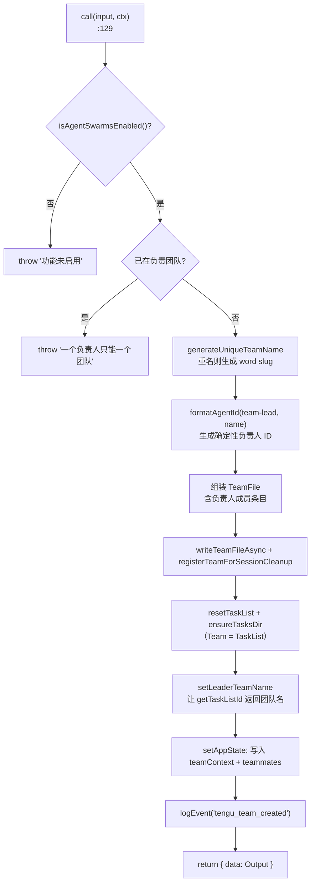
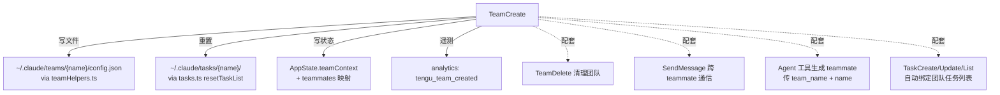

# TeamCreate 工具详解

> `TeamCreate` 是 Agent Teams（agent 群体协作 / swarm）功能的**入口工具**。它创建一个团队，同时建立团队文件（`~/.claude/teams/{name}/config.json`）和共享任务列表目录（`~/.claude/tasks/{name}/`），把当前会话注册为团队负责人（team-lead）。该工具属于"中等复杂度"的状态写入型工具：它的 `call()` 不只是返回数据，而是跨 AppState、文件系统、任务系统三处落地状态。

---

## 一、工具定位（一句话总结）

**`TeamCreate` = 创建多 agent 协作团队并初始化负责人上下文的写入型工具。**

| 维度 | 值 |
|---|---|
| 工具名 | `TeamCreate`（常量 `TEAM_CREATE_TOOL_NAME`，`constants.ts:1`） |
| 一句话 | 创建团队、生成 team-lead 的确定性 agent ID、写配置文件、重置任务列表 |
| 是否进 system prompt | ❌ 不在 `CORE_TOOLS` 白名单（`src/constants/tools.ts:137`），属延迟工具；`shouldDefer: true` |
| 只读 / 破坏性 | **破坏性**（写文件、改 AppState、重置任务列表）——无 `isReadOnly()` 声明，默认 false |
| 是否可并发 | 未显式声明 `isConcurrencySafe()`（默认非并发安全，符合"写状态"语义） |
| 启用条件 | 注册**无条件**（`tools.ts:257`）；运行时由 `isAgentSwarmsEnabled()` 把关（`TeamCreateTool.ts:130`） |
| 核心依赖 | `src/utils/swarm/teamHelpers.ts`、`src/utils/tasks.ts`、`src/utils/swarm/teammateLayoutManager.ts` |
| 定位互补方 | `TeamDelete`（关闭/清理团队）、`SendMessage`（跨 teammate 通信）、`Agent`（生成 teammate） |

**为什么需要它？** 当任务复杂到需要多个 agent 并行（如同时改前后端、多阶段重构），单会话的 Agent 子代理模型不够用。TeamCreate 建立"一个负责人 + 多个 teammate"的群体结构：team-lead 分配任务，teammate 各自独立运行并汇报。团队 = 项目 = 任务列表，三者绑定。

---

## 二、关键文件清单

```
TeamCreateTool/
├── TeamCreateTool.ts   ← buildTool({...}) 主体（247 行），call() 是核心
├── prompt.ts           ← 团队工作流完整指南（何时用、如何分配任务、空闲语义）
├── UI.tsx              ← renderToolUseMessage（仅 6 行，显示"创建团队：xxx"）
└── constants.ts        ← TEAM_CREATE_TOOL_NAME 常量（仅 1 行）
```

| 文件 | 角色 | 必看行号 |
|---|---|---|
| `TeamCreateTool.ts` | 工具主体：schema + 校验 + call() + 结果映射全在这 | `buildTool:74`、`call:129`、`validateInput:97`、`generateUniqueTeamName:64` |
| `prompt.ts` | 进 system prompt 的团队工作流长文 | `getPrompt:1`（何时用 `:5-13`、teammate 类型 `:14-22`、工作流 `:37-46`、空闲语义 `:65-72`） |
| `UI.tsx` | 终端渲染（极简，一行文本） | `renderToolUseMessage:4` |
| `constants.ts` | 工具名常量 | `:1` |

> **结构特点**：与 GlobTool 的"单文件主体"不同，TeamCreate 把团队工作流的大段说明拆到 `prompt.ts`（113 行），让 `TeamCreateTool.ts` 聚焦于 `call()` 的状态写入逻辑。这是因为团队协作的指导文本极长（teammate 空闲语义、任务认领规则等），混在主文件会掩盖核心逻辑。

---

## 三、Tool 接口字段实现（`buildTool` 逐字段）

### 标识字段

```ts
name: TEAM_CREATE_TOOL_NAME,          // "TeamCreate"
searchHint: 'create multi-agent swarm team, ...',  // TF-IDF 索引关键词
maxResultSizeChars: 100_000,
shouldDefer: true,                    // 延迟工具，非核心，不进初始 prompt
userFacingName() { return '' },       // 空字符串——UI 不单独展示工具名
```

> **`shouldDefer: true` 的含义**：该工具不在 `CORE_TOOLS` 白名单，初始不注入完整 schema，需通过 `SearchExtraToolsTool` 发现 + `ExecuteExtraTool` 调用。这对低频但重磅的工具是合理取舍——避免每个会话都加载团队协作的完整 prompt。

### 模型面字段

```ts
async description() { return '创建新团队用于协调多个 agent' }
async prompt()      { return getPrompt() }   // → 长篇团队工作流指南
get inputSchema()  { return inputSchema() }  // Zod schema（lazySchema 懒加载）
```

**输入 schema**（`TeamCreateTool.ts:37-49`）：
```ts
{
  team_name:  string,           // 必填，团队名称
  description?: string,         // 可选，团队用途
  agent_type?: string,          // 可选，负责人角色（如 "researcher"）
}
```

**输出类型**（`:52-56`）：
```ts
{
  team_name: string,            // 最终团队名（可能与传入不同——重名时自动生成 slug）
  team_file_path: string,       // 配置文件绝对路径
  lead_agent_id: string,        // 负责人确定性 ID
}
```

### 行为字段

| 字段 | 实现 | 说明 |
|---|---|---|
| `call()` | `:129` | 核心逻辑（见下节） |
| `validateInput()` | `:97` | 仅校验 `team_name` 非空，否则 `errorCode: 9` |
| `isEnabled()` | `:89` → `true` | 工具级启用恒真；真正门控在 `call()` 内的 `isAgentSwarmsEnabled()` |
| `toAutoClassifierInput()` | `:93` | 自动审批分类器输入 = `team_name` 文本 |
| `mapToolResultToToolResultBlockParam` | `:116` | 把 Output JSON 化为 `tool_result` 文本 |

> **注意缺失的字段**：没有 `isReadOnly()`（默认破坏性）、没有 `isConcurrencySafe()`（默认非并发安全）、没有 `checkPermissions()`（无独立权限钩子，走默认权限管道）、没有 `getPath()`。这与只读检索工具形成鲜明对比——TeamCreate 的"权限"体现在运行时 `isAgentSwarmsEnabled()` 检查上。

---

## 四、核心执行流程：`call()`

`call()`（`TeamCreateTool.ts:129-244`）是典型的"多步状态写入"流程：



**关键点逐条**：

1. **运行时门控**（`:130`）：`isAgentSwarmsEnabled()` 检查 `CLAUDE_CODE_EXPERIMENTAL_AGENT_TEAMS_DISABLED` 环境变量（`agentSwarmsEnabled.ts:11`）。注意这与 `isEnabled()` 不同——`isEnabled` 是工具级（恒 true），这里是业务级门控，在 `call()` 内抛错。
2. **单团队约束**（`:143`）：从 `appState.teamContext?.teamName` 读取，若已存在团队则抛错"一个负责人一次只能管理一个团队"。这是强约束，防止状态混乱。
3. **唯一名称生成**（`:150`，调用 `:64`）：若团队名已存在（`readTeamFile` 命中），用 `generateWordSlug()` 生成随机词 slug，**不报错**——设计上容忍重名，自动绕开。
4. **确定性 agent ID**（`:153`）：`formatAgentId(TEAM_LEAD_NAME, finalTeamName)`——负责人 ID 由角色 + 团队名推导，可复现，teammate 能据此找到负责人。
5. **模型解析**（`:156`）：负责人 model 从 AppState 的 `mainLoopModelForSession ?? mainLoopModel ?? getDefaultMainLoopModel()` 链式获取，写入团队文件供 teammate 参考。
6. **TeamFile 落盘**（`:164-184`）：包含 `members` 数组（首个成员就是负责人），存储真实 `leadSessionId: getSessionId()` 用于团队发现。`writeTeamFileAsync` 异步写入，`registerTeamForSessionCleanup` 登记会话退出时自动清理（注释 `:185-187` 说明这是为修复 gh-32730——之前团队会残留磁盘）。
7. **任务列表重置**（`:191-193`）：`resetTaskList(sanitizeName(...))` + `ensureTasksDir`——确保每个新团队的任务编号从 1 开始。这是 "Team = Project = TaskList" 三位一体的体现。
8. **`setLeaderTeamName`**（`:198`）：让 `getTaskListId()` 对负责人返回团队名而非 session ID。注释 `:195-197` 解释：否则负责人会回退到 session ID，导致任务写到与 tmux/iTerm2 teammate 期望不同的目录。
9. **AppState 写入**（`:201-219`）：设置 `teamContext`，含 `teamName`、`teamFilePath`、`leadAgentId`、`teammates` 映射（首条是负责人，带 `assignTeammateColor` 分配的颜色）。
10. **遥测**（`:221`）：`logEvent('tengu_team_created', {team_name, teammate_count: 1, lead_agent_type, teammate_mode})`。
11. **有意不设 `CLAUDE_CODE_AGENT_ID`**（`:231-235`）：注释明确三条理由——负责人不是 teammate（`isTeammate()` 应返回 false）、ID 可推导、设置它会破坏 inbox 轮询。团队名存 AppState 而非环境变量。

---

## 五、权限与安全

TeamCreate 没有自定义 `checkPermissions()`，走默认权限管道。安全控制体现在三处：

1. **`validateInput`**（`:97-106`）：纯输入校验，`team_name` 为空 → `{result: false, errorCode: 9}`，不走 `canUseTool`。
2. **运行时功能门控**（`:130`）：`isAgentSwarmsEnabled()` 是"agent 团队/队友功能的集中运行时检查"（`agentSwarmsEnabled.ts:3-9`），所有引用 teammate 的地方都应查它。禁用方式：`CLAUDE_CODE_EXPERIMENTAL_AGENT_TEAMS_DISABLED=1`。
3. **单团队约束**（`:143`）：防止重复创建导致状态冲突——这是一种"业务安全"约束，而非权限安全。

> 与 GlobTool 委托 `checkReadPermissionForTool` 不同，TeamCreate 的"权限"完全由运行时 flag + 业务约束承担，没有文件系统级的 deny-rule 介入点（它写的路径是固定的 `~/.claude/teams/`，不在用户工作区内）。

---

## 六、与其他系统/工具的关系



- **与 `TeamDelete`**：严格成对。TeamCreate 建，TeamDelete 拆（含优雅终止活跃 teammate、清理目录、清颜色）。
- **与 `Agent` 工具**：TeamCreate 只建空团队；真正的 teammate 由 Agent 工具生成（传入 `team_name` 和 `name` 参数加入团队）。`prompt.ts:14-22` 详细指导如何按 `subagent_type`（只读 vs 全能力）分配任务。
- **与 Task 系统工具**：团队创建后，TaskCreate/Update/List 自动通过 `getTaskListId()` 绑定到团队任务列表。`setLeaderTeamName`（`:198`）是这条绑定链的关键。
- **与 `SendMessage`**：团队内通信管道。teammate 完成任务后通过 SendMessage 汇报，消息自动投递给负责人。
- **与 `registerTeamForSessionCleanup`**：会话退出时自动清理，修复了历史上团队残留磁盘的问题（gh-32730）。

---

## 七、亮点与设计取舍

1. **`shouldDefer: true` 但 prompt 极长**：团队工作流指南（113 行）虽长，但因延迟加载，只有真正调用时才进 context。这是"低频重磅工具"的典型处理。
2. **重名自动生成 slug 而非报错**（`:64-72`）：`generateUniqueTeamName` 容忍重名，提升鲁棒性——用户不必担心命名冲突。
3. **确定性 agent ID**（`:153`）：`formatAgentId(TEAM_LEAD_NAME, teamName)` 可复现，teammate 无需中心注册表就能推导出负责人地址。
4. **有意不设 `CLAUDE_CODE_AGENT_ID`**（`:231-235`）：三条理由的注释展示了深思熟虑的设计——区分"负责人"与"teammate"两种角色，避免破坏 inbox 轮询。
5. **Team = Project = TaskList 三位一体**：通过 `setLeaderTeamName` + `resetTaskList` 把三个概念绑定，任务系统无需感知"团队"概念，只需通过 `getTaskListId()` 透明路由。
6. **会话退出自动清理**（`:187`）：`registerTeamForSessionCleanup` 修复了历史遗留问题，体现"状态必须有清理路径"的工程纪律。
7. **`userFacingName() → ''`**：UI 不单独展示工具名，因为团队创建是低频重磅操作，结果消息（"创建团队：xxx"）已足够。

---

## 八、源码导航（书签速查）

| 想看什么 | 去哪里 |
|---|---|
| 工具名常量 | `TeamCreateTool/constants.ts:1` |
| `buildTool` 字段填充 | `TeamCreateTool/TeamCreateTool.ts:74-247` |
| 输入/输出 schema | `TeamCreateTool.ts:37-56` |
| `call()` 核心逻辑 | `TeamCreateTool.ts:129-244` |
| 单团队约束 | `TeamCreateTool.ts:143` |
| 唯一名称生成 | `TeamCreateTool.ts:64-72` |
| 团队文件结构 | `TeamCreateTool.ts:164-182` |
| 任务列表绑定 | `TeamCreateTool.ts:191-198` |
| 团队工作流指南 | `TeamCreateTool/prompt.ts:1-113` |
| 运行时门控 | `src/utils/agentSwarmsEnabled.ts:11` |
| 注册位置 | `src/tools.ts:257`（无条件注册） |

---

## 九、学习建议与验证清单

**怎么读这章**：先看"一、定位"理解 TeamCreate 是 swarm 入口，再跳到"四、call()"看 11 步状态写入，最后对照"六、关系"理解它如何与 TeamDelete/Agent/Task/SendMessage 组成完整工作流。

**验证清单（读完自测）**：
- [ ] 能说出 TeamCreate 不在 `CORE_TOOLS`，是延迟工具（`shouldDefer: true`）
- [ ] 能指出运行时门控是 `isAgentSwarmsEnabled()`（`call()` 内），而非 `isEnabled()`（恒 true）
- [ ] 能解释"单团队约束"（一个负责人一次只能管一个团队，`:143`）
- [ ] 能说出 Team = Project = TaskList 三位一体如何通过 `setLeaderTeamName` 实现
- [ ] 能解释为什么有意不为负责人设 `CLAUDE_CODE_AGENT_ID`（三条理由）
- [ ] 能说出重名时的行为（自动生成 word slug，不报错）

**配合动作**：
1. 设置 `CLAUDE_CODE_EXPERIMENTAL_AGENT_TEAMS_DISABLED=1` 运行，观察 `call()` 抛错
2. 读 `src/utils/swarm/teamHelpers.ts` 的 `writeTeamFileAsync` 和 `readTeamFile`，理解配置文件格式
3. 跟踪 `setLeaderTeamName` → `getTaskListId()` 的调用链，验证任务列表绑定
