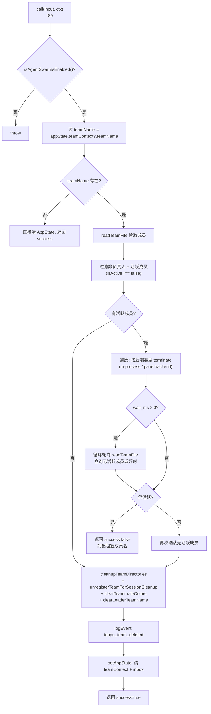
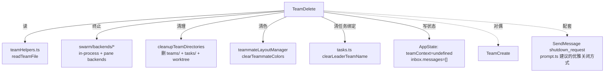

# TeamDelete 工具详解

> `TeamDelete` 是 `TeamCreate` 的严格对偶：它负责在 swarm 工作完成后**安全地拆除团队**。核心难点不是删目录，而是"优雅终止"——先给所有活跃 teammate 发关闭请求，可选等待它们确认退出，最后才清理磁盘资源。这是"中等偏复杂"的状态清理型工具，`call()` 内含循环等待、多后端终止、阻塞判定三层逻辑。

---

## 一、工具定位（一句话总结）

**`TeamDelete` = 优雅终止活跃 teammate 后清理团队/任务目录的销毁型工具。**

| 维度 | 值 |
|---|---|
| 工具名 | `TeamDelete`（常量 `TEAM_DELETE_TOOL_NAME`，`constants.ts:1`） |
| 一句话 | 终止活跃 teammate → 等待退出 → 清理团队/任务目录 → 清 AppState |
| 是否进 system prompt | ❌ 不在 `CORE_TOOLS`（`src/constants/tools.ts:137`），`shouldDefer: true` |
| 只读 / 破坏性 | **强破坏性**（删目录、杀进程、清状态）——无 `isReadOnly()` |
| 是否可并发 | 未声明（默认非并发安全，符合"销毁"语义） |
| 启用条件 | 注册**无条件**（`tools.ts:258`）；运行时由 `isAgentSwarmsEnabled()` 把关（`TeamDeleteTool.ts:90`） |
| 核心依赖 | `src/utils/swarm/teamHelpers.ts`、`src/utils/swarm/backends/*`、`src/utils/swarm/teammateLayoutManager.ts` |
| 定位互补方 | `TeamCreate`（创建团队） |

**为什么需要它？** 团队是磁盘上的持久状态（配置文件 + 任务目录 + worktree）。如果直接退出会话而不清理，资源会残留（历史 bug gh-32730）。更关键的是，teammate 是独立运行的 agent 进程/pane，直接删目录会留下孤儿进程。TeamDelete 保证"先停人、再拆屋"的有序退出。

---

## 二、关键文件清单

```
TeamDeleteTool/
├── TeamDeleteTool.ts   ← buildTool({...}) 主体（235 行），call() 含三层逻辑
├── prompt.ts           ← 简短说明（16 行，强调"活跃成员存在时失败"）
├── UI.tsx              ← renderToolUseMessage + renderToolResultMessage（结果被抑制）
└── constants.ts        ← TEAM_DELETE_TOOL_NAME 常量（1 行）
```

| 文件 | 角色 | 必看行号 |
|---|---|---|
| `TeamDeleteTool.ts` | 工具主体：三层清理逻辑全在这 | `buildTool:49`、`call:89`、活跃成员终止 `:111-194`、清理 `:197-205` |
| `prompt.ts` | 进 system prompt 的简短说明 | `:1-16` |
| `UI.tsx` | 渲染（结果消息**被有意抑制**返回 null） | `renderToolResultMessage:9-22` |
| `constants.ts` | 工具名常量 | `:1` |

> **结构特点**：与 TeamCreate 的"长 prompt + 中等 call"不同，TeamDelete 是"短 prompt + 长 call"。清理逻辑（终止 + 等待 + 阻塞判定）占 `call()` 大部分篇幅（`:100-211`），prompt 反而极简——因为删除操作的语义不言自明。

---

## 三、Tool 接口字段实现（`buildTool` 逐字段）

### 标识字段

```ts
name: TEAM_DELETE_TOOL_NAME,        // "TeamDelete"
searchHint: 'disband delete swarm team cleanup, ...',
maxResultSizeChars: 100_000,
shouldDefer: true,                  // 延迟工具
userFacingName() { return '' },     // UI 不单独展示
```

### 模型面字段

```ts
async description() { return '在 swarm 完成后清理团队和任务目录' }
async prompt()      { return getPrompt() }
get inputSchema()  { return inputSchema() }
```

**输入 schema**（`TeamDeleteTool.ts:29-38`）——极简，只有一个可选参数：
```ts
{
  wait_ms?: number   // 可选，0–30000，清理前等待活跃 teammate 确认关闭的毫秒数
}
```

> **设计要点**：团队名**不从输入取**，而是从 `appState.teamContext?.teamName` 读（`:98`）。这避免模型误删别的团队——只能删"当前会话负责的团队"。

**输出类型**（`:41-45`）：
```ts
{
  success: boolean,
  message: string,
  team_name?: string,
}
```

### 行为字段

| 字段 | 实现 | 说明 |
|---|---|---|
| `call()` | `:89` | 核心逻辑（见下节） |
| `isEnabled()` | `:64` → `true` | 工具级恒真；业务门控在 `call()` 内 |
| `mapToolResultToToolResultBlockParam` | `:76` | Output JSON 化 |
| `renderToolUseMessage` | `UI.tsx:5` | 显示"清理团队：当前" |
| `renderToolResultMessage` | `UI.tsx:9` | **有意返回 null**（注释 `:17`：批量关闭消息已覆盖） |

> **缺失的字段**：没有 `validateInput`（输入太简单，无需校验）、没有 `checkPermissions`、没有 `isReadOnly`/`isConcurrencySafe`。`wait_ms` 的范围约束（0–30000）由 Zod `.min(0).max(30_000)` 在 schema 层强制。

---

## 四、核心执行流程：`call()`

`call()`（`TeamDeleteTool.ts:89-231`）分三大阶段：



**关键点逐条**：

1. **运行时门控**（`:90`）：同 TeamCreate，`isAgentSwarmsEnabled()` 检查。
2. **团队名来源**（`:98`）：从 AppState 读，不从输入取——**安全设计**，防误删。
3. **活跃成员判定**（`:105-112`）：先过滤掉负责人（`name !== TEAM_LEAD_NAME`），再过滤 `isActive !== false`。注释 `:109-110` 说明：`isActive === false` 表示空闲（已结束回合或已崩溃）。
4. **多后端终止**（`:116-141`）：按 `member.backendType` 分派：
   - `in-process` 后端 → `getInProcessBackend()` + `executor.terminate(agentId, '团队负责人请求清理团队')`
   - pane 后端（tmux/iTerm2）→ `ensureBackendsRegistered()` + `createPaneBackendExecutor(getBackendByType(...))` + terminate
   - 每次终止前 `executor.setContext?.(context)` 注入上下文，成功则记入 `requested` 列表。
5. **可选等待循环**（`:142-173`）：若 `wait_ms > 0` 且发出了终止请求，进入轮询循环：每 250ms（`Math.min(250, ...)`）`readTeamFile` 刷新，直到无活跃成员或超时。超时后仍有活跃成员 → 返回 `success: false` + 成员名列表。
6. **二次确认**（`:174-194`）：等待结束后再读一次团队文件，确认无活跃成员才继续；否则返回阻塞消息。注释区分两种话术：`requested.length > 0`（已请求但未退出）vs `requested.length === 0`（无法终止，需手动 `requestShutdown`）。
7. **目录清理**（`:197-205`）：四步——
   - `cleanupTeamDirectories(teamName)`：删团队目录 + 任务目录 + worktree
   - `unregisterTeamForSessionCleanup(teamName)`：注销会话清理登记（避免 `gracefulShutdown` 重复尝试，注释 `:198-199`）
   - `clearTeammateColors()`：清颜色分配，新团队从零开始
   - `clearLeaderTeamName()`：让 `getTaskListId()` 回退到 session ID
8. **遥测**（`:207`）：`logEvent('tengu_team_deleted', {team_name})`。
9. **AppState 清理**（`:214-220`）：无论团队名是否存在，都清 `teamContext` 和 `inbox.messages`（清空排队消息）。

---

## 五、权限与安全

TeamDelete 没有自定义 `checkPermissions()`，安全控制体现在：

1. **团队名绑定当前会话**（`:98`）：只能删 `appState.teamContext.teamName`，模型无法通过输入指定任意团队——**从根本上杜绝误删**。
2. **运行时功能门控**（`:90`）：`isAgentSwarmsEnabled()`。
3. **活跃成员阻塞**（`:111-194`）：核心安全机制——有活跃 teammate 时拒绝直接清理，强制先优雅终止。这是防止孤儿进程/孤儿 pane 的关键。
4. **`wait_ms` 上限 30000**（schema `:34`）：防止无限等待，Zod 层强制。
5. **注销清理登记**（`:199`）：避免 `gracefulShutdown` 重复清理已删团队。

> **对比 TeamCreate**：Create 的安全是"单团队约束"（防重复建），Delete 的安全是"活跃成员阻塞"（防孤儿进程）。两者从不同角度保护团队状态一致性。

---

## 六、与其他系统/工具的关系



- **与 `TeamCreate`**：严格对偶。Create 建（写文件 + 重置任务 + 设 leader name），Delete 拆（终止成员 + 删目录 + 清 leader name）。两者的 `setLeaderTeamName`/`clearLeaderTeamName`、`registerTeamForSessionCleanup`/`unregisterTeamForSessionCleanup`、`assignTeammateColor`/`clearTeammateColors` 一一对应。
- **与 swarm backends**：依赖 `src/utils/swarm/backends/` 的后端注册表（`registry.ts`、`PaneBackendExecutor.ts`、`types.ts`）。支持 in-process 和 pane（tmux/iTerm2）两种 teammate 后端的统一终止接口。
- **与 `SendMessage`**：`prompt.ts:12` 建议——更优雅的方式是用 `SendMessage` 发 `shutdown_request` 让 teammate 自行退出，TeamDelete 是兜底强制清理。
- **与 `gracefulShutdown`**：通过 `unregisterTeamForSessionCleanup` 协调，避免会话退出时重复清理。

---

## 七、亮点与设计取舍

1. **团队名绑定会话而非输入**（`:98`）：根本性安全设计——模型无法误删任意团队。对比 TeamCreate 的"重名自动 slug"，Delete 更保守，因为删除不可逆。
2. **三层渐进式终止**：terminate 请求 → 可选等待轮询 → 二次确认 → 清理。任何一层失败都不进下一层，保证不会在活跃成员存在时强行删目录。
3. **`isActive !== false` 的语义**（`:111`）：把"空闲"和"崩溃"统一视为"非活跃"，都可以安全清理。注释 `:109-110` 明确这个设计意图。
4. **多后端统一终止接口**（`:116-141`）：in-process 和 pane backend 走不同的 executor，但都实现 `terminate(agentId, reason)` 接口，让 `call()` 逻辑后端无关。
5. **结果消息有意抑制**（`UI.tsx:17-21`）：`renderToolResultMessage` 返回 null——因为批量关闭 teammate 时已有更丰富的 UI 反馈，单独的结果行会冗余。这是"避免 UI 噪音"的取舍。
6. **`wait_ms` 默认 0**（`:142`）：默认不等待，立即返回阻塞状态；模型可显式传 `wait_ms` 进入轮询模式。把"是否耐心等待"的决定权交给调用方。
7. **无论团队名是否存在都清 AppState**（`:214`）：保证 AppState 总是干净，即使团队状态已不一致（如文件被手动删除）。

---

## 八、源码导航（书签速查）

| 想看什么 | 去哪里 |
|---|---|
| 工具名常量 | `TeamDeleteTool/constants.ts:1` |
| `buildTool` 字段填充 | `TeamDeleteTool/TeamDeleteTool.ts:49-235` |
| 输入 schema（wait_ms） | `TeamDeleteTool.ts:29-38` |
| `call()` 核心逻辑 | `TeamDeleteTool.ts:89-231` |
| 活跃成员终止 | `TeamDeleteTool.ts:111-141` |
| 等待轮询循环 | `TeamDeleteTool.ts:142-173` |
| 二次确认阻塞 | `TeamDeleteTool.ts:174-194` |
| 目录清理四步 | `TeamDeleteTool.ts:197-205` |
| 结果消息抑制 | `TeamDeleteTool/UI.tsx:9-22` |
| 后端终止接口 | `src/utils/swarm/backends/PaneBackendExecutor.ts` |
| 注册位置 | `src/tools.ts:258`（无条件注册） |

---

## 九、学习建议与验证清单

**怎么读这章**：先看"一、定位"理解 TeamDelete 是 TeamCreate 的对偶，再跳到"四、call()"的流程图理解三层渐进式终止，最后对照"五、安全"理解为什么团队名绑定会话。

**验证清单（读完自测）**：
- [ ] 能说出 TeamDelete 的团队名来源是 `appState.teamContext`（非输入），并解释安全意义
- [ ] 能指出活跃成员判定条件（`name !== TEAM_LEAD_NAME && isActive !== false`）
- [ ] 能解释三层终止流程（terminate → 等待轮询 → 二次确认）
- [ ] 能说出 `wait_ms` 的上限（30000）和默认值（0）
- [ ] 能解释 `unregisterTeamForSessionCleanup` 的作用（防 gracefulShutdown 重复清理）
- [ ] 能说出结果消息为何被抑制（批量关闭 UI 已覆盖）

**配合动作**：
1. 创建一个团队后立即调用 TeamDelete（无活跃 teammate），观察直接清理路径
2. 生成一个 teammate 后调用 TeamDelete，观察"活跃成员阻塞"返回
3. 读 `src/utils/swarm/backends/PaneBackendExecutor.ts` 的 `terminate` 实现，理解多后端终止
