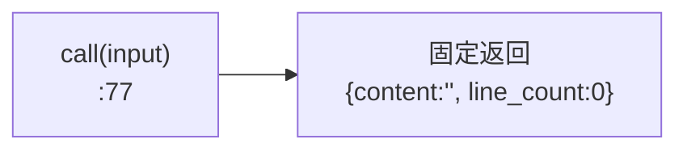
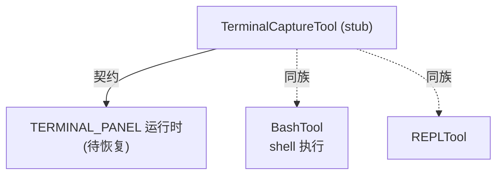

# TerminalCapture 工具详解

> 这是工具系统逐个拆解系列的一篇。`TerminalCapture` 是一个**stub**工具：schema、prompt、渲染字段都完整定义，但 `call()` 返回空内容（`content:''`）。注释明确"终端面板捕获由 TERMINAL_PANEL 运行时提供"——即真正的捕获逻辑在运行时层注入，本文件只定义工具契约。它是观察"工具作为接口契约、运行时作为实现"模式的例子。

---

## 一、工具定位（一句话总结）

**`TerminalCapture` = 读取终端面板 UI 输出的工具（当前 stub，契约已定义、实现待运行时注入）。**

| 维度 | 值 |
|---|---|
| 工具名 | `TerminalCapture`（常量 `TERMINAL_CAPTURE_TOOL_NAME`，`prompt.ts:1`） |
| 一句话 | 捕获指定终端面板的最近 N 行输出 |
| 是否进 system prompt | ❌ 不在 `CORE_TOOLS`；`tools.ts:129-131` 受 `feature('TERMINAL_PANEL')` 门控，`:252` 条件注册 |
| 只读 / 破坏性 | **只读**（`:53`） |
| 是否可并发 | ✅ **可并发**（`:50`） |
| 激活门控 | `feature('TERMINAL_PANEL')`（构建期） |
| 核心依赖 | 无（stub，真实实现由 TERMINAL_PANEL 运行时提供） |

**为什么需要它？** 当用户在终端面板 UI 里跑着一个进程（如 dev server、watch 任务），模型可能需要读取该进程的当前输出来诊断问题。本工具让模型能"看一眼"那个终端的内容，而不必让用户复制粘贴。

---

## 二、关键文件清单

```
TerminalCaptureTool/
├── TerminalCaptureTool.ts   ← buildTool({...}) 主体（86 行），call() 为 stub
└── prompt.ts                ← 工具名常量（2 行）
```

| 文件 | 角色 | 必看行号 |
|---|---|---|
| `TerminalCaptureTool.ts` | 主体：schema + call() stub + 渲染 | `buildTool:28`、`call:77`（stub） |
| `prompt.ts` | 工具名常量 | `TERMINAL_CAPTURE_TOOL_NAME:1` |

> **结构特点**：单文件主体 + 极简 prompt.ts。本工具是 stub——`call()` 固定返回空内容（`:77-85`），不读取任何真实终端。

---

## 三、Tool 接口字段实现（`buildTool` 逐字段）

### 标识字段

```ts
name: TERMINAL_CAPTURE_TOOL_NAME,   // "TerminalCapture"
searchHint: 'terminal capture screen output panel read',
maxResultSizeChars: 100_000,
strict: true,
```

### 模型面字段

```ts
async description() { return '从终端面板捕获输出' }
async prompt()      { return `捕获某个终端面板的当前内容...` }
get inputSchema()   // lazySchema + z.strictObject
```

**输入 schema**（`:7-22`）：
```ts
{
  lines?: number,      // 可选，捕获行数，默认 50
  panel_id?: string,   // 可选，目标面板 ID，默认当前激活面板
}
```

**输出类型**（`:26`）：
```ts
{ content: string, line_count: number }
```

### 行为字段

| 字段 | 实现 | 说明 |
|---|---|---|
| `call()` | `:77` | **stub**，固定返回 `{content:'', line_count:0}` |
| `isConcurrencySafe()` | `:50` → `true` | |
| `isReadOnly()` | `:53` → `true` | |
| `userFacingName()` | `:57` → `'TerminalCapture'` | |
| `renderToolUseMessage` | `:61` → `终端捕获：N 行` | |
| `mapToolResultToToolResultBlockParam` | `:66` | 返回 `content`，空则 `（终端为空）` |

> **注意**：没有 `isEnabled` / `checkPermissions` / `validateInput`。工具可见性完全由 `feature('TERMINAL_PANEL')` 构建期门控决定。

---

## 四、核心执行流程：`call()`

`call()`（`:77-85`）是 stub：

```ts
async call(input: CaptureInput) {
  // 终端面板捕获由 TERMINAL_PANEL 运行时提供。
  return {
    data: {
      content: '',
      line_count: 0,
    },
  }
}
```



**关键点**：

1. **`input` 未被使用**：即便模型传入 `lines` / `panel_id`，stub 一律返回空。
2. **注释明确运行时职责**（`:78`）：真正的捕获逻辑由 `TERMINAL_PANEL` 运行时提供——意味着存在某种运行时 hook 或注入机制接管本工具的 `call()`，但当前代码库里这部分未恢复。
3. **空结果友好处理**（`:73`）：`mapToolResultToToolResultBlockParam` 在 `content` 为空时返回 `（终端为空）`，而非空字符串——让模型能区分"终端无输出"与"工具失败"。

---

## 五、权限与安全

- **无 `checkPermissions` / `validateInput`**：stub 无副作用可校验。
- **`isReadOnly: true`**：标注只读（终端捕获不修改终端状态）。
- **真实实现的安全考量**：待运行时层恢复后，应限制可捕获的面板范围（避免读取敏感终端如密码输入）——但当前 stub 无此问题。

---

## 六、与其他系统/工具的关系



- **与 TERMINAL_PANEL 运行时**：依赖关系——本工具只是契约，真实捕获由运行时注入。当前运行时未恢复，故为 stub。
- **与 BashTool**：互补关系。BashTool 是"执行并获取输出"；TerminalCapture 是"读取已在 UI 终端里运行的进程输出"。

---

## 七、亮点与设计取舍

1. **契约先行、实现后注入**：schema、prompt、渲染全部就位，仅 `call()` 待运行时实现。这种"先定接口"的模式让模型层面已可用，运行时恢复后即可生效。
2. **空结果友好提示**（`:73`）：`（终端为空）` 区分无输出与失败。
3. **`strict: true` + 完整 schema**：即便 stub，输入约束严谨，为运行时实现做好准备。
4. **`maxResultSizeChars: 100_000`**：预留较大的结果上限（终端输出可能很长）。

---

## 八、源码导航（书签速查）

| 想看什么 | 去哪里 |
|---|---|
| 工具名常量 | `TerminalCaptureTool/prompt.ts:1` |
| `buildTool` 字段填充 | `TerminalCaptureTool/TerminalCaptureTool.ts:28-86` |
| 输入 schema | `TerminalCaptureTool.ts:7-22` |
| `call()` stub | `TerminalCaptureTool.ts:77-85` |
| 空结果提示 | `TerminalCaptureTool.ts:73` |
| feature gate 注册 | `src/tools.ts:129-131, 252` |

---

## 九、学习建议与验证清单

**怎么读这章**：核心是理解这是 stub——契约完整但 `call()` 空实现。不要误以为它能真正捕获终端。

**验证清单（读完自测）**：
- [ ] 能说出本工具是 stub（`call()` 固定返回空）
- [ ] 能找到 feature gate（`TERMINAL_PANEL`，`tools.ts:129`）
- [ ] 能指出真实捕获逻辑的归属（TERMINAL_PANEL 运行时，注释 `:78`）
- [ ] 能说出空结果时返回的提示（`（终端为空）`）
- [ ] 能指出 `input` 参数（lines / panel_id）当前未被使用

**配合动作**：
1. 启用 `FEATURE_TERMINAL_PANEL=1`，让模型调用 TerminalCapture，确认返回空
2. 在源码搜索 `TERMINAL_PANEL` 找运行时注入点（当前代码库可能未恢复）
3. 观察 `renderToolUseMessage` 显示的 `终端捕获：50 行`
