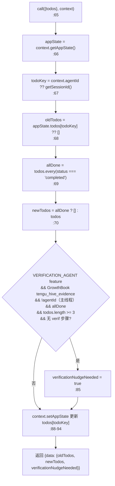
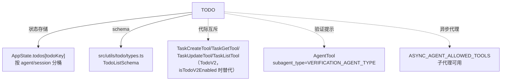

# TodoWriteTool 工具详解

> 这是工具系统逐个拆解系列的一篇。`TodoWriteTool` 是一个**简单**的状态更新工具：它把模型维护的待办列表写到 AppState，让 UI 实时渲染进度。它的 `call()` 极简——读旧列表、写新列表、可选触发"验证提示"。这是理解"工具如何驱动 UI 状态"以及"结构性提示（nudge）机制"的关键样本。注意它与 TaskCreate/Update/List（TodoV2）是互斥的代际关系。

---

## 一、工具定位（一句话总结）

**`TodoWriteTool` = 会话级待办列表的全量更新工具（v1 代）。**

| 维度 | 值 |
|---|---|
| 工具名 | `TodoWrite`（常量 `TODO_WRITE_TOOL_NAME`，`constants.ts:1`） |
| 一句话 | 用一份完整的待办列表替换当前会话的列表，驱动 UI 进度展示 |
| 是否进 system prompt | ✅ **在** `CORE_TOOLS` 白名单（`src/constants/tools.ts:156`） |
| 运行时门控 | `isEnabled()` 返回 `!isTodoV2Enabled()`（`:52`）——TodoV2 启用时本工具禁用 |
| 只读 / 破坏性 | 非只读（改 AppState），但非破坏性（无 `isReadOnly`/`isDestructive` 声明） |
| 权限 | **自动放行**（`checkPermissions` 返回 `allow`，`:58`） |
| 异步代理可用 | ✅ 在 `ASYNC_AGENT_ALLOWED_TOOLS`（`src/constants/tools.ts:74`） |
| 核心依赖 | `src/utils/todo/types.ts` 的 `TodoListSchema`、AppState 的 `todos` 字段 |

**为什么需要它？** 复杂任务需要拆解和进度跟踪。模型用 TodoWrite 把"要做什么"结构化记录，UI 实时渲染成可勾选列表，用户能看到整体推进。这也是模型"自驱严谨"的体现——主动管理任务状态而非埋头干。

---

## 二、关键文件清单

```
TodoWriteTool/
├── TodoWriteTool.ts   ← buildTool({...}) 主体（116 行），全逻辑在这
├── prompt.ts          ← PROMPT（何时用/不用 + 6 个正反例）+ DESCRIPTION
└── constants.ts       ← TODO_WRITE_TOOL_NAME = 'TodoWrite'
```

| 文件 | 角色 | 必看行号 |
|---|---|---|
| `TodoWriteTool.ts` | 工具主体：schema + call() + 验证提示逻辑 | `buildTool:31`、`inputSchema:13`、`call:65`、`verificationNudgeNeeded:77-86` |
| `prompt.ts` | 长篇使用指南（7 个 example 正反例）+ 简短 DESCRIPTION | `PROMPT:3`、`DESCRIPTION:183` |
| `constants.ts` | 工具名常量 | `TODO_WRITE_TOOL_NAME:1` |

> **结构特点**：极简单文件主体（116 行）。复杂度在 `prompt.ts`——它是系列里 prompt 最长的之一（180 行），用 7 个正反 example 教模型"何时该用 / 何时不该用待办列表"。

---

## 三、Tool 接口字段实现（`buildTool` 逐字段）

### 标识字段

```ts
name: TODO_WRITE_TOOL_NAME,                  // "TodoWrite"
searchHint: 'manage the session task checklist',
maxResultSizeChars: 100_000,
strict: true,                                // ★ 严格模式标记
shouldDefer: true,
```

> **`strict: true`**（`:35`）：系列里少见的标记，可能影响工具调用的严格性（如不允许部分字段缺失）。具体语义见 `Tool.ts` 定义。

### 模型面字段

```ts
async description() { return DESCRIPTION }
async prompt()      { return PROMPT }       // 长篇使用指南
userFacingName()    { return '' }            // 空字符串——不显示工具名
```

**输入 schema**（`:13-17`）：
```ts
{
  todos: TodoListSchema   // 更新后的完整待办列表（来自 src/utils/todo/types.ts）
}
```

**输出 schema**（`:20-26`）：
```ts
{
  oldTodos: TodoListSchema,          // 更新前的列表
  newTodos: TodoListSchema,          // 更新后的列表
  verificationNudgeNeeded?: boolean, // 是否需要验证 agent 提示
}
```

### 行为字段

| 字段 | 实现 | 说明 |
|---|---|---|
| `call()` | `:65` | 核心逻辑（见下节） |
| `checkPermissions(input)` | `:58` | **自动放行**：`{ behavior: 'allow', updatedInput: input }` |
| `isEnabled()` | `:52` | `!isTodoV2Enabled()`——TodoV2 启用时禁用 |
| `toAutoClassifierInput(input)` | `:55` | 返回 `${todos.length} items` |
| `renderToolUseMessage()` | `:62` | 返回 `null`（UI 由 AppState.todos 驱动，不单独渲染调用消息） |

> **注意缺失**：没有 `validateInput`、没有 `isReadOnly`/`isConcurrencySafe`。待办操作被视为"无风险"，权限直接 allow。

---

## 四、核心执行流程：`call()`

`call()`（`:65-103`）简洁明了：



**关键点逐条**：

1. **按 agent/session 分桶**（`:67`）：`todoKey = context.agentId ?? getSessionId()`——每个 agent（子代理）或会话有独立的待办列表，存在 `appState.todos[todoKey]`。这让多代理场景下各代理的进度互不干扰。
2. **全完成清空**（`:69-70`）：`allDone`（所有 todo 都 completed）时 `newTodos = []`——列表清空而非保留一堆勾选项。这是 UI 体验优化（完成的列表不占屏幕）。
3. **验证提示触发条件**（`:77-86`）—— 6 个 AND 条件：
   - `feature('VERIFICATION_AGENT')` 构建期门控
   - `getFeatureValue_CACHED_MAY_BE_STALE('tengu_hive_evidence', false)` GrowthBook 门控
   - `!context.agentId`（仅主线程 agent，子代理不触发）
   - `allDone`（列表全部完成的那一刻）
   - `todos.length >= 3`（3 个及以上条目）
   - `!todos.some(t => /verif/i.test(t.content))`（没有任何条目含"verif"字样）
4. **setAppState 更新**（`:88-94`）：把 `newTodos` 写到 `appState.todos[todoKey]`，UI 自动重渲染。

### `mapToolResultToToolResultBlockParam`（`:104-114`）

```ts
base = '待办列表已成功更新。请继续使用待办列表跟踪你的进度。如有适用的任务，请继续执行。'
nudge = verificationNudgeNeeded
  ? '\n\n注意：你刚刚收尾了 3 个及以上的任务，但其中没有一个验证步骤。在撰写最终总结之前，请生成 verification agent（subagent_type="..."）。你无法通过在总结中列出种种限定来为自己判定 PARTIAL——只有验证 agent 才能下达判定。'
  : ''
```

验证提示通过 `tool_result` 内容注入——模型在下一轮看到这条"注意"，被引导生成验证 agent。

---

## 五、权限与安全

### `checkPermissions`（`:58-61`）

```ts
async checkPermissions(input) {
  return { behavior: 'allow', updatedInput: input }   // 待办操作不需要权限检查
}
```

**自动放行**——待办列表是模型自管的内部状态，无副作用，不需要用户确认。注释（`:59`）明确"待办操作不需要权限检查"。

### 代际互斥（`:52-54`）

```ts
isEnabled() {
  return !isTodoV2Enabled()   // TodoV2（TaskCreate/Update/List）启用时本工具禁用
}
```

`isTodoV2Enabled()`（`src/utils/tasks.ts`）控制代际切换。TodoV2 启用时，工具池里用 `TaskCreateTool/TaskGetTool/TaskUpdateTool/TaskListTool`（`src/tools.ts:247-249`）替代本工具。两者不共存。

### 验证提示的安全意义（`:77-86`）

验证提示是为了防止模型"自判完成"——3 个以上任务收尾且无验证步骤时，强制引导模型生成 verification agent。注释（`:74-76`）解释：这恰好在循环退出的那一刻触发（"当最后一个任务关闭时，循环随之退出"），是最常发生跳过的时机。`mapToolResultToToolResultBlockParam` 的 nudge 文本明确说"只有验证 agent 才能下达判定"——防止模型用"我在总结里列了限定"来给自己判 PARTIAL。

---

## 六、与其他系统/工具的关系



- **与 AppState 的关系**：直接写 `appState.todos[todoKey]`，UI（待办列表组件）订阅该状态实时渲染。这是"工具驱动 UI 状态"的最直接例子。
- **与 TaskCreate/Update/List（TodoV2）的关系**：代际互斥。TodoWrite 是 v1（全量替换），Task* 是 v2（增量操作）。`isTodoV2Enabled()` 决定哪一代注册。
- **与 AgentTool（验证 agent）的关系**：验证提示通过 `tool_result` 引导模型生成 `subagent_type=VERIFICATION_AGENT_TYPE`（`AgentTool/constants.ts`）的子代理。这是"工具结果影响后续模型行为"的范例。
- **与异步代理的关系**：在 `ASYNC_AGENT_ALLOWED_TOOLS`（`src/constants/tools.ts:74`）——子代理也能维护自己的待办列表（通过 `agentId` 分桶）。

---

## 七、亮点与设计取舍

1. **全量替换 vs 增量**（`:65-103`）：TodoWrite 用完整列表替换旧列表，而非增量操作。这让模型始终持有"当前完整状态"的心智，但代价是每次调用要重发整个列表。TodoV2（Task*）改用增量操作解决了这个代价。
2. **按 agent/session 分桶**（`:67`）：`todoKey = agentId ?? sessionId` 让多代理场景下各代理进度独立。这是多代理协作的基础设施。
3. **全完成清空**（`:69-70`）：`allDone ? [] : todos`——避免 UI 堆积完成的勾选项。小优化但提升体验。
4. **结构性验证提示**（`:77-86`）：6 个 AND 条件精准触发"最常跳过验证的时机"。注释（`:74-76`）解释设计意图——在循环退出那一刻注入提示。这是"用工具结果引导模型行为"的高级模式。
5. **prompt 的正反例教学**（`prompt.ts`）：7 个 `<example>`（5 正 2 反）教模型何时用/不用待办列表。这是 prompt engineering 的范例——用具体场景而非抽象规则。
6. **`strict: true` 标记**（`:35`）：系列少见的字段，可能影响调用的严格性。
7. **权限自动放行**（`:58`）：待办是模型自管状态，无副作用，不需要打扰用户。
8. **`userFacingName` 返回空串**（`:49`）：不显示工具名——因为待办列表由 AppState 驱动独立 UI 组件渲染，调用消息本身不需要名字。

---

## 八、源码导航（书签速查）

| 想看什么 | 去哪里 |
|---|---|
| 工具名常量 | `TodoWriteTool/constants.ts:1` |
| `buildTool` 字段填充 | `TodoWriteTool.ts:31-115` |
| 输入/输出 schema | `TodoWriteTool.ts:13-27` |
| `call()` 核心逻辑 | `TodoWriteTool.ts:65-103` |
| 验证提示触发条件 | `TodoWriteTool.ts:77-86` |
| 验证提示文本 | `TodoWriteTool.ts:104-114` |
| `checkPermissions`（自动放行） | `TodoWriteTool.ts:58-61` |
| 代际互斥门控 | `TodoWriteTool.ts:52-54` |
| 长篇 prompt（7 正反例） | `prompt.ts:3-181` |
| TodoListSchema 定义 | `src/utils/todo/types.ts` |
| TodoV2 注册（替代） | `src/tools.ts:247-249` |
| CORE_TOOLS 白名单 | `src/constants/tools.ts:156` |

---

## 九、学习建议与验证清单

**怎么读这章**：先读"一、工具定位"理解它是 v1 代任务工具，再读"四、call()"看全量替换 + 验证提示，最后对照 `prompt.ts` 的正反例理解 prompt engineering。

**验证清单（读完自测）**：
- [ ] 能解释为什么 `call()` 用全量替换而非增量（模型持完整心智，代价是重发列表）
- [ ] 能说出 `todoKey = agentId ?? sessionId` 的作用（按 agent/session 分桶，多代理独立）
- [ ] 能列出验证提示触发的 6 个条件（feature/GrowthBook/主线程/allDone/≥3/无 verif）
- [ ] 能解释验证提示为什么在"循环退出那一刻"触发（最常跳过验证的时机）
- [ ] 能说出与 TaskCreate/Update/List（TodoV2）的关系（代际互斥，`isTodoV2Enabled` 切换）
- [ ] 能解释 `checkPermissions` 为什么自动放行（待办是模型自管状态，无副作用）
- [ ] 能指出 `allDone ? [] : todos` 的 UI 优化意图（避免堆积完成项）

**配合动作**：
1. 让 Claude 处理一个 3+ 步骤任务，观察它主动调 TodoWrite 维护列表
2. 在 `call:77` 加日志，验证验证提示触发条件
3. 启用 TodoV2（`isTodoV2Enabled`），观察 TodoWrite 从工具池消失、Task* 出现
4. 让一个子代理调 TodoWrite，验证 `agentId` 分桶（主线程列表不受影响）
5. 构造一个 3 项全完成且无 verif 的列表，观察 nudge 文本是否注入 tool_result
