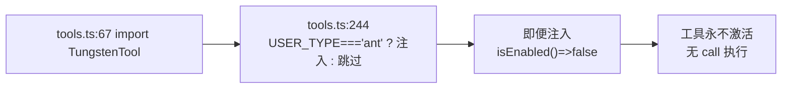
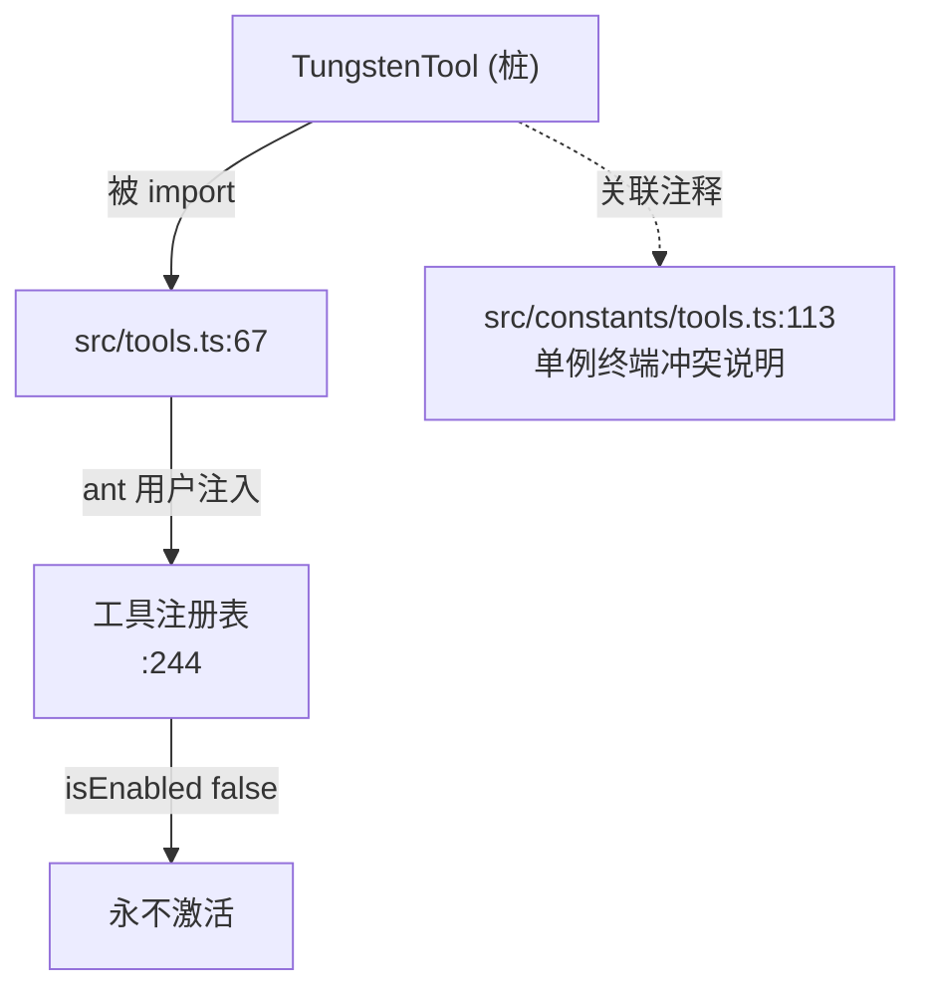

# TungstenTool 工具详解

> 这是工具系统逐个拆解系列的一篇。`TungstenTool` 是一个**stub**工具：`TungstenTool.ts` 把一个空函数强转为 `Tool` 类型（恒为 falsy 的桩），`isEnabled: () => false` 保证它永不启用；配套的 `TungstenLiveMonitor.ts`（3 行）返回 null，`clearSessionsWithTungstenUsage` / `resetInitializationState` 是空操作。这是为内部 `USER_TYPE === 'ant'` 保留的占位，真实终端监控逻辑未恢复。

---

## 一、工具定位（一句话总结）

**`TungstenTool` = 内部 ant 用户专属的终端监控工具占位（stub，恒禁用）。**

| 维度 | 值 |
|---|---|
| 工具名 | `TungstenTool`（无独立工具名常量，`:1` 内联） |
| 一句话 | 桩对象，`isEnabled` 恒 false，永不激活 |
| 是否进 system prompt | ❌ 不在 `CORE_TOOLS`；`tools.ts:67` 无条件 import，`:244` 仅 `USER_TYPE === 'ant'` 时注入 |
| 只读 / 破坏性 | N/A（桩，`isEnabled` 恒 false） |
| 是否可并发 | N/A |
| 激活门控 | `process.env.USER_TYPE === 'ant'`（`tools.ts:244`）+ `isEnabled: () => false`（`.js` 桩） |
| 核心依赖 | 无（stub） |

**为什么需要它？** 原始 TungstenTool 是 Anthropic 内部（ant 用户）的终端监控工具，推测用于实时监控/分析终端活动。`src/constants/tools.ts:113` 注释提到"TungstenTool 使用单例虚拟终端抽象，在代理之间冲突"——说明真实实现涉及共享终端状态，多 agent 会冲突。反编译后未恢复，保留桩占位以维持 `tools.ts` 的 import 不报错。

---

## 二、关键文件清单

```
TungstenTool/
├── TungstenTool.ts            ← 桩：空函数强转 Tool + 空操作辅助（7 行）
├── TungstenTool.js            ← 更完整的桩（带 name / isEnabled，4 行）
└── TungstenLiveMonitor.ts     ← React 组件桩，返回 null（3 行）
```

| 文件 | 角色 | 必看行号 |
|---|---|---|
| `TungstenTool.ts` | TS 桩：`(() => {}) as unknown as Tool` | `TungstenTool:4`、`clearSessionsWithTungstenUsage:5`、`resetInitializationState:6` |
| `TungstenTool.js` | JS 桩（更结构化）：`{name, isEnabled:()=>false}` | `:1-4` |
| `TungstenLiveMonitor.ts` | 组件桩：`() => null` | `:2-3` |

**`.ts` 桩全部内容**：
```ts
// 自动生成的桩实现 — 请用真实实现替换
import type { Tool } from 'src/Tool.js'

export const TungstenTool: Tool = (() => {}) as unknown as Tool
export const clearSessionsWithTungstenUsage: () => void = () => {}
export const resetInitializationState: () => void = () => {}
```

> **结构特点**：本批最"多文件却全 stub"的工具。三个文件都是占位。`.ts` 与 `.js` 并存是反编译产物——`.js` 带 `isEnabled: () => false` 的结构化桩，`.ts` 是更激进的空函数强转。`tools.ts:67` import 的是 `.js`（`require(...).TungstenTool`）。

---

## 三、Tool 接口字段实现

**桩，无真实字段实现。**

### `.js` 桩（被 `tools.ts` 实际使用）

```ts
export const TungstenTool = {
  name: 'TungstenTool',
  isEnabled: () => false,
}
export const clearSessionsWithTungstenUsage = () => {}
export const resetInitializationState = () => {}
```

- `name: 'TungstenTool'`：仅有名字。
- `isEnabled: () => false`：**恒禁用**——即便注入工具列表，运行时也永不激活。
- 其余 Tool 接口字段（call、schema、prompt 等）全部缺失。

### `.ts` 桩

`(() => {}) as unknown as Tool`——空函数双重断言为 Tool 类型，连 `name` / `isEnabled` 都没有。这是一个"类型占位"而非运行时可用对象。

---

## 四、核心执行流程：`call()`

**无 `call()`。** 桩对象没有 `call` 方法。即便工具被注入列表，`isEnabled: () => false` 也保证它永不被调用。



---

## 五、权限与安全

**不适用。** `isEnabled: () => false` 使工具在任何环境都不可用，无权限检查可言。

`src/constants/tools.ts:113` 的注释提示真实实现的隐患："TungstenTool 使用单例虚拟终端抽象，在代理之间冲突"——说明真实工具涉及共享终端状态，多 agent 并发会冲突。这可能是它被桩化的原因之一。

---

## 六、与其他系统/工具的关系



- **与 `tools.ts`**：`:67` 无条件 import（无 feature gate），`:244` 按 `USER_TYPE === 'ant'` 注入。这是本批唯一按用户类型（而非 feature flag）门控的工具。
- **与 `src/constants/tools.ts:113`**：注释提及真实实现的"单例虚拟终端冲突"隐患，解释了为何被桩化。
- **与 `TungstenLiveMonitor`**：配套组件桩（`:2-3` 返回 null），推测真实实现是终端实时监控的 React 组件。

---

## 七、亮点与设计取舍

1. **`.js` 桩的 `isEnabled: () => false` 防御**：即便工具被注入列表（ant 用户），运行时也恒禁用。双重保险——既不在非 ant 构建注入，又在 ant 构建里禁用。
2. **`.ts` 与 `.js` 并存**：反编译产物的典型特征。`.ts` 是类型占位（空函数强转），`.js` 是运行时占位（结构化对象）。`tools.ts` 实际用 `.js`。
3. **`USER_TYPE === 'ant'` 门控**（`tools.ts:244`）：本批唯一按用户类型门控的工具，表明它是 Anthropic 内部专属。
4. **诚实标注 stub**（`TungstenTool.ts:1`、`TungstenLiveMonitor.ts:1`）：两个文件注释都明确"自动生成的桩实现"。
5. **空操作辅助函数**：`clearSessionsWithTungstenUsage` / `resetInitializationState` 是空函数，维持调用方代码不报错。

---

## 八、源码导航（书签速查）

| 想看什么 | 去哪里 |
|---|---|
| TS 桩全部内容 | `TungstenTool/TungstenTool.ts:1-7` |
| JS 桩（实际使用） | `TungstenTool/TungstenTool.js:1-4` |
| `isEnabled: () => false` | `TungstenTool.js:3` |
| LiveMonitor 组件桩 | `TungstenTool/TungstenLiveMonitor.ts:2-3` |
| import 注册 | `src/tools.ts:67` |
| ant 用户条件注入 | `src/tools.ts:244` |
| 冲突隐患注释 | `src/constants/tools.ts:113` |

---

## 九、学习建议与验证清单

**怎么读这章**：核心认知——这是纯 stub，无任何可学习的行为模式。重点反而在于理解它为何被桩化（单例终端冲突，`constants/tools.ts:113`）以及 `USER_TYPE === 'ant'` 的门控方式。

**验证清单（读完自测）**：
- [ ] 能说出本工具是 stub（`.ts` 与 `.js` 注释均明确）
- [ ] 能指出 `.js` 桩的 `isEnabled: () => false` 使工具恒禁用
- [ ] 能说出门控方式（`USER_TYPE === 'ant'`，`tools.ts:244`，本批唯一按用户类型门控）
- [ ] 能找到冲突隐患的注释（`src/constants/tools.ts:113`）
- [ ] 能解释 `.ts` 与 `.js` 并存的原因（反编译产物的类型占位 vs 运行时占位）
- [ ] 能说出 `TungstenLiveMonitor` 桩返回什么（null）

**配合动作**：
1. 阅读三个桩文件，确认无业务逻辑
2. 设置 `USER_TYPE=ant` 启动，观察 TungstenTool 是否被注入（会注入但 isEnabled 禁用）
3. 阅读 `src/constants/tools.ts:113` 附近的注释，了解真实工具的设计冲突
