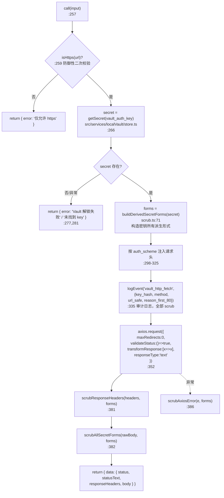
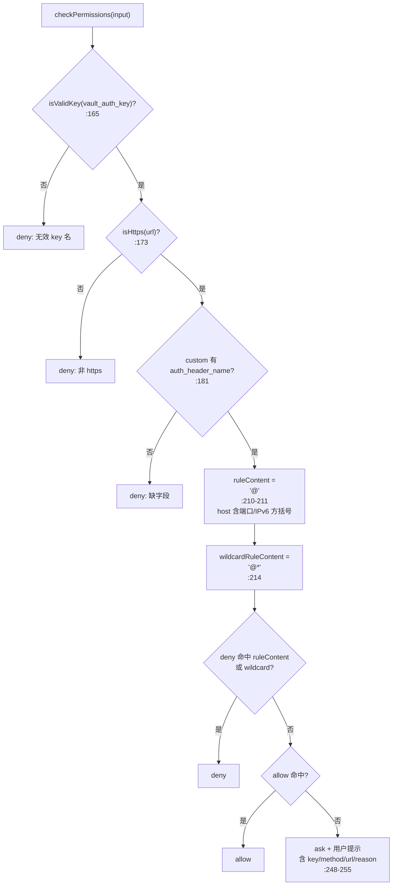
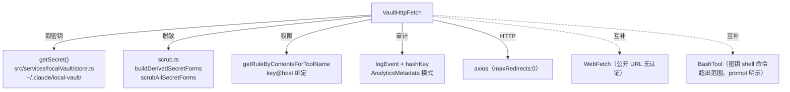

# VaultHttpFetch 工具详解

> VaultHttpFetch 是工具系统里**安全设计最严密**的一个。它让模型用存储在本地加密 vault（`~/.claude/local-vault/`）里的密钥（Bearer token / Basic auth / X-Api-Key）发起已认证的 HTTPS 请求——调用 GitHub API、Stripe API、内部服务等。精髓在于：密钥**永远不进入模型上下文**（工具自己注入请求头），且响应体、响应头、错误信息在返回前都被 **scrub**——把密钥所有派生形式（原始值、`Bearer X`、base64、`Basic <base64>`）替换成 `[REDACTED]`。权限模型用 `key@host` 绑定——批准 `github-token` 访问 `api.github.com` 不能用来把该 token 发到别处。这是理解"如何让 AI 安全地持有并使用凭据"的最佳样本。

---

## 一、工具定位（一句话总结）

**`VaultHttpFetch` = 用 vault 密钥发认证 HTTPS 请求，密钥不进上下文 + 全链路 scrub 脱敏 + key@host 绑定权限。**

| 维度 | 值 |
|---|---|
| 工具名 | `VaultHttpFetch`（常量 `VAULT_HTTP_FETCH_TOOL_NAME`，`constants.ts:1`） |
| 一句话 | 取 vault 密钥注入请求头发 HTTPS，响应/错误全 scrub；key@host 绑定授权 |
| 是否进 system prompt | ❌ **不在** `CORE_TOOLS` 白名单（在 `ALL_AGENT_DISALLOWED_TOOLS`，主线程专用，按需加载） |
| 只读 / 破坏性 | **非只读**（`isReadOnly() → false`，`VaultHttpFetchTool.ts:138`——有网络写副作用） |
| 是否可并发 | ❌ **不可并发**（`isConcurrencySafe() → false`，`:133`——vault keychain 竞争） |
| 是否可绕过权限 | ❌ `requiresUserInteraction() → true`（`:147`，bypass 模式也强制 ask） |
| 核心依赖 | `src/services/localVault/store.ts`（getSecret）、`scrub.ts`（脱敏）、axios |
| 定位互补方 | `WebFetch`（公开 URL 无认证）、`BashTool`（密钥命令超出范围） |

**为什么需要它？** 模型经常需要调认证 API（查 GitHub PR、查 Stripe 账单、调内部服务）。直接把 token 给模型 = token 泄露到 transcript/jsonl/compact 摘要。VaultHttpFetch 让工具自己持有密钥、注入请求头、把响应里的密钥回显擦干净——模型只看到脱敏后的响应。

> **不在 CORE_TOOLS**：`src/constants/tools.ts:42` 仅 import 了常量名，未列入 `CORE_TOOLS` 白名单（`:162-163` 只含 WebFetch/WebSearch）。本工具实际出现在**另一个集合**——`ALL_AGENT_DISALLOWED_TOOLS`（`:61`，注释 `:59-60`："vault HTTP fetch 更加敏感（涉及用户密钥）...仅保留在主线程"）。这是"禁止子代理使用"的列表。所以它的定位是：在 `src/tools.ts:95,241` 无条件注册进 `getAllBaseTools()`、不进 CORE_TOOLS（按需延迟）、且禁止在子代理中调用——三层定位。

---

## 二、关键文件清单

```
VaultHttpFetchTool/
├── VaultHttpFetchTool.ts   ← buildTool 主体（400 行）：schema + 权限 + call
├── scrub.ts                ← 脱敏核心（171 行）：派生形式 + scrub 响应/头/错误
├── prompt.ts               ← DESCRIPTION + PROMPT（用户面 + 模型面）
├── constants.ts            ← 工具名 + 响应体上限 1MB + 超时 30s
├── UI.tsx                  ← Ink 渲染（显示 method/url/key 名，不涉密钥值）
└── __tests__/
    ├── scrub.test.ts        ← scrub 单元测试（10782 字节）
    └── VaultHttpFetchTool.test.ts  ← 工具集成测试（32876 字节，最大）
```

| 文件 | 角色 | 必看行号 |
|---|---|---|
| `VaultHttpFetchTool.ts` | 主体：HTTPS 强制 + key@host 权限 + 4 种 auth_scheme | `checkPermissions:163`、`call:257`、auth switch `:298`、审计日志 `:335` |
| `scrub.ts` | 密钥脱敏：派生形式 + scrub 响应/头/错误 | `buildDerivedSecretForms:71`、`scrubAllSecretForms:93`、`scrubResponseHeaders:110`、`scrubAxiosError:164` |
| `prompt.ts` | 适用/不适用场景 + 权限模型说明 | `DESCRIPTION:1`、`PROMPT:9` |
| `constants.ts` | 上限常量 | `RESPONSE_BODY_CAP_BYTES:4`（1MB）、`REQUEST_TIMEOUT_MS:6`（30s） |
| `UI.tsx` | 渲染（显示 key 名非值） | `renderToolUseMessage:11`（注释 `:27` 明示安全） |

> **结构特点**：VaultHttpFetchTool 是"主体 + 安全模块"型——`VaultHttpFetchTool.ts` 做编排和权限，`scrub.ts` 专注脱敏（独立 171 行 + 独立测试）。这种把安全关键逻辑隔离到独立文件 + 独立测试的做法，是高安全工具的标志。测试文件体积（scrub.test 10KB + 工具 test 32KB）也反映了安全审计的深度（注释中多处提及 "codecov-100 审计"）。

---

## 三、Tool 接口字段实现（`buildTool` 逐字段）

VaultHttpFetchTool 实现了 Tool 接口的**全部安全相关字段**，且多处有独特设计。

### 标识字段

```ts
name: VAULT_HTTP_FETCH_TOOL_NAME,              // "VaultHttpFetch"
searchHint: 'authenticated HTTPS request using a vault-stored secret',
maxResultSizeChars: RESPONSE_BODY_CAP_BYTES,   // 1MB（与 axios maxContentLength 一致）
userFacingName: () => 'Vault HTTP',
```

### 模型面字段

```ts
async description() { return DESCRIPTION }   // 用户面：适用场景 + 权限模型
async prompt() { return PROMPT }              // 模型面：请求 schema + 不适用场景
get inputSchema()  // 9 字段，最复杂的 schema 之一
get outputSchema() // { status?, statusText?, responseHeaders?, body?, error? }
```

**输入 schema**（`:31-84`，9 个字段，工具系统里最丰富之一）：
```ts
{
  url:               string           // 必填，必须 https://
  method:            'GET'|'POST'|'PUT'|'PATCH'|'DELETE'  // 默认 GET
  vault_auth_key:    string.min(1).max(128)  // 必填，vault key 名称（非密钥值！）
  auth_scheme:       'bearer'|'basic'|'header_x_api_key'|'custom'  // 默认 bearer
  auth_header_name?: string.regex(/^[A-Za-z0-9_-]{1,64}$/)  // custom 时必填
  body?:             string.max(1MB)
  body_content_type?: string.max(128)
  reason:            string.min(1).max(500)  // 必填！说明为何需要此请求
}
```

> **`reason` 必填**（`:76-82`）：强制模型说明每次请求的目的——会出现在权限提示和审计日志里。这是可审计性设计。
>
> **`auth_header_name` 正则约束**（`:57-63`）：`/^[A-Za-z0-9_-]{1,64}$/`——注释 `:56`（H5 修复）说明：没有这条正则，模型给出的值若含 CR/LF，可通过 `headers[name]=secret` 注入额外 header（CRLF header 注入）。

### 行为字段（重点 + 独特）

| 字段 | 实现 | 说明 |
|---|---|---|
| `call()` | `:257` | 取密钥 → 注入头 → axios → scrub 响应 |
| `checkPermissions()` | `:163` | key@host 绑定 + 早期 HTTPS/key 校验 |
| `isConcurrencySafe()` | `:133` → **`false`** | vault keychain 并发竞争 |
| `isReadOnly()` | `:138` → **`false`** | 有网络写副作用（POST/PUT/DELETE） |
| `requiresUserInteraction()` | `:147` → **`true`** | **bypass 模式也强制 ask** |
| `toAutoClassifierInput()` | `:140` | `"<method> <url>"` |

> **`requiresUserInteraction() → true`**（`:147`）是本工具独有的强约束。配合 `checkPermissions` 无规则时返回 `ask`（`:248`），即使会话处于 `bypassPermissions` 模式，本工具**仍会弹用户提示**——密钥使用绝不可静默绕过。注释 `:145-146` 明确这一设计意图。

---

## 四、核心执行流程：`call()`

`call()`（`VaultHttpFetchTool.ts:257-388`）严格遵循"取密钥 → 注入头 → 请求 → scrub 返回"的安全流水线：



**关键点逐条**：

1. **防御性 HTTPS 二次校验**（`:259`）：`checkPermissions` 已强制 HTTPS，但 `call()` 里再查一次——纵深防御，防权限管线将来变化。
2. **密钥仅存内存**（`:264` 注释）：`secret` 变量绝不赋值给任何输出字段。密钥只用于构造请求头。
3. **派生形式预构造**（`:288` `buildDerivedSecretForms`）：在请求**之前**算出密钥所有可能泄漏的形式（见下节），供后续 scrub。
4. **4 种 auth_scheme 注入**（`:298-325`）：
   - `bearer` → `Authorization: Bearer <secret>`
   - `basic` → `Authorization: Basic <base64(secret)>`
   - `header_x_api_key` → `X-Api-Key: <secret>`
   - `custom` → `headers[auth_header_name] = <secret>`（有显式守卫 `:312`）
   - 用穷尽性 switch（`:319` `const _exhaustive: never = scheme`）——新增 scheme 不更新 switch 会编译报错。
5. **审计日志全 scrub**（`:335-349`）：记录 `key_hash`（fnv-1a 哈希，非密钥名原文）、`method`、`url_safe`（scrub 后）、`reason_first_80`（scrub + 字节截断后）。用 `AnalyticsMetadata_I_VERIFIED_THIS_IS_NOT_CODE_OR_FILEPATHS` 模式（注释 `:269-271` H7 修复）证明字段安全。
6. **axios 关键配置**（`:352-367`）：
   - `maxRedirects: 0`（`:361`）——**不跟随重定向**。注释 `:359-360`：30x 跳不同 origin 会重发 Authorization，剥离它很脆弱，索性拒绝。
   - `validateStatus: () => true`（`:363`）——4xx/5xx 不抛错，因为这些响应体仍需 scrub。
   - `transformResponse: [data => data]` + `responseType: 'text'`（`:365-366`）——不让 axios 解析 JSON，先拿原始 body 做 scrub。
7. **响应全 scrub**（`:381-382`）：响应头用 `scrubResponseHeaders`（敏感头整体脱敏 + 其余头 scrub 密钥回显），响应体用 `scrubAllSecretForms`。
8. **错误也 scrub**（`:386`）：`scrubAxiosError`——绝不 stringify 原始 axios 错误（`.config.headers` 含刚发的 Authorization）。

---

## 五、权限与安全（核心章节）

### `checkPermissions` —— key@host 绑定（`:163-256`）

这是本工具最精髓的设计。三层校验 + 规则匹配：



**核心设计：key@host 绑定**（`:191-214`）：
- ruleContent 格式 `<vault_auth_key>@<host>`，如 `github-token@api.github.com`。
- 注释 `:191-194`（C1 修复）：针对 `github-token` 的持久 allow **不能**用来把该 token 发到其他 origin——模型必须为每个新 host 重新申请。
- `host` 用 `URL.host.toLowerCase()`（`:210`）——**含端口**。注释 `:198-209`（M2 修复）：`api.example.com:8080` 的 allow 不同时允许 `:8443`（RFC 6454 同源规则），IPv6 方括号原样往返。
- 通配规则 `<key>@*`（`:214`）：允许某 key 访问任意 host，仅用户明确授权时用。

**早期硬校验**（`:165-187`，在规则匹配前）：
- `vault_auth_key` 格式（`isValidKey`）——deny。
- URL 必须 https（`:173`）——deny。注释 `:172`：在权限阶段就强制，被拒协议永不进 call()。
- `custom` 必须有 `auth_header_name`（`:181`）——deny。

**默认 ask + 强制交互**（`:248`）：无规则时返回 ask，消息含 key/method/url/reason。配合 `requiresUserInteraction()=true`，bypass 模式也走提示。

### scrub.ts —— 密钥脱敏（`:1-171`）

`scrub.ts` 是独立的 171 行安全模块，带独立测试。核心策略（文件头注释 `:1-21`）：**任何密钥派生字符串都绝不能通过 tool_result / jsonl / transcript / telemetry / compact 摘要流出工具边界。**

**`buildDerivedSecretForms(secret)`**（`:71-83`）——预构造密钥所有可能泄漏的形式：
- 原始密钥值
- `Bearer <secret>`
- `<secret>` 的 base64（用于 Basic payload）
- `Basic <base64>` 完整 header 值
- **按长度从长到短排序**（`:74-75`），调用方无需再排序。
- **短密钥保护**（`:72`）：密钥 < 4 字符返回空数组——过短模式 scrub 会致输出膨胀（1 字符密钥 'X' 应用到含大量 X 的 1MB body 会产生 10MB `[REDACTED]`）。
- **base64 碰撞保护**（`:76-81` M3 修复）：4-7 字符的短密钥省略纯 base64 形式（7-8 字符编码易与 body 中无关 token 碰撞），但保留 `Basic <base64>`（锚定前缀，碰撞概率极低）。

**`scrubAllSecretForms(s, forms)`**（`:93-105`）——把每种形式替换成 `[REDACTED]`：
- 快速路径（`:100` M7 修复）：`out.length >= form.length && out.includes(form)` 跳过不可能匹配的情形，干净时跳过 split/join 分配。

**`scrubResponseHeaders(headers, forms)`**（`:110-130`）：
- **敏感头整体脱敏**（`:120-122`）：`authorization`/`x-api-key`/`cookie`/`set-cookie`/`proxy-authorization`/`www-authenticate` 直接 → `[REDACTED]`。
- 其余头的值做密钥回显 scrub。

**`truncateToBytes(input, maxBytes)`**（`:145-157`）——UTF-8 安全截断：
- H1 修复（`:136-141`）：原 `slice(0,80)` 统计 UTF-16 code unit，CJK/emoji 80 字符可能膨胀到 240+ 字节。遍历字节缓冲区回退到完整 code point 边界（`:152-154` 检查 `0xc0` 掩码）。

**`scrubAxiosError(e, forms)`**（`:164-170`）——绝不 stringify 原始错误（axios 错误的 `.config.headers` 含 Authorization），构造合成消息 + scrub。

### 其他安全细节

- **`hashKey`**（`:112-121`）：fnv-1a 8 位十六进制哈希——审计日志里混淆 key 名（`github-personal-prod` 这类半敏感名）。注释 `:110-111` 明确非加密用途。
- **1MB 响应上限**（`constants.ts:4` `RESPONSE_BODY_CAP_BYTES`）+ 30s 超时（`:6`）。
- **不跟随重定向**（`:361`）——防 Authorization 泄露到重定向 origin。
- **UI 只显示 key 名**（`UI.tsx:27` 注释）：`renderToolUseMessage` 显示 `(vault: <key名>)`，不涉密钥值。

---

## 六、与其他系统/工具的关系



- **与 `WebFetch`**：WebFetch 读公开页（无认证、GET only、130+ 预批准域名）；VaultHttpFetch 用 vault 密钥发认证请求（任意 method、需 key@host 授权）。两者覆盖"无认证 vs 有认证"两端。
- **与 `BashTool`**：prompt（`prompt.ts:14-15`）明确——需要密钥的 shell 命令（git push、npm publish、ssh、docker login）**超出本工具范围**，用户须外部处理。VaultHttpFetch 只管 HTTP API 调用。
- **与 vault 系统**：`src/services/localVault/store.ts` 的 `getSecret` 是密钥唯一来源。密钥在写入 vault 时应已加密。
- **与权限系统**：用 `getRuleByContentsForToolName`（注意是 `ForToolName` 不是 WebFetch 的 `ForTool``）做 key@host 粒度匹配。`requiresUserInteraction` 让它成为少数在 bypass 模式下仍强制提示的工具。
- **与 analytics 系统**：`AnalyticsMetadata_I_VERIFIED_THIS_IS_NOT_CODE_OR_FILEPATHS` 类型模式（沿用 `src/bridge/bridgeMain.ts` 的 fork 约定）——编译期证明 analytics 字段不含代码/文件路径，多个字段逐一标注。

---

## 七、亮点与设计取舍

1. **密钥永不进上下文**（`:264` 注释）：模型只看到 `vault_auth_key`（名称），密钥值由工具自己从 vault 取、注入请求头、scrub 响应。这是"AI 安全使用凭据"的核心范式。
2. **key@host 绑定权限**（`:210`）：批准一个 key 访问一个 host，不能跨 host 复用——最小权限原则的精确实现。含端口/IPv6 的同源语义（M2 修复）。
3. **密钥派生形式预构造 + 全链路 scrub**（`scrub.ts`）：响应体、响应头、错误信息、审计日志的每个字节都 scrub。覆盖 4 种派生形式，处理短密钥膨胀和 base64 碰撞。
4. **`requiresUserInteraction() → true`**（`:147`）：bypass 模式也强制 ask——密钥使用绝不可静默。这是工具系统里最强的权限约束之一。
5. **不跟随重定向**（`:361`）：宁可功能受限也不冒 Authorization 泄露到重定向 origin 的风险——安全优先于便利。
6. **穷尽性 switch + 防御性守卫**（`:319-324`）：auth_scheme 的 switch 用 `never` 守卫，新增 scheme 不更新会编译报错；custom 分支有显式 `if (!auth_header_name)` 守卫（`:312`），不靠 `as string`。
7. **CRLF header 注入防护**（`:57-63` H5 修复）：`auth_header_name` 正则约束字符集，防 CR/LF 注入额外 header。
8. **UTF-8 安全截断**（`scrub.ts:145` H1 修复）：`truncateToBytes` 回退到 code point 边界，保证 analytics 字段字节上限契约对 CJK/emoji 成立。
9. **审计日志的 hashKey**（`:112`）：key 名用 fnv-1a 哈希进 analytics——半敏感字符串不原文记录。
10. **独立的 scrub 测试套件**（`scrub.test.ts` 10KB）：安全关键逻辑有独立、充分的测试，注释多处提及 codecov-100 审计——反映这是经过多轮安全审计打磨的代码。

---

## 八、源码导航（书签速查）

| 想看什么 | 去哪里 |
|---|---|
| 工具名 + 上限常量 | `VaultHttpFetchTool/constants.ts:1,4,6` |
| 用户面 DESCRIPTION + 模型面 PROMPT | `VaultHttpFetchTool/prompt.ts:1,9` |
| `checkPermissions` key@host 绑定 | `VaultHttpFetchTool.ts:163-256` |
| key@host ruleContent 构造 | `VaultHttpFetchTool.ts:210-214` |
| `call()` 取密钥 + 注入 + scrub | `VaultHttpFetchTool.ts:257-388` |
| 4 种 auth_scheme switch | `VaultHttpFetchTool.ts:298-325` |
| 审计日志（全 scrub） | `VaultHttpFetchTool.ts:335-349` |
| axios 配置（maxRedirects:0） | `VaultHttpFetchTool.ts:352-367` |
| 派生形式 `buildDerivedSecretForms` | `VaultHttpFetchTool/scrub.ts:71-83` |
| scrub 函数 `scrubAllSecretForms` | `VaultHttpFetchTool/scrub.ts:93-105` |
| 敏感头脱敏 `scrubResponseHeaders` | `VaultHttpFetchTool/scrub.ts:110-130` |
| UTF-8 安全截断 `truncateToBytes` | `VaultHttpFetchTool/scrub.ts:145-157` |
| 错误 scrub `scrubAxiosError` | `VaultHttpFetchTool/scrub.ts:164-170` |
| hashKey（审计日志混淆） | `VaultHttpFetchTool.ts:112-121` |
| 工具注册 | `src/tools.ts:95,241` |
| CORE_TOOLS / AGENT_DISALLOWED 定位 | `src/constants/tools.ts:42`（import）、`:61`（在 `ALL_AGENT_DISALLOWED_TOOLS`）、`:162-163`（CORE_TOOLS **不含**它） |

---

## 九、学习建议与验证清单

**怎么读这章**：这是 4 个 Web 工具里安全设计最重的。建议先读"五、权限与安全"的 key@host 绑定（理解授权模型），再读 scrub.ts 全文（理解脱敏策略），最后读"四、call()"看安全流水线如何串起来。注意代码注释里大量的 "H5/H7/M2/M3/L7 codecov-100 审计" 标记——每处都是真实安全审计发现并修复的问题，值得逐条理解。

**验证清单（读完自测）**：
- [ ] 能说出密钥为什么永远不进模型上下文（工具自己取+注入+scrub）
- [ ] 能解释 key@host 绑定的安全意义（防跨 host 复用 token）
- [ ] 能列出 `buildDerivedSecretForms` 覆盖的 4 种派生形式（raw/Bearer/base64/Basic）
- [ ] 能说出短密钥（<4 字符）为何不 scrub（输出膨胀）
- [ ] 能解释 `requiresUserInteraction() → true` 的作用（bypass 模式也强制 ask）
- [ ] 能说出为什么不跟随重定向（防 Authorization 泄露到重定向 origin）
- [ ] 能指出 `auth_header_name` 正则约束防的是什么攻击（CRLF header 注入）
- [ ] 能解释 `truncateToBytes` 为何不用 `slice`（UTF-16 code unit vs UTF-8 字节）
- [ ] 能说出 `reason` 字段为何必填（可审计性，进权限提示+审计日志）
- [ ] 能指出 scrub 作用于哪 4 个出口（响应体/响应头/错误/审计日志）

**配合动作**：
1. 读 `scrub.test.ts`，理解每个测试用例覆盖的边界（短密钥、base64 碰撞、CJK 截断）
2. 在 `buildDerivedSecretForms` 加日志，打印一个示例密钥的 4 种派生形式（用测试 fixture，非真实密钥）
3. 构造一个 key@host allow 规则，验证同 key 访问不同 host 时仍弹 ask
4. 在 `:382` scrub 前后加日志（仅本地测试），对比响应体里密钥回显被替换成 `[REDACTED]`
5. 检查审计日志（logEvent），确认只记录 key_hash 而非 key 名原文
