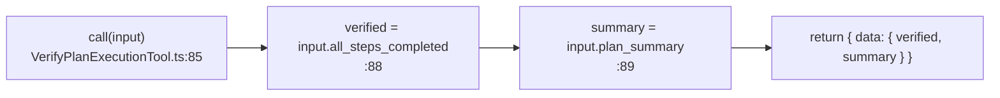
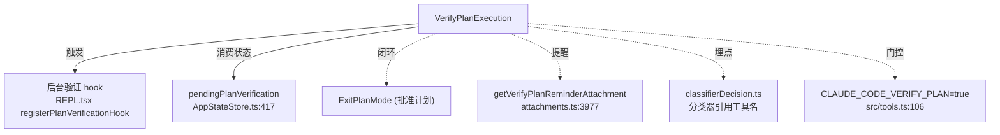

# VerifyPlanExecution 工具详解

> 这是规划三件套里**最轻量**的一个（主体仅 93 行），也是唯一一个**默认关闭**的（由 `CLAUDE_CODE_VERIFY_PLAN=true` 环境变量门控）。它不真的"验证"代码——只是接收模型自报的"计划完成摘要 + 是否全步骤完成"，原样回包成 `{ verified, summary }`。真正的后台验证逻辑在别处（REPL.tsx 的 `registerPlanVerificationHook`）。可以把它理解成"模型主动上报完成状态、触发后台验证 hook 的信号灯"。

---

## 一、工具定位（一句话总结）

**`VerifyPlanExecution` = 计划实施完成后，模型自报完成情况、触发后台验证流程的轻量收尾工具。**

| 维度 | 值 |
|---|---|
| 工具名 | `VerifyPlanExecution`（常量 `VERIFY_PLAN_EXECUTION_TOOL_NAME`，`constants.ts:1`） |
| 一句话 | 接收模型自报的计划完成摘要，回包验证结果，触发后台验证 |
| 是否进 system prompt | ✅ 在 `CORE_TOOLS` 白名单内（`src/constants/tools.ts:160`） |
| 只读 / 破坏性 | **只读**（`isReadOnly() → true`，`VerifyPlanExecutionTool.ts:54`） |
| 是否可并发 | ✅ **可并发**（`:51`） |
| 是否默认启用 | ❌ **默认关闭**——`CLAUDE_CODE_VERIFY_PLAN=true` 才注册（`src/tools.ts:106`） |
| 是否严格模式 | ✅ `strict: true`（`:32`）——模型必须按 schema 调用 |
| 输入参数 | `plan_summary`（必填）、`all_steps_completed`（必填）、`verification_notes`（可选） |
| 协作方 | `ExitPlanMode`（批准后才有"计划"可验证）、后台验证 hook |

**为什么需要它？** 计划批准 → 实施完成后，需要一个"收尾仪式"：模型明确声明"我做完了，这是摘要，所有步骤都完成了"。这个声明有两个用途——一是作为 tool_result 留痕，二是**触发后台验证**（`ExitPlanModePermissionRequest.tsx:423` 在批准计划时会提醒模型"实施完后必须调用 VerifyPlanExecution"）。工具本身不做验证，验证由消费 `pendingPlanVerification` 状态的后台 hook 完成。

---

## 二、关键文件清单

```
VerifyPlanExecutionTool/
├── VerifyPlanExecutionTool.ts   ← buildTool({...}) 主体（93 行），全部逻辑在这
└── constants.ts                 ← VERIFY_PLAN_EXECUTION_TOOL_NAME 常量
```

| 文件 | 角色 | 必看行号 |
|---|---|---|
| `VerifyPlanExecutionTool.ts` | 主体：schema + call() + prompt + 渲染 + 结果翻译 | `buildTool:28`、`call:85`、`mapToolResultToToolResultBlockParam:72`、`renderToolUseMessage:62` |
| `constants.ts` | 工具名常量 | `:1` |

> **结构特点**：三件套里**唯一没有 `src/` 子目录、没有 `UI.tsx`、没有 `prompt.ts`** 的——它的 UI 用内联的 `renderToolUseMessage`（不返回 React 节点而是返回字符串），prompt 直接写在 `async prompt()` 里。整个工具就是一个文件 93 行，是学习"最小可用工具"的极佳样本。

---

## 三、Tool 接口字段实现（`buildTool` 逐字段）

VerifyPlanExecution 是一个**字段极简但有两个不寻常标记**（`strict: true` 和 `maxResultSizeChars: 10_000`）的工具。

### 标识字段

```ts
name: VERIFY_PLAN_EXECUTION_TOOL_NAME,            // "VerifyPlanExecution"
searchHint: 'verify plan execution check completion',
maxResultSizeChars: 10_000,                         // ← 注意：只有 1 万字符（其他工具通常 10 万）
strict: true,                                       // ← 严格模式
```

> **两个特殊值**：
> - `maxResultSizeChars: 10_000`：比 EnterPlanMode/ExitPlanMode 的 `100_000` 小一个数量级。因为验证摘要本就该简短，大结果说明模型在灌水。
> - `strict: true`：严格工具——schema 校验更严，模型必须按字段定义调用，不允许模糊匹配。这符合"收尾报告"应该结构化的预期。

### 模型面字段

```ts
get inputSchema()  { return inputSchema() }
async description() { return '在退出 plan 模式之前验证计划是否被正确执行' }
async prompt()      { return `验证某个计划是否已被正确执行...` }   // 内联，无独立 prompt.ts
userFacingName()    { return 'VerifyPlan' }   // ← 注意：显示名与工具名不同
```

**输入 schema**（`:7-22`）——严格对象，三个字段：
```ts
z.strictObject({
  plan_summary: z.string(),                  // 必填，已执行计划的摘要
  verification_notes: z.string().optional(), // 可选，验证说明（测试通过、创建了文件等）
  all_steps_completed: z.boolean(),          // 必填，是否所有步骤都成功完成
})
```

**输出类型**（`:26`，未用 zod，直接 type alias）：
```ts
type VerifyOutput = { verified: boolean; summary: string }
```

### 行为字段

| 字段 | 实现 | 说明 |
|---|---|---|
| `call()` | `:85-92` | 极简：把 `all_steps_completed` 映射成 `verified`，原样回包 |
| `isConcurrencySafe()` | `:51` → `true` | 无副作用 |
| `isReadOnly()` | `:54` → `true` | 不写盘 |
| **无** `validateInput` | — | 输入靠 strict schema 兜底 |
| **无** `checkPermissions` | — | 只读、无副作用，默认走允许路径 |

### 渲染字段

```ts
renderToolUseMessage(input) {   // :62-70 —— 注意返回的是字符串，不是 React 节点
  if (input.all_steps_completed === true)  return '验证计划：所有步骤已完成'
  if (input.all_steps_completed === false) return '验证计划：未完成'
  return '验证计划'
}
mapToolResultToToolResultBlockParam(content, id) {  // :72-83
  content.verified ? `计划已验证：${content.summary}` : `计划验证失败：${content.summary}`
}
```

> `renderToolUseMessage` 返回字符串而非 React 节点是**合法但不常见**的做法——框架会把它当纯文本渲染。这里用它是因为验证状态只有三态，没必要画组件。

---

## 四、核心执行流程：`call()`

`call()`（`:85-92`）是三件套里最短的，只有 5 行有效代码：



```ts
async call(input: VerifyInput) {
  return {
    data: {
      verified: input.all_steps_completed,   // 直接透传，无独立判定
      summary: input.plan_summary,
    },
  }
}
```

**关键点**：

1. **`verified` 就是 `all_steps_completed` 的别名**：工具**不做任何独立验证**——模型说完成就是完成，模型说没完成就是没完成。这听起来很"假"，但合理：真正的验证是异步的后台 hook（`pendingPlanVerification.verificationStarted/Completed`，见 `AppStateStore.ts:417-421`），本工具只是"启动信号"。

2. **`verification_notes` 被丢弃**：输入 schema 接收 `verification_notes`，但 `call()` 和输出 type 都没用它。这个字段的价值在 prompt 层面——引导模型思考"我验证了什么"，而非在数据层面消费。

3. **同步返回**：`{ data }` 包裹，非 async generator。无中间状态。

**`mapToolResultToToolResultBlockParam`（`:72-83`）**：把 `{ verified, summary }` 翻译成给模型的 tool_result：
- `verified: true` → `计划已验证：${summary}`
- `verified: false` → `计划验证失败：${summary}`

这个 tool_result 是模型"知道自己是否通过验证"的唯一信号。

---

## 五、权限与安全

VerifyPlanExecution 的权限模型**是三件套里最简单的**——因为它只读、无副作用、不碰文件、不切换模式。

### 为什么没有任何权限字段？

- **无 `validateInput`**：输入靠 `strict: true` + `z.strictObject` 在 schema 层校验，不需要额外的运行时校验。
- **无 `checkPermissions`**：只读工具走默认允许路径，无需审批。
- **`isReadOnly: true` + `isConcurrencySafe: true`**：双重无害标记，可与其他工具并发。

### 唯一的"安全"考量：环境变量门控

工具本身不危险，但**默认不注册**（`src/tools.ts:105-109`）：
```ts
const VerifyPlanExecutionTool =
  process.env.CLAUDE_CODE_VERIFY_PLAN === 'true'
    ? require('...VerifyPlanExecutionTool.js').VerifyPlanExecutionTool
    : null
```

这是**死代码消除**（注释 `src/tools.ts:103`）：不启用时连 require 都不执行，减少打包体积和启动开销。门控原因：后台验证功能（`registerPlanVerificationHook`）目前主要面向 ant 内部用户和实验环境（`getVerifyPlanReminderAttachment` 还检查 `USER_TYPE === 'ant'`，见 `src/utils/attachments.ts:3982`）。

### `strict: true` 的隐含安全意义

严格工具模式下，模型必须精确按 schema 调用——不能省略必填字段、不能加多余字段。这对"完成报告"很重要：防止模型用模糊的 free-form 文本糊弄过去，强制它明确回答"所有步骤是否完成"这个布尔值。

---

## 六、与其他系统/工具的关系



- **与 `ExitPlanMode` 的关系**：弱耦合。ExitPlanMode 批准计划 → 模型实施 → 实施完调用 VerifyPlanExecution。`ExitPlanModePermissionRequest.tsx:423` 在批准时**强制提醒**模型"实施完后必须调用 VerifyPlanExecution（而不是 Agent 工具）"。
- **与后台验证 hook 的关系**：`pendingPlanVerification`（`AppStateStore.ts:417`）在退出计划模式时设置，由 `VerifyPlanExecution 工具用于触发后台验证`（注释 `:416`）。工具调用是触发条件，hook 才是真正的验证执行者。
- **与 `attachments.ts` 的关系**：`getVerifyPlanReminderAttachment`（`:3977`）会在模型还没调用本工具时下发提醒附件——但仅当 `USER_TYPE === 'ant'` 且 `CLAUDE_CODE_VERIFY_PLAN` 为真（`:3982-3984`）。
- **与分类器的关系**：`src/utils/permissions/classifierDecision.ts:40` 引用本工具名常量——auto 模式分类器在判定是否自动批准时，会识别"这是验证调用"这类语义。
- **与 `ExitPlanModeV2Tool.ts:321` 注释的关系**：ExitPlanMode 的代码注释明确说"后台验证 hook 在 REPL.tsx 中上下文清除之后通过 `registerPlanVerificationHook()` 注册"——解释了为什么不在 ExitPlanMode 里直接注册。

---

## 七、亮点与设计取舍

1. **"信号灯"式工具设计**：工具本身不做验证，只是模型自报状态的信号。真正的逻辑在消费方（后台 hook）。这是一种"工具作为协议触发器"的范式——和 EnterPlanMode（模式切换器）异曲同工。
2. **`strict: true` 强制结构化**：少数开启 strict 的工具。完成报告必须结构化（summary + 布尔完成标志），防止模型用散文糊弄。
3. **`maxResultSizeChars: 10_000` 的克制**：比同类工具小 10 倍。结果不该长——长了说明摘要变成长篇叙述，违背"收尾报告"的初衷。
4. **死代码消除式门控**：`process.env.CLAUDE_CODE_VERIFY_PLAN === 'true'` 三元 + 条件 require，关闭时零开销。这是实验性工具注册的推荐模式（对比 `feature()` flag，env 变量更利于 A/B 测试）。
5. **`verification_notes` 的"prompt 价值 > 数据价值"**：字段被接收但不被消费——它的存在是为了在 prompt 里引导模型思考验证过程（`prompt.ts:48` "附上任何验证说明"），而非真的存储这些信息。这是一种"用 schema 塑造模型行为"的技巧。
6. **`userFacingName: 'VerifyPlan'` ≠ 工具名**：UI 显示 `VerifyPlan`，工具调用名是 `VerifyPlanExecution`。这种分离让 UI 简短、API 明确。
7. **极简单文件结构**：93 行、无子目录、无 UI.tsx、无 prompt.ts——是三件套里最好的"最小工具模板"。新手读源码应该从这个开始。

---

## 八、源码导航（书签速查）

| 想看什么 | 去哪里 |
|---|---|
| 工具名常量 | `VerifyPlanExecutionTool/constants.ts:1` |
| `buildTool` 全字段 | `VerifyPlanExecutionTool.ts:28-93` |
| 输入 schema（三字段） | `VerifyPlanExecutionTool.ts:7-22` |
| 输出类型 | `VerifyPlanExecutionTool.ts:26` |
| `call()` 核心（5 行） | `VerifyPlanExecutionTool.ts:85-92` |
| `mapToolResultToToolResultBlockParam` | `VerifyPlanExecutionTool.ts:72-83` |
| `renderToolUseMessage`（字符串渲染） | `VerifyPlanExecutionTool.ts:62-70` |
| 内联 prompt | `VerifyPlanExecutionTool.ts:42-49` |
| 环境变量门控（死代码消除） | `src/tools.ts:103-110` |
| 条件注册 | `src/tools.ts:259` |
| CORE_TOOLS 白名单 | `src/constants/tools.ts:160` |
| 后台验证状态字段 | `src/state/AppStateStore.ts:416-421` |
| 提醒附件（ant 专属） | `src/utils/attachments.ts:3977` |
| ExitPlanMode 批准时的提醒 | `src/components/permissions/ExitPlanModePermissionRequest/ExitPlanModePermissionRequest.tsx:423` |
| 分类器引用 | `src/utils/permissions/classifierDecision.ts:40` |

---

## 九、学习建议与验证清单

**怎么读这章**：这是三件套里最简单的一个，建议**先读它**建立"一个最小工具长什么样"的心智，再去看 EnterPlanMode（无参数模式切换）和 ExitPlanMode（复杂审批流）。注意它的两个反直觉点：工具本身不验证（只触发）、默认关闭（env 门控）。

**验证清单（读完自测）**：
- [ ] 能说出 `verified` 字段的真实来源（就是 `all_steps_completed` 的透传，工具不做独立判定）
- [ ] 能解释为什么工具默认不注册（`CLAUDE_CODE_VERIFY_PLAN=true` 门控，死代码消除）
- [ ] 能指出 `verification_notes` 输入字段被谁消费（没人——它只有 prompt 引导价值）
- [ ] 能说出 `strict: true` 和 `maxResultSizeChars: 10_000` 的设计意图（强制结构化 + 限制摘要长度）
- [ ] 能找到真正的后台验证逻辑在哪（`pendingPlanVerification` + REPL.tsx 的 `registerPlanVerificationHook`）
- [ ] 能解释 ExitPlanMode 批准时为什么会提醒调用本工具（`ExitPlanModePermissionRequest.tsx:423`）

**配合动作**：
1. 设置 `CLAUDE_CODE_VERIFY_PLAN=true`，完成一个计划后让 Claude 调用本工具，观察 `verified` 与 `all_steps_completed` 的一致性。
2. 在 `call()` 的 `:85` 加日志，确认 `verification_notes` 进了 input 但没进 output。
3. 不设置环境变量重跑，确认工具不出现在工具列表（`src/tools.ts:259` 的条件展开）。
4. 设置 `USER_TYPE=ant` + `CLAUDE_CODE_VERIFY_PLAN=true`，观察 `getVerifyPlanReminderAttachment` 在模型忘记调用时下发的提醒（`attachments.ts:3977`）。
5. 对比 EnterPlanMode/ExitPlanMode 的 `maxResultSizeChars`（10 万）与本工具（1 万），体会"收尾报告应该简短"的设计取向。
