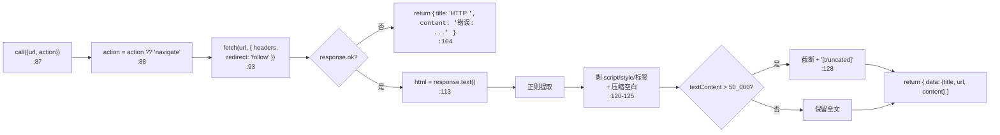
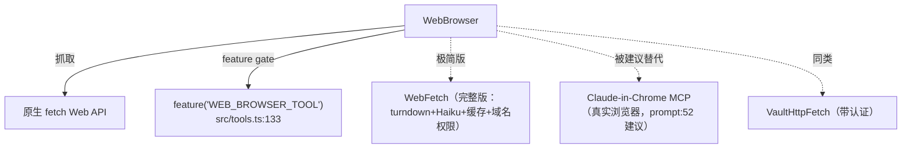

# WebBrowser 工具详解

> WebBrowser 是一个**极简的 HTTP 网页抓取工具**。它名字叫"浏览器"，但实际只是 `fetch` 一个 URL + 用正则剥掉 HTML 标签，**不执行 JavaScript、没有真实浏览器引擎**。它的 prompt 如实声明这一限制，并建议需要完整浏览器交互时改用 Claude-in-Chrome MCP。它是 feature-gated（`WEB_BROWSER_TOOL`）的，且 `WebBrowserPanel.ts` 是个空桩文件。这个工具的价值在于：它是一个"薄工具"的反面教材——展示了一个不依赖 turndown/Haiku/缓存的纯 HTTP 工具长什么样，适合作为学习 WebFetch 前的对照。

---

## 一、工具定位（一句话总结）

**`WebBrowser` = 名为浏览器、实为纯 HTTP 抓取 + 正则剥标签的极简只读工具。**

| 维度 | 值 |
|---|---|
| 工具名 | `WebBrowser`（内联常量 `WEB_BROWSER_TOOL_NAME`，`WebBrowserTool.ts:6`） |
| 一句话 | fetch URL → 正则剥 script/style/标签 → 截断 50K 字符返回文本 |
| 是否进 system prompt | ❌ **不在** `CORE_TOOLS` 白名单（feature-gated，按需加载） |
| 只读 / 破坏性 | **只读**（`isReadOnly() → true`，`:63`） |
| 是否可并发 | ❌ **不可并发**（`isConcurrencySafe() → false`，`:60`） |
| feature gate | `feature('WEB_BROWSER_TOOL')`（`src/tools.ts:133`） |
| 核心依赖 | 仅 `fetch`（Web API）+ 正则。无 turndown、无 Haiku、无缓存 |
| 定位互补方 | `WebFetch`（功能完整版）、Claude-in-Chrome MCP（真实浏览器） |

**为什么需要它？** 在 WebFetch（重：turndown + Haiku + 缓存）和真实浏览器（Chrome MCP）之间，WebBrowser 提供一个**零依赖的轻量抓取**选项。它适合"只想快速看一眼页面文本"的场景，不需要 Markdown 转换或 AI 摘要。

> **注意**：本工具在 `src/tools.ts:133` 受 `feature('WEB_BROWSER_TOOL')` 门控，默认构建/dev 不一定启用。`CORE_TOOLS` 白名单（`src/constants/tools.ts`）**不包含**它——搜索该文件无 `WebBrowser`，所以它是延迟加载工具。

---

## 二、关键文件清单

```
WebBrowserTool/
├── WebBrowserTool.ts      ← 全部逻辑（169 行）：schema + call + 渲染全在这
├── WebBrowserPanel.ts     ← 空桩文件（4 行），导出恒返回 null 的组件
└── __tests__/
    └── WebBrowserTool.test.ts  ← 测试（3493 字节）
```

| 文件 | 角色 | 必看行号 |
|---|---|---|
| `WebBrowserTool.ts` | 全部逻辑：schema + call + 渲染 | `buildTool:29`、`call:87`、navigate 分支 `:90`、剥标签 `:120` |
| `WebBrowserPanel.ts` | 空桩（自动生成，`export {}`） | `:1-4` |

> **结构特点**：WebBrowserTool 是"单文件主体 + 空桩"型。所有逻辑集中在 `WebBrowserTool.ts` 一个文件；`WebBrowserPanel.ts` 是自动生成的占位桩（注释 `:1` 明确"自动生成的桩文件 — 请替换为真实实现"），说明原本可能计划有一个 Ink 面板组件但未实现。**没有独立的 prompt.ts / UI.tsx**——prompt 和渲染函数都内联在主体里。

---

## 三、Tool 接口字段实现（`buildTool` 逐字段）

WebBrowserTool 实现的字段比 WebFetch 少——没有独立的权限函数、没有 searchHint 进索引的辅助文件。

### 标识字段

```ts
name: WEB_BROWSER_TOOL_NAME,                  // "WebBrowser"（内联定义，无独立常量文件）
searchHint: 'web browser navigate url page screenshot click',
maxResultSizeChars: 100_000,
strict: true,                                  // 严格模式（未启用？见下）
```

> **`strict: true`**（`:33`）：标记为严格工具。注意此工具**没有** `shouldDefer`——是否延迟取决于 feature gate 和注册逻辑。

### 模型面字段

```ts
get inputSchema()  // { url: string, action?: 'navigate'|'screenshot' }
async description() { return '通过 HTTP 获取并读取网页内容' }
async prompt() { /* 如实声明：HTTP 抓取，非浏览器引擎，不执行 JS */ }
```

**输入 schema**（`:8-18`）：
```ts
{
  url:    string                 // 必填，目标 URL
  action?: 'navigate'|'screenshot'  // 可选，默认 navigate
}
```

> **`screenshot` 是个误导性命名**：prompt（`:46-47`）明确"screenshot 与 navigate 相同（返回文本快照，而非可视化截图）"。真正的截图需要 Chrome MCP。

**输出类型**（`:22-27`，内联 type，非 Zod schema）：
```ts
type BrowserOutput = {
  title: string
  url: string
  content?: string
  screenshot?: string  // 实际未使用
}
```

### 行为字段

| 字段 | 实现 | 说明 |
|---|---|---|
| `call()` | `:87` | 纯 fetch + 正则剥标签 |
| `isConcurrencySafe()` | `:60` → **`false`** | 与 WebFetch（true）相反 |
| `isReadOnly()` | `:63` → `true` | 只读 |
| `userFacingName()` | `:67` → `'浏览器'` | 中文显示名 |

> **缺失的字段**（对比 WebFetch）：**没有** `checkPermissions`、**没有** `validateInput`、**没有** `toAutoClassifierInput`、**没有** `getActivityDescription`、**没有** `isSearchOrReadCommand`。这是一个字段最少的工具之一。

### 渲染字段

```ts
renderToolUseMessage(input) { return `浏览器 ${action}: ${url}` }  // :71，内联
// 没有 renderToolResultMessage —— 结果只通过 mapToolResultToToolResultBlockParam 给模型
```

---

## 四、核心执行流程：`call()`

`call()`（`WebBrowserTool.ts:87-168`）是本系列里最简单的 call 之一：



**关键点**：

1. **用原生 `fetch`**（`:93`），不是 axios。带一个固定的 Chrome UA（`:95-98`）和 `redirect: 'follow'`（`:100`）——**无条件跟随重定向**，与 WebFetch 的"跨主机重定向让模型重试"截然不同。
2. **标题提取是正则**（`:116`）：`/<title[^>]*>([^<]*)<\/title>/i`——简单粗暴，不解析 DOM。
3. **剥标签是正则链**（`:120-125`）：
   ```ts
   html.replace(/<script[\s\S]*?<\/script>/gi, '')   // 删 script
       .replace(/<style[\s\S]*?<\/style>/gi, '')     // 删 style
       .replace(/<[^>]+>/g, ' ')                     // 标签→空格
       .replace(/\s+/g, ' ')                         // 压缩空白
       .trim()
   ```
   对比 WebFetch 用 turndown（1.4MB 库）做 HTML→Markdown——WebBrowser 用 4 行正则，零依赖但质量差（无法保留结构、表格、代码块语义）。
4. **50K 字符硬截断**（`:128`）：超出直接 `slice + '[truncated]'`。对比 WebFetch 的 100K + Haiku 摘要。
5. **screenshot 分支与 navigate 几乎相同**（`:132-139`）：只在 content 前加 `[文本快照 — 可视化截图需要 Chrome 浏览器工具]` 前缀。
6. **错误兜底**（`:149-157`）：catch 任意错误，返回 `{ title: 'Error', content: '获取失败：...' }`——不抛异常，始终返回 data。

---

## 五、权限与安全

WebBrowserTool **没有实现 `checkPermissions`**——这意味着它走工具系统的**默认权限管道**（通常会触发 ask 或继承会话模式）。这是它和 WebFetch（精细的域名权限）最大的差异。

**安全姿态相对宽松/简陋**：
- **无条件跟随重定向**（`:100`）——没有 WebFetch 的 `isPermittedRedirect` 白名单。理论上可被开放重定向利用，但因为只 GET + 只读，风险有限。
- **无 URL 校验**（没有 validateInput）——任何字符串都直接交给 fetch。
- **无缓存**——每次都重新抓。
- **无 HTTPS 强制**——不像 WebFetch/VaultHttpFetch 强制升级 https。

> 这工具的安全模型基本是"信任 fetch 自身的行为"。生产场景下 WebFetch 是更安全的选择。

---

## 六、与其他系统/工具的关系



- **与 `WebFetch`**：WebBrowser 是 WebFetch 的"极简近亲"。WebFetch 有 turndown、Haiku 摘要、15 分钟缓存、130+ 域名白名单、域名粒度权限；WebBrowser 全没有，只用 4 行正则。两者 input 都含 url，但 WebFetch 多了 prompt（让 Haiku 提炼），WebBrowser 没有。
- **与 Claude-in-Chrome MCP**：WebBrowser 的 prompt（`:52`）明确建议——需要完整浏览器交互（click/type/scroll/JS）时改用 Claude-in-Chrome MCP。WebBrowser 只是 HTTP 抓取的占位。
- **与 feature 系统**：唯一的 feature gate 入口在 `src/tools.ts:133`。`getAllBaseTools()`（`:246`）用 `...(WebBrowserTool ? [WebBrowserTool] : [])` 条件展开——feature 关闭时根本不进工具列表。
- **与 `WebBrowserPanel.ts`**：原本可能计划有 Ink 面板，目前是空桩（`:1-4` `export {}` + 恒 null 组件）。

---

## 七、亮点与设计取舍

1. **零依赖**（亮点也是缺点）：不用 axios、不用 turndown、不用 Haiku、不用 lru-cache。启动开销几乎为零，但牺牲了转换质量和缓存。
2. **如实声明限制**（`:42-58` prompt）：明确告诉模型"不执行 JS、click/type/scroll 不可用、需要完整浏览器请用 Chrome MCP"——不伪装成真浏览器，避免模型误用。
3. **`screenshot` 命名的坦诚**（`:46-47`）：prompt 直接说明 screenshot 返回的是文本快照而非可视化截图——不误导。
4. **`isConcurrencySafe: false`**（`:60`）：与 WebFetch（true）相反。可能是因为没有缓存/状态隔离的考量，或保守默认。这是一个值得追问的设计选择。
5. **字段极简**：没有 checkPermissions、validateInput、toAutoClassifierInput——展示了"一个最小可用工具"长什么样。也意味着它失去了精细控制。
6. **`WebBrowserPanel.ts` 空桩**（`:1-4`）：自动生成的占位，说明这是未完成/学习用途的工具，而非生产主力。
7. **错误不抛、始终返回 data**（`:149-157`）：catch 所有异常转成 `{title:'Error', content:'获取失败'}`——工具永不抛错，代价是模型要自己判断 content 里是不是错误信息。

---

## 八、源码导航（书签速查）

| 想看什么 | 去哪里 |
|---|---|
| 工具名常量（内联） | `WebBrowserTool.ts:6` |
| `buildTool` 字段填充 | `WebBrowserTool.ts:29-169` |
| 输入 schema（url + action） | `WebBrowserTool.ts:8-18` |
| 输出 type（内联） | `WebBrowserTool.ts:22-27` |
| `call()` fetch + 剥标签 | `WebBrowserTool.ts:87-168` |
| 标题正则提取 | `WebBrowserTool.ts:116` |
| 标签剥离正则链 | `WebBrowserTool.ts:120-125` |
| 50K 截断 | `WebBrowserTool.ts:128` |
| prompt（如实声明限制） | `WebBrowserTool.ts:42-58` |
| 空桩面板 | `WebBrowserPanel.ts:1-4` |
| feature gate 注册 | `src/tools.ts:133-136,246` |
| CORE_TOOLS 白名单 | `src/constants/tools.ts`（**不含** WebBrowser） |

---

## 九、学习建议与验证清单

**怎么读这章**：先把它当 WebFetch 的"极简对照"读。重点对比"四、call()"——看剥离标签的正则链 vs WebFetch 的 turndown，理解"零依赖"的代价。然后注意"五、权限"——看一个**没有** checkPermissions 的工具如何走默认管道。

**验证清单（读完自测）**：
- [ ] 能说出 WebBrowser 名为浏览器但实际只做 HTTP 抓取（不执行 JS）
- [ ] 能指出它剥 HTML 标签用的是 4 行正则（非 turndown）
- [ ] 能解释为什么它不在 CORE_TOOLS 白名单（feature-gated，按需加载）
- [ ] 能说出它与 WebFetch 的 3 个主要差异（无 turndown / 无 Haiku / 无缓存 / 无域名权限）
- [ ] 能指出 `screenshot` action 实际返回的是文本快照（非可视化截图）
- [ ] 能说出 `isConcurrencySafe: false` 与 WebFetch（true）相反
- [ ] 能找到 `WebBrowserPanel.ts` 是空桩的证据（`:1` 注释"自动生成的桩文件"）
- [ ] 能说出它没有 checkPermissions（走默认权限管道）

**配合动作**：
1. 用 `FEATURE_WEB_BROWSER_TOOL=1 bun run dev` 启用本工具，让 Claude `WebBrowser navigate` 一个简单 HTML 页面，观察剥标签后的纯文本
2. 对比同一 URL 用 WebFetch（有 Markdown 结构）和 WebBrowser（纯文本）的输出差异
3. 让 Claude `WebBrowser screenshot` 一个 URL，验证它返回的是文本而非图片
4. 在 `:120-125` 正则链前后加日志，对比原始 HTML 和剥离后的文本
