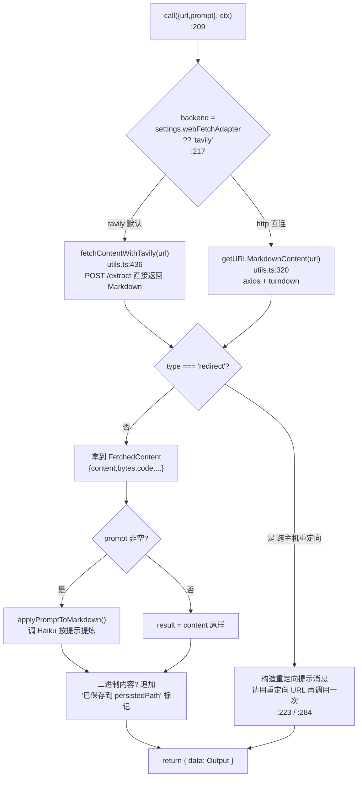
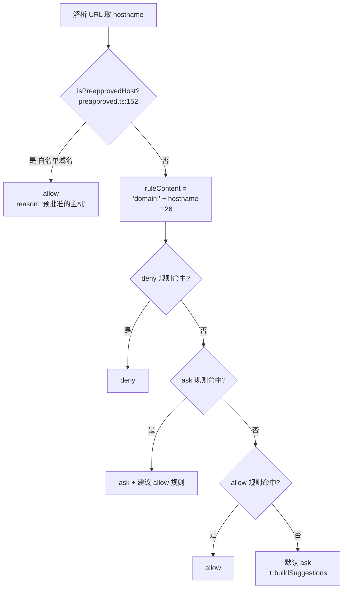
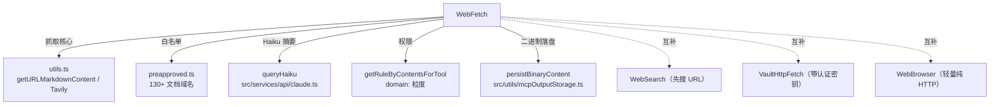

# WebFetch 工具详解

> WebFetch 是 Claude Code 的**网页抓取 + 摘要**工具：给定一个公开 URL 和一段提示（prompt），它把页面内容取回、转成 Markdown，再用一个"小而快"的辅助模型（Haiku）按你的提示把内容压缩成回答。它有一个**预批准域名白名单**（130+ 个编程文档站，如 MDN、React、AWS 文档），白名单内的域名可以跳过 Haiku 摘要直接回吐内容，且对每个域名单独做权限控制。这是理解"一个有网络副作用、但只读的工具如何做权限与缓存"的最佳样本。

---

## 一、工具定位（一句话总结）

**`WebFetch` = 抓公开 URL → 转 Markdown → 辅助模型按 prompt 提炼的只读网页工具。**

| 维度 | 值 |
|---|---|
| 工具名 | `WebFetch`（常量 `WEB_FETCH_TOOL_NAME`，`prompt.ts:1`） |
| 一句话 | 取 URL、转 Markdown、用 Haiku 按 prompt 摘要；预批准域名直吐内容 |
| 是否进 system prompt | ✅ 在 `CORE_TOOLS` 白名单内（`src/constants/tools.ts:162`） |
| 只读 / 破坏性 | **只读**（`isReadOnly() → true`，`WebFetchTool.ts:100`） |
| 是否可并发 | ✅ **可并发**（`isConcurrencySafe() → true`，`:97`） |
| 是否延迟加载 | ✅ `shouldDefer: true`（`maxResultSizeChars:100_000` + 延迟，`:72-73`） |
| 核心依赖 | `utils.ts`（抓取/turndown/Haiku）、`preapproved.ts`（域名白名单）、Tavily Extract API |
| 定位互补方 | `WebSearch`（先搜再读）、`VaultHttpFetch`（带认证密钥）、`WebBrowser`（轻量 HTTP） |

**为什么需要它？** 模型自身知识有截止日期，遇到"最新文档""某个 URL 说了什么"时需要真正去抓网页。WebFetch 把"抓 + 转 Markdown + 压缩"打包，避免把整个 10MB HTML 塞进主上下文。

---

## 二、关键文件清单

```
WebFetchTool/
├── WebFetchTool.ts    ← buildTool({...}) 主体（385 行）：schema + call + 权限
├── prompt.ts          ← 工具名 + DESCRIPTION + makeSecondaryModelPrompt（给 Haiku 的模板）
├── preapproved.ts     ← 130+ 预批准域名白名单 + isPreapprovedHost()（163 行）
├── utils.ts           ← 抓取核心：getURLMarkdownContent / fetchContentWithTavily / applyPromptToMarkdown（585 行）
└── UI.tsx             ← Ink 渲染（抓取进度 / 结果大小 + HTTP 码）
```

| 文件 | 角色 | 必看行号 |
|---|---|---|
| `WebFetchTool.ts` | 工具主体：双后端 call() + 域名权限 | `checkPermissions:106`、`call:209`、tavily 路径 `:220`、http 路径 `:281` |
| `preapproved.ts` | 130+ 白名单 + 主机/路径分离优化 | `PREAPPROVED_HOSTS:12`、拆分优化 `:134`、`isPreapprovedHost:152` |
| `utils.ts` | 抓取/缓存/turndown/Haiku | LRU 缓存 `:52`、重定向白名单 `:183`、`getURLMarkdownContent:320`、`fetchContentWithTavily:436`、`applyPromptToMarkdown:534` |
| `prompt.ts` | Haiku 的 system prompt 模板（预批准域名放宽版权约束） | `DESCRIPTION:3`、`makeSecondaryModelPrompt:23` |

> **结构特点**：WebFetchTool 是"主体 + 三辅助"型——`WebFetchTool.ts` 做编排，真正干活的抓取逻辑在 `utils.ts`，安全边界（预批准域名）在 `preapproved.ts`，给 Haiku 的提示模板在 `prompt.ts`。这是逻辑足够复杂时分文件的典型做法。

---

## 三、Tool 接口字段实现（`buildTool` 逐字段）

WebFetchTool 实现了 `Tool` 接口的几乎所有字段，且它的 `checkPermissions` / `call` 比只读文件工具复杂得多。

### 标识字段

```ts
name: WEB_FETCH_TOOL_NAME,                    // "WebFetch"
searchHint: 'fetch and extract content from a URL',  // TF-IDF 索引关键词
maxResultSizeChars: 100_000,                  // 结果持久化阈值
shouldDefer: true,                            // 延迟加载（非核心启动时注入）
userFacingName() { return '抓取' },           // 中文显示名
```

### 模型面字段

```ts
async description(input) { /* 显示 "Claude 想要获取来自 <hostname> 的内容" */ }
async prompt() { /* 固定前缀警告认证 URL 会失败 + DESCRIPTION */ }
get inputSchema()  // { url: string.url(), prompt: string }
get outputSchema() // { bytes, code, codeText, result, durationMs, url }
```

**输入 schema**（`WebFetchTool.ts:26-31`，`z.strictObject`）：
```ts
{
  url:    string  // 必填，必须是合法 URL
  prompt: string  // 必填，对抓取到的内容运行的提示
}
```

> 注意：`url` 用 `z.string().url()` 校验合法性，`prompt` 是必填——模型必须说明想从页面提取什么。

**输出 schema**（`:34-47`）：`{ bytes, code, codeText, result, durationMs, url }`——`result` 是 Haiku 处理后的文本（或重定向提示消息）。

### 行为字段（重点）

| 字段 | 实现 | 说明 |
|---|---|---|
| `call()` | `:209` | 双后端核心逻辑（见下节） |
| `validateInput()` | `:192` | 仅校验 URL 能否 `new URL()` 解析 |
| `checkPermissions()` | `:106` | **三层判定**：预批准域名 → deny 规则 → ask/allow 规则 |
| `isConcurrencySafe()` | `:97` → `true` | 抓不同 URL 互不干扰 |
| `isReadOnly()` | `:100` → `true` | 不改本地状态（但有网络副作用） |
| `toAutoClassifierInput()` | `:103` | `"<url>: <prompt>"` 用于自动审批分类 |
| `getActivityDescription()` | `:87` | "正在抓取 <url>" 状态行 |

> **没有 `isSearchOrReadCommand()`**：与文件工具不同，WebFetch 不标记 search/read，因为它不属于本地文件检索分类。

---

## 四、核心执行流程：`call()`

`call()`（`WebFetchTool.ts:209-365`）的核心是**按后端分支**：



**Tavily 路径关键点**（`:220-278`，默认）：
1. `fetchContentWithTavily`（`utils.ts:436`）向 `https://tavily.claude-code-best.win/extract` POST `{urls:[url]}`，直接拿回**已转好的 Markdown**——跳过了 turndown 转换。
2. 即便 Tavily 已给 Markdown，若用户提供了 `prompt`，**仍会再调一次 Haiku** 处理内容（`:256`）。
3. `tavilyEndpointUrl` 可通过 settings 覆盖（`utils.ts:476`）。

**HTTP 直连路径关键点**（`:281-364`）：
1. `getURLMarkdownContent`（`utils.ts:320`）：15 分钟 LRU 缓存（`:52`，50MB 上限）→ http 强制升级 https（`:349`）→ axios 抓取 → 二进制内容落盘（`:390`）→ turndown 转 Markdown。
2. **预批准域名短路**（`:328-336`）：若 URL 在白名单内、内容是 `text/markdown`、且 < 100K 字符，**跳过 Haiku 直接返回原文**——省一次模型调用、保全文细节。
3. 否则走 `applyPromptToMarkdown`（`:338`）让 Haiku 提炼。

**重定向处理**（`:223` / `:284`）：检测到**跨主机**重定向时，不自动跟随，而是返回一条消息让模型用新 URL 再调一次。`isPermittedRedirect`（`utils.ts:183`）只允许同主机 / 加减 `www.` 的重定向自动跟随。

**`applyPromptToMarkdown`**（`utils.ts:534`）：
- 内容 > 100K 字符先截断（`:543`）。
- 用 `makeSecondaryModelPrompt` 拼模板——**预批准域名走宽松版权约束**（可引用代码示例、文档摘录），非预批准走严格约束（引用 ≤125 字符、不复述歌词、不发法律意见）（`prompt.ts:23-46`）。
- 调 `queryHaiku`（`utils.ts:553`），`querySource: 'web_fetch_apply'`。

---

## 五、权限与安全

WebFetch 的权限模型是"**域名粒度**"，这是它最值得学的地方：

### `checkPermissions`（`:106-182`，三层判定）



**核心设计**：
- **权限键是 `domain:<hostname>`**（`webFetchToolInputToPermissionRuleContent`，`:52-66`）——不是完整 URL。批准 `domain:developer.mozilla.org` 一次，以后访问该域名任意路径都不再问。
- **预批准域名优先级最高**（`:114`）：在白名单内的（MDN、React 文档、AWS 文档等）直接 allow，绕过所有用户规则——这是为了让常用文档站零摩擦。
- 默认 `ask`（`:177`），并附 `buildSuggestions`（`:375`）给用户一键加 allow 规则。

### `preapproved.ts` —— 130+ 域名白名单

- **白名单内容**（`:12-129`）：Anthropic 自家 + 主流编程语言文档（Python/Java/C#/Go/Rust...）+ Web 框架（React/Vue/Angular/Next...）+ Python 库（Django/FastAPI/PyTorch...）+ 云厂商文档（AWS/GCP/K8s...）+ 数据库 + 测试工具等。
- **安全警告**（文件头注释 `:1-10`）：白名单**仅适用于 WebFetch（仅 GET）**。沙箱网络限制**故意不继承**此列表——因为 POST/上传到 huggingface.co、kaggle.com 等会有数据渗出风险。
- **性能优化**（`:134-150`）：模块加载时把白名单拆成 `HOSTNAME_ONLY`（Set，O(1) 查）和 `PATH_PREFIXES`（带路径的少量条目如 `github.com/anthropics`）。
- **路径边界保护**（`:158-160`）：`/anthropics` 不得匹配 `/anthropics-evil/malware`——强制路径段边界。

### `validateInput`（`:192-205`）

仅校验 URL 能否被 `new URL()` 解析，失败返回 `errorCode: 1` + 友好提示。更深层的 URL 安全检查在 `utils.ts:validateURL`（`:145`）：URL ≤ 2000 字符、禁止带 username/password、主机名至少两段（防内部域名）。

### 安全细节（散落各处）

- **HTTP → HTTPS 强制升级**（`utils.ts:349`）。
- **重定向白名单**（`utils.ts:183` `isPermittedRedirect`）：只跟同主机/加减 www 的重定向，防开放重定向攻击。
- **重定向上限 10 跳**（`utils.ts:131` `MAX_REDIRECTS`）：防重定向循环。
- **内容上限 10MB**（`utils.ts:113` `MAX_HTTP_CONTENT_LENGTH`）：防资源耗尽。
- **出口代理封锁检测**（`utils.ts:290-298`）：代理返回 `403 + x-proxy-error: blocked-by-allowlist` 时抛 `EgressBlockedError`。
- **turndown 懒加载**（`utils.ts:94-101`）：1.4MB 的 turndown + domino 延迟到首次 HTML 抓取才加载。

---

## 六、与其他系统/工具的关系



- **与 `WebSearch`**：WebSearch 找 URL，WebFetch 读 URL。两者都默认走 Tavily 后端。
- **与 `VaultHttpFetch`**：WebFetch 只读公开页；VaultHttpFetch 用 vault 密钥发认证请求（GitHub API、Stripe 等）。
- **与 `WebBrowser`**：WebFetch 功能完整（turndown + Haiku + 缓存）；WebBrowser 是极简纯 HTTP 抓取（见单独章节）。
- **与 Haiku 辅助模型**：`applyPromptToMarkdown` 通过 `queryHaiku` 调用——把"压缩大网页"的活外包给便宜的小模型，省主上下文。
- **与权限系统**：用 `getRuleByContentsForTool` 做域名粒度的 deny/ask/allow 匹配，是"非文件类工具如何接入权限管道"的范例。

---

## 七、亮点与设计取舍

1. **双后端可切换**（`:217`）：`settings.webFetchAdapter` 选 `tavily`（默认，服务端转好 Markdown）或 `http`（本地 axios + turndown）。Tavily 路径更干净、省本地 CPU；http 路径更可控、离线可调。
2. **预批准域名 + 版权约束分层**（`prompt.ts:23-46`）：白名单域名走宽松 Haiku 提示（可贴代码示例），非白名单走严格提示（引用 ≤125 字符）。这是"信任域 vs 不信任域"在 AI 摘要层的体现。
3. **域名粒度权限**（`:52-66`）：用 `domain:<host>` 而非完整 URL 做权限键——批准一次覆盖整站，平衡安全与摩擦。
4. **跨主机重定向让模型重试**（`:223`）：不自动跟随跨主机重定向（防开放重定向攻击），而是返回提示让模型显式再调一次——把安全决策交给上层。
5. **15 分钟 LRU 缓存**（`utils.ts:52`）：50MB 上限，重复访问同一 URL 直接命中——显著降低延迟和 API 调用。
6. **turndown 懒加载单例**（`utils.ts:94`）：1.4MB 的 HTML→Markdown 库延迟到首次抓取，且全程复用一个实例——启动性能 + 运行时内存双赢。
7. **二进制内容落盘**（`utils.ts:390`）：PDF 等二进制存到磁盘，正文仍走 utf-8 解码 + Haiku 摘要，并附路径让模型可二次检查原始文件。
8. **prompt 前缀的缓存考量**（`:183-190` 注释）：认证警告前缀**无条件常驻**，避免随 SearchExtraTools 启用状态切换导致 system prompt 闪烁、击穿 Anthropic API 缓存——一个很生产级的细节。

---

## 八、源码导航（书签速查）

| 想看什么 | 去哪里 |
|---|---|
| 工具名常量 + 描述 | `WebFetchTool/prompt.ts:1,3` |
| Haiku 二级提示模板（版权约束分层） | `WebFetchTool/prompt.ts:23-46` |
| 130+ 预批准域名 | `WebFetchTool/preapproved.ts:12-129` |
| `isPreapprovedHost` + 路径边界 | `WebFetchTool/preapproved.ts:152-163` |
| `checkPermissions` 三层判定 | `WebFetchTool.ts:106-182` |
| `call()` 双后端 | `WebFetchTool.ts:209-365` |
| tavily 路径 | `WebFetchTool.ts:220-278` + `utils.ts:436` |
| http 直连路径 | `WebFetchTool.ts:281-364` + `utils.ts:320` |
| 重定向白名单 `isPermittedRedirect` | `WebFetchTool/utils.ts:183-214` |
| LRU 缓存 | `WebFetchTool/utils.ts:49-59` |
| Haiku 摘要 `applyPromptToMarkdown` | `WebFetchTool/utils.ts:534-584` |
| 工具注册 | `src/tools.ts:11,233` |
| CORE_TOOLS 白名单 | `src/constants/tools.ts:162` |

---

## 九、学习建议与验证清单

**怎么读这章**：先看"一、定位"理解"抓 + 转 Markdown + Haiku 摘要"三段式，再跳"五、权限"理解域名粒度三层判定（这是本工具最精髓处），最后看"四、call()"的双后端分支。

**验证清单（读完自测）**：
- [ ] 能说出 WebFetch 的三段式流水线（抓取 → 转 Markdown → Haiku 摘要）
- [ ] 能解释为什么权限键是 `domain:<hostname>` 而非完整 URL（平衡安全与摩擦）
- [ ] 能说出预批准域名的两个作用（跳过权限问 + 放宽 Haiku 版权约束 + 可短路跳过 Haiku）
- [ ] 能指出预批准白名单**不**被沙箱继承的安全理由（防 POST/上传数据渗出）
- [ ] 能解释双后端 tavily vs http 的区别（服务端转 Markdown vs 本地 turndown）
- [ ] 能说出跨主机重定向为什么不自动跟随（防开放重定向攻击）
- [ ] 能找到 LRU 缓存的 TTL（15 分钟）和大小上限（50MB）

**配合动作**：
1. 让 Claude `WebFetch` 一个 MDN 页面（如 `developer.mozilla.org/en-US/docs/Web/HTTP/CORS`），观察它走预批准路径、无权限提示
2. 让 Claude `WebFetch` 一个非白名单域名，观察 ask 权限提示和 buildSuggestions 的一键 allow
3. 在 `utils.ts:328` 加日志，验证预批准域名 + markdown 内容时跳过了 Haiku 调用
4. 构造一个跨主机重定向 URL，观察"请用重定向 URL 再调一次"的提示消息
