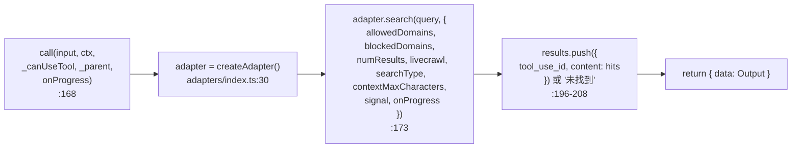
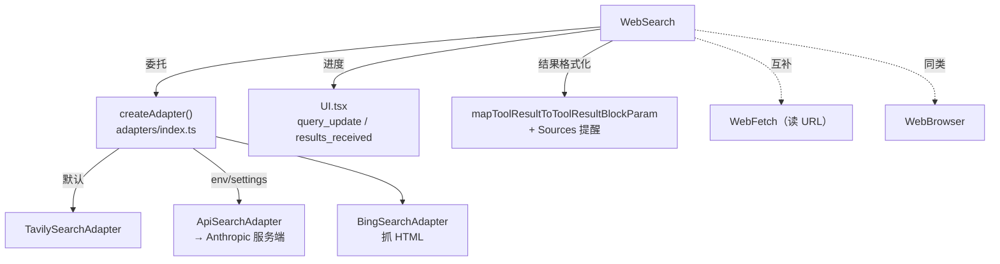

# WebSearch 工具详解

> WebSearch 是 Claude Code 的**网络搜索**工具。它的精髓不在搜索本身（那只是调一个 HTTP API），而在于**适配器工厂模式**：把"搜索后端"抽象成统一接口，运行时按优先级（环境变量 > 设置 > 默认 Tavily）选择 5 种实现之一——Tavily、Bing（HTML 抓取）、Brave、Exa、Anthropic API（服务端 `web_search_20250305` 工具）。主工具类（255 行）几乎不含搜索逻辑，全部委托给适配器。这是理解"工具如何通过抽象层支持多后端"的最佳样本。

---

## 一、工具定位（一句话总结）

**`WebSearch` = 委托给可插拔适配器的网络搜索工具，带域名过滤 + Sources 强制引用。**

| 维度 | 值 |
|---|---|
| 工具名 | `WebSearch`（常量 `WEB_SEARCH_TOOL_NAME`，`prompt.ts:3`） |
| 一句话 | 调适配器搜索网络，返回标题+URL+摘要列表，强制回复末尾带 Sources |
| 是否进 system prompt | ✅ 在 `CORE_TOOLS` 白名单内（`src/constants/tools.ts:163`） |
| 只读 / 破坏性 | **只读**（`isReadOnly() → true`，`WebSearchTool.ts:120`） |
| 是否可并发 | ✅ **可并发**（`isConcurrencySafe() → true`，`:117`） |
| 是否延迟加载 | ✅ `shouldDefer: true`（`:94`） |
| 核心依赖 | `adapters/`（5 个适配器 + 工厂）、`WebSearchProgress` 进度类型 |
| 定位互补方 | `WebFetch`（读具体 URL）、`mcp__web_reader`（抓取转换） |

**为什么需要它？** 模型知识有截止日期。WebSearch 让模型主动查"2026 年的最新 React 文档""当前的 Node 版本"，把外部最新信息注入上下文。

---

## 二、关键文件清单

```
WebSearchTool/
├── WebSearchTool.ts          ← buildTool 主体（255 行）：schema + call + 权限 + 结果格式化
├── prompt.ts                 ← 工具名 + getWebSearchPrompt()（含当前月份 + Sources 要求）
├── UI.tsx                    ← Ink 渲染（搜索中进度 / 完成 X 次搜索）
├── adapters/
│   ├── index.ts              ← createAdapter() 工厂：按优先级选 5 种后端
│   ├── types.ts              ← WebSearchAdapter 接口 + SearchResult/SearchOptions/SearchProgress
│   ├── tavilyAdapter.ts      ← 默认：Tavily Search API（POST /search）
│   ├── apiAdapter.ts         ← 委托 Anthropic 服务端 web_search_20250305 工具
│   ├── bingAdapter.ts        ← 抓 Bing HTML + 正则提取（免 API key）
│   ├── braveAdapter.ts       ← Brave Search API
│   └── exaAdapter.ts         ← Exa 搜索 API
└── src/                      ← （constants/utils 子目录，辅助）
```

| 文件 | 角色 | 必看行号 |
|---|---|---|
| `WebSearchTool.ts` | 主体：call 委托适配器 + 结果格式化 | `call:168`、`validateInput:149`、`mapToolResultToToolResultBlockParam:217` |
| `adapters/index.ts` | 工厂：优先级 `env > settings > 'tavily'` | `createAdapter:30`、5 种 key `:25` |
| `adapters/types.ts` | `WebSearchAdapter.search()` 接口 | `:28-30` |
| `adapters/tavilyAdapter.ts` | 默认后端实现 | `search:27` |
| `adapters/apiAdapter.ts` | 委托服务端工具（最复杂） | `search:39`、流式解析 `:102` |
| `prompt.ts` | Sources 强制要求 + 当前月份注入 | `getWebSearchPrompt:5` |

> **结构特点**：WebSearchTool 是"薄主体 + 厚适配器"型——主体只做参数校验、委托、结果格式化（255 行）；真正干活的是 5 个适配器，每个独立封装一种搜索后端。这是策略模式（Strategy Pattern）的教科书实现。

---

## 三、Tool 接口字段实现（`buildTool` 逐字段）

### 标识字段

```ts
name: WEB_SEARCH_TOOL_NAME,                       // "WebSearch"
searchHint: 'search the web for current information',
maxResultSizeChars: 100_000,
shouldDefer: true,
userFacingName() { return '网络搜索' },
```

### 模型面字段

```ts
async description(input) { return `Claude 想要在网络上搜索：${input.query}` }
async prompt() { return getWebSearchPrompt() }  // 含当前月份 + Sources 要求
isEnabled() { return true }  // 始终启用，适配器工厂自选后端
```

> **`isEnabled() → true` 的注释**（`:106-110`）明确：始终启用，因为适配器工厂会根据 provider 能力选后端（API 服务端搜索或 Bing 后备）。没有 feature gate。

**输入 schema**（`:15-49`，字段最丰富的工具之一）：
```ts
{
  query:                 string.min(2)   // 必填，搜索词
  allowed_domains?:      string[]        // 仅包含这些域名
  blocked_domains?:      string[]        // 屏蔽这些域名
  num_results?:          number          // 结果数（默认 8）
  livecrawl?:            'fallback'|'preferred'  // 实时抓取模式
  search_type?:          'auto'|'fast'|'deep'     // 搜索深度
  context_max_characters?: number        // 上下文字符上限（默认 10000）
}
```

**输出 schema**（`:70-80`）：`{ query, results: (SearchResult|string)[], durationSeconds }`。`results` 是联合类型——既可能是结构化搜索命中数组，也可能是纯文字说明（如"未找到结果"）。

### 行为字段（重点）

| 字段 | 实现 | 说明 |
|---|---|---|
| `call()` | `:168` | 委托 `adapter.search()` + 进度回传 |
| `validateInput()` | `:149` | query 非空 + allowed/blocked 不可同时指定 |
| `checkPermissions()` | `:126` | 返回 `passthrough` + 建议 allow 规则 |
| `isConcurrencySafe()` | `:117` → `true` | 不同 query 互不干扰 |
| `isReadOnly()` | `:120` → `true` | 只读 |
| `toAutoClassifierInput()` | `:123` | 返回 `input.query` |
| `extractSearchText()` | `:146` → `''` | 不参与历史检索聚合 |

> **`checkPermissions` 返回 `passthrough`**（`:126-139`）：不是 allow/deny/ask，而是"放行但建议用户加 allow 规则"。这是 WebSearch 特有的权限姿态——搜索本身低风险，但工具会建议持久化授权。

---

## 四、核心执行流程：`call()`

`call()`（`WebSearchTool.ts:168-216`）极简，因为逻辑都在适配器里：



**关键点**：

1. **适配器选择在 call 内做**（`:172`）：每次调用都 `createAdapter()`——工厂内部有缓存（`adapters/index.ts:27-28` `cachedAdapter`），同 key 复用实例。
2. **进度回传**（`:181-189`）：适配器调 `onProgress` 时，本工具用 `Date.now()` 生成唯一 `toolUseID`（`search-progress-<ts>`）转发给上层 `onProgress`，让 UI 能显示"正在搜索 X""找到 Y 条结果"。
3. **空结果兜底**（`:206`）：适配器返回空数组时，results 塞一条 `'未找到搜索结果。'` 字符串。
4. **返回 `{ data }`**：不是 async generator yield——搜索是原子的，没有需要流式的中间态（进度是通过 `onProgress` 回调而非 yield）。

**`mapToolResultToToolResultBlockParam`**（`:217-253`）：把结构化 Output 翻译成模型可读文本：
- 拼成 `查询 "X" 的网络搜索结果` + 列表 `- [标题](URL): 摘要`。
- **末尾强制追加**（`:245-246`）：`提醒：你必须在回复中使用 markdown 超链接包含上述来源。`——与 prompt 里的 Sources 要求双重保险。

---

## 五、适配器工厂（核心设计）

`adapters/index.ts:30-74` 的 `createAdapter()` 是本工具的灵魂：

**优先级**（从高到低）：
1. `process.env.WEB_SEARCH_ADAPTER`（显式覆盖）
2. `settings.webSearchAdapter`（用户通过 `/web-tools` 面板配置）
3. 默认 `'tavily'`

**5 种适配器**（`SearchAdapterKey`，`:25`）：

| 适配器 | 后端 | 特点 |
|---|---|---|
| `tavily`（默认） | `tavily.claude-code-best.win/search` | POST 查询，返回 title/url/content，端点可配置 |
| `api` | Anthropic 服务端 `web_search_20250305` 工具 | 委托服务端，支持 thinking，流式解析 server_tool_use |
| `bing` | 抓 Bing HTML + 正则提取 | 免 API key，模拟 Edge UA 绕反爬 |
| `brave` | Brave Search API | 独立后端 |
| `exa` | Exa 搜索 API | 独立后端 |

**缓存**（`:27-28` + `:51`）：`cachedAdapter` + `cachedAdapterKey`——同 key 复用实例，避免每次 call 都 new。

**`WebSearchAdapter` 接口**（`types.ts:28-30`）极简：
```ts
interface WebSearchAdapter {
  search(query: string, options: SearchOptions): Promise<SearchResult[]>
}
```

### `apiAdapter` 最复杂（`apiAdapter.ts`）

它把搜索**委托回 Anthropic 服务端**的 `web_search_20250305` 工具（`:38-191`）：
- 用 `queryModelWithStreaming` 发起一次带 `web_search` 工具的 API 调用（`:61`）。
- **流式解析**（`:102-184`）：监听 `server_tool_use` / `input_json_delta` / `web_search_tool_result` 事件，边解析边回传 `onProgress`。
- 用 growthbook flag `tengu_plum_vx3`（`:47`）决定用 Haiku（禁 thinking）还是主模型（开 thinking）。

---

## 六、权限与安全

WebSearch 的权限模型比 WebFetch 简单——搜索不针对具体域名：

### `checkPermissions`（`:126-139`）

```ts
return {
  behavior: 'passthrough',
  message: 'WebSearchTool 需要权限。',
  suggestions: [{ type: 'addRules', rules: [{ toolName: WEB_SEARCH_TOOL_NAME }], behavior: 'allow', destination: 'localSettings' }],
}
```

- **`passthrough`**：放行本次调用，但不建立持久授权。工具靠 `suggestions` 引导用户主动加 allow 规则。
- **规则不带 ruleContent**（`:133`）：只指定 `toolName`，不绑定域名——整工具级授权。

### `validateInput`（`:149-167`）

- query 必须非空（`:151`，`errorCode: 1`）。
- **allowed_domains 和 blocked_domains 不可同时指定**（`:158`，`errorCode: 2`）——语义冲突。

### 安全考虑

- **Sources 强制引用**（`prompt.ts:14-23` + `WebSearchTool.ts:245`）：prompt 要求 + 结果末尾提醒双重保险，确保模型回复带来源链接。
- **当前月份注入**（`prompt.ts:5,30-32`）：`getLocalMonthYear()` 把当前年月注入 prompt，逼模型搜索时用对年份（如 2026 年的 React 文档）。
- **仅美国可用**（`prompt.ts:28`）：明确写在 prompt 里——这是 Anthropic 服务端搜索后端的地理限制。

---

## 七、与其他系统/工具的关系



- **与 `WebFetch`**：WebSearch 找 URL，WebFetch 读 URL。两者都默认走 Tavily 后端，端点都可配置。
- **与 Anthropic 服务端 web_search 工具**：`apiAdapter` 把搜索委托回服务端原生工具——这是"客户端工具复用服务端能力"的范例。
- **与 settings 系统**：`webSearchAdapter` 设置项驱动后端选择（通过 `/web-tools` 面板配置）。
- **与 growthbook**：`apiAdapter` 用 `tengu_plum_vx3` flag 决定 Haiku vs 主模型——feature flag 控制运行时行为。

---

## 八、亮点与设计取舍

1. **适配器工厂模式**（`adapters/index.ts`）：5 种后端用统一接口，运行时按优先级切换。新增后端只需实现 `WebSearchAdapter` 接口 + 在 switch 加 case——开闭原则。
2. **主体极薄**（255 行）：所有搜索逻辑下沉到适配器，主体只做参数校验 + 委托 + 结果格式化。对比 WebFetch 主体 385 行——因为搜索逻辑被抽象隔离了。
3. **适配器实例缓存**（`:27-28`）：避免每次 call 都 new 适配器，同 key 复用。
4. **Sources 强制双重保险**：prompt 要求（`prompt.ts:14`）+ 结果末尾提醒（`WebSearchTool.ts:245`）——防止模型"忘记"引用来源。
5. **当前月份动态注入**（`prompt.ts:5`）：`getLocalMonthYear()` 让搜索始终用对年份，避免模型用过期年份搜索。
6. **passthrough 权限姿态**（`:126`）：不强制 ask，放行但建议授权——降低搜索的摩擦。
7. **apiAdapter 流式进度回传**（`apiAdapter.ts:102-184`）：边解析服务端流边回传 `onProgress`，让 UI 实时显示搜索进度——复杂但体验好。
8. **allowed/blocked 互斥校验**（`:158`）：在 validateInput 就拦截语义冲突，而非等适配器报错。

---

## 九、学习建议与验证清单

**怎么读这章**：先看"五、适配器工厂"理解策略模式，再看"四、call()"看主体如何委托，最后对照 `tavilyAdapter`（最简）和 `apiAdapter`（最复杂）看两种后端实现。

**验证清单（读完自测）**：
- [ ] 能说出适配器选择的 3 级优先级（env > settings > 默认 tavily）
- [ ] 能列出 5 种适配器后端（tavily/api/bing/brave/exa）
- [ ] 能解释为什么 `call()` 只有 50 行（逻辑全在适配器）
- [ ] 能说出 `passthrough` 权限姿态的含义（放行但不持久授权）
- [ ] 能解释 Sources 强制的双重保险（prompt + 结果末尾提醒）
- [ ] 能说出 allowed_domains 和 blocked_domains 为何互斥（语义冲突）
- [ ] 能指出 `apiAdapter` 委托的是哪个服务端工具（`web_search_20250305`）

**配合动作**：
1. 设 `WEB_SEARCH_ADAPTER=bing bun run dev`，观察搜索走 Bing HTML 抓取
2. 在 `createAdapter()` 加日志，验证 `cachedAdapter` 复用逻辑
3. 让 Claude `WebSearch` 一个查询，观察回复末尾的 Sources 部分
4. 在 `apiAdapter.ts:102` 流式循环加日志，观察 server_tool_use 事件解析
