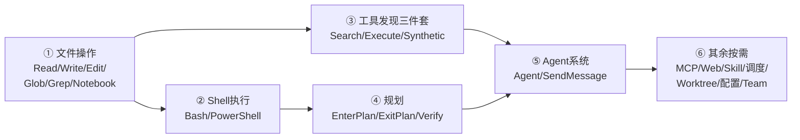

# 内置工具学习手册（书签总览）

> 这是工具系统逐个拆解系列的**导航总入口**。`packages/builtin-tools/src/tools/` 下共有 **59 个工具目录**，本页把它们按职能分成 13 组，每个工具配一句话定位 + 一个跳转链接。点进去就是该工具的完整学习报告（9 章节结构：定位 / 文件清单 / 接口字段 / call() 流程 / 权限安全 / 系统关系 / 设计取舍 / 源码书签 / 验证清单）。
>
> 配套阅读：先读 [工具系统知识总结](../tool-system-summary.mdx) 建立全局心智（Tool 接口、注册表、7 步流水线、延迟工具），再按下方"推荐学习顺序"逐个深入。

---

## 怎么用这本手册

- **找工具**：用下方分类表，工具名是链接，点击直达报告。
- **判断优先级**：表格末列的复杂度标记（`复杂` / `中等` / `简单` / `stub`）帮你决定投入多少时间。`stub` 表示当前为桩/占位/feature-gated 关闭，可快速略读。
- **读第一篇**：还没读过任何一篇？强烈建议从 [GlobTool](./GlobTool.mdx) 开始——它是这套报告的**标杆模板**，中等复杂度、字段齐全，读懂它就能按图索骥读其他任何工具。

---

## 推荐学习顺序

1. **文件操作 6 个** —— 最高频、最基础，`FileEditTool` 是"标准模板"代表。
2. **Shell 执行** —— `BashTool` 是最复杂的工具，含完整安全/权限子系统。
3. **工具发现三件套** —— 理解 60+ 工具如何靠 TF-IDF "按需暴露"。
4. **规划 / Agent 系统** —— 理解 plan 模式与子代理递归复用 query()。
5. **其余按需** —— MCP / Web / Skill / 调度 / Worktree / 配置杂项 / Team&PR。

---

## 一、文件操作（6 个）

模型读写检索文件的基础能力。`Read`/`Edit`/`Glob`/`Grep` 都在 `CORE_TOOLS` 白名单。

| 工具 | 一句话定位 | 复杂度 |
|---|---|---|
| [FileReadTool](./FileReadTool.mdx) | 多模态文件读取网关：文本/图片/PDF/notebook 四类分流，`fileStateCache` 去重 | 复杂 |
| [FileWriteTool](./FileWriteTool.mdx) | 整文件覆盖写工具，新建或完整重写，强制 LF 换行 | 中等 |
| [FileEditTool](./FileEditTool.mdx) | 精确字符串替换的写工具旗舰模板，原子读改写临界区 | 复杂 |
| [NotebookEditTool](./NotebookEditTool.mdx) | Jupyter notebook 单元格结构化编辑，replace/insert/delete 三模式 | 中等 |
| [GlobTool](./GlobTool.mdx) | 按名称模式查文件路径的只读检索工具（**标杆模板**） | 中等 |
| [GrepTool](./GrepTool.mdx) | 基于 ripgrep 的内容检索，三模式 + head_limit 分页，内容面检索 | 复杂 |

---

## 二、Shell 执行（3 个）

| 工具 | 一句话定位 | 复杂度 |
|---|---|---|
| [BashTool](./BashTool.mdx) | 执行 bash 命令的执行类工具，配备完整权限/安全/沙箱子系统 | 复杂 |
| [PowerShellTool](./PowerShellTool.mdx) | Windows 平台执行 PowerShell 命令，BashTool 的 Windows 镜像 | 复杂 |
| [REPLTool](./REPLTool.mdx) | VM 上下文批量调用原始工具的包装器，当前为 stub | stub |

---

## 三、工具发现三件套（3 个）

60+ 工具如何靠"先搜后调"按需暴露给模型。三者都在 `CORE_TOOLS`，但 `SyntheticOutput` 不对模型可见。

| 工具 | 一句话定位 | 复杂度 |
|---|---|---|
| [SearchExtraToolsTool](./SearchExtraToolsTool.mdx) | 三路前缀搜索延迟工具，关键词 + TF-IDF 双引擎融合 | 复杂 |
| [ExecuteTool](./ExecuteTool.mdx) | `ExecuteExtraTool`：6 步守卫委托执行延迟工具，模型调用唯一通道 | 中等 |
| [SyntheticOutputTool](./SyntheticOutputTool.mdx) | 让 ExecuteExtraTool 的结果在 transcript 中显示为真实工具名的内部工具 | 中等 |

---

## 四、规划（3 个）

plan 模式的进入/退出/验证三件套，与 `PermissionMode` 强耦合。

| 工具 | 一句话定位 | 复杂度 |
|---|---|---|
| [EnterPlanModeTool](./EnterPlanModeTool.mdx) | 把权限模式切换到 plan 的只读开关，强制只读探索与设计 | 中等 |
| [ExitPlanModeTool](./ExitPlanModeTool.mdx) | 读计划请求审批并回滚模式，含队友负责人审批流 | 复杂 |
| [VerifyPlanExecutionTool](./VerifyPlanExecutionTool.mdx) | 计划实施后模型自报完成情况、触发后台验证的收尾工具 | 简单 |

---

## 五、Task 系统（6 个）

注意分属**两个**子系统：`TaskCreate/Update/List/Get` 是 TodoV2 待办 CRUD；`TaskOutput/Stop` 是 Bash/Agent 后台任务管理。

| 工具 | 一句话定位 | 复杂度 |
|---|---|---|
| [TaskCreateTool](./TaskCreateTool.mdx) | 在任务列表新建 pending 任务并触发 TaskCreated hooks | 中等 |
| [TaskUpdateTool](./TaskUpdateTool.mdx) | 全功能 UPDATE：状态流转/依赖/owner 通知/验证提醒 | 复杂 |
| [TaskListTool](./TaskListTool.mdx) | 无参列出任务摘要，过滤内部任务与已完成依赖 | 简单 |
| [TaskGetTool](./TaskGetTool.mdx) | 按 ID 读取单任务完整详情，字段白名单映射 | 简单 |
| [TaskOutputTool](./TaskOutputTool.mdx) | 读取后台任务输出（block/non-block），已废弃 | 复杂 |
| [TaskStopTool](./TaskStopTool.mdx) | 按 task_id 停止运行中的后台任务，兼容 KillShell | 中等 |

---

## 六、Agent 系统（2 个）

子代理的递归复用——`runAgent()` 内部再调一次 `query()`，构成代理树。

| 工具 | 一句话定位 | 复杂度 |
|---|---|---|
| [AgentTool](./AgentTool.mdx) | 递归启动子代理，runAgent 内部复用 query() 实现代理树 | 复杂 |
| [SendMessageTool](./SendMessageTool.mdx) | 向已存在子代理续发消息，五通道纯路由分发器 | 复杂 |

---

## 七、MCP（4 个）

MCP 工具如何"伪装"成内置 Tool。`MCPTool` 是模板原型，由 `client.ts` 运行时克隆覆盖。

| 工具 | 一句话定位 | 复杂度 |
|---|---|---|
| [MCPTool](./MCPTool.mdx) | MCP 工具的模板原型，字段全是 stub，由 client.ts 运行时克隆覆盖 | 复杂 |
| [McpAuthTool](./McpAuthTool.mdx) | 未认证 MCP 服务器的占位伪工具，工厂动态生成，代用户启动 OAuth | 复杂 |
| [ListMcpResourcesTool](./ListMcpResourcesTool.mdx) | 列出已连接 MCP 服务器 resources，被 getTools 过滤、按需注入 | 中等 |
| [ReadMcpResourceTool](./ReadMcpResourceTool.mdx) | 按 server+uri 读单个 MCP resource，含 blob 落盘拦截防上下文爆炸 | 中等 |

---

## 八、Web（4 个）

| 工具 | 一句话定位 | 复杂度 |
|---|---|---|
| [WebFetchTool](./WebFetchTool.mdx) | 抓公开 URL 转 Markdown 并用 Haiku 按 prompt 提炼，含 130+ 预批准域名 | 复杂 |
| [WebSearchTool](./WebSearchTool.mdx) | 委托给 5 种可插拔适配器的网络搜索，强制 Sources 引用 | 中等 |
| [WebBrowserTool](./WebBrowserTool.mdx) | 名为浏览器实为纯 fetch + 正则剥标签的极简 HTTP 抓取工具 | stub |
| [VaultHttpFetchTool](./VaultHttpFetchTool.mdx) | 用 vault 密钥发认证 HTTPS 请求，密钥不进上下文 + 全链路 scrub 脱敏 | 复杂 |

---

## 九、Skill 与 Memory（3 个）

| 工具 | 一句话定位 | 复杂度 |
|---|---|---|
| [SkillTool](./SkillTool.mdx) | 调用/执行 skill，inline/fork/remote 三路分发，含 safe-properties 权限白名单 | 复杂 |
| [DiscoverSkillsTool](./DiscoverSkillsTool.mdx) | 按任务描述 TF-IDF 检索可用 skill，SkillTool 的发现面，feature-gated | 简单 |
| [LocalMemoryRecallTool](./LocalMemoryRecallTool.mdx) | 只读召回用户跨会话笔记，五重注入防护 + 单轮预算记账 + UTF-8 截断 | 中等 |

---

## 十、调度与监控（3 个）

多为延迟工具（不在 `CORE_TOOLS`），走 SearchExtraTools → ExecuteExtraTool 两步发现。

| 工具 | 一句话定位 | 复杂度 |
|---|---|---|
| [ScheduleCronTool](./ScheduleCronTool.mdx) | cron 三件套：创建/取消/列出未来 prompt，支持会话级与磁盘持久化 | 复杂 |
| [MonitorTool](./MonitorTool.mdx) | 启动长时流式 shell 命令为后台监控器，立即返回任务句柄 | 中等 |
| [SleepTool](./SleepTool.mdx) | 可中断可提前唤醒的等待原语，不占 shell，与 proactive 联动 | 中等 |

---

## 十一、Worktree（2 个）

git worktree 隔离会话，与 `--worktree` 快速路径配套。

| 工具 | 一句话定位 | 复杂度 |
|---|---|---|
| [EnterWorktreeTool](./EnterWorktreeTool.mdx) | 创建隔离 git worktree 并把会话切进去，清缓存记状态 | 中等 |
| [ExitWorktreeTool](./ExitWorktreeTool.mdx) | 安全退出 worktree，含失败即关闭的变更守卫与 tmux 清理 | 复杂 |

---

## 十二、配置与杂项（15 个）

交互、配置、LSP、待办、通知、上下文管理等。含多个 stub / 调试专用工具。

| 工具 | 一句话定位 | 复杂度 |
|---|---|---|
| [AskUserQuestionTool](./AskUserQuestionTool.mdx) | 向用户提结构化多选问题，answers 由权限组件回填 | 中等 |
| [ConfigTool](./ConfigTool.mdx) | 注册表驱动的配置读写，动态 prompt 与差异化权限 | 复杂 |
| [LSPTool](./LSPTool.mdx) | 9 种 LSP 操作的统一客户端，含 gitignore 过滤 | 复杂 |
| [TodoWriteTool](./TodoWriteTool.mdx) | 全量更新会话待办列表，带验证 agent 提示机制 | 简单 |
| [GoalTool](./GoalTool.mdx) | 受限接口查询/推进目标终态，受阻需连续 3 轮 | 中等 |
| [BriefTool](./BriefTool.mdx) | assistant/chat 视图下模型回复用户的唯一可见出口，支持 markdown 与附件 | 复杂 |
| [SnipTool](./SnipTool.mdx) | 剪除历史消息释放上下文，引擎投影系统拦截结果执行真正压缩 | 中等 |
| [PushNotificationTool](./PushNotificationTool.mdx) | 经 bridge 向用户移动设备推送通知，无 bridge 时优雅降级 | 中等 |
| [SendUserFileTool](./SendUserFileTool.mdx) | 助手模式下经 bridge 上传文件到用户设备，复用 BriefTool 上传逻辑 | 简单 |
| [TerminalCaptureTool](./TerminalCaptureTool.mdx) | 捕获终端面板输出，契约完整但 call() 为 stub 待运行时注入 | stub |
| [CtxInspectTool](./CtxInspectTool.mdx) | 调试专用，检查上下文令牌占用与折叠/缓存/会话内存状态 | 简单 |
| [OverflowTestTool](./OverflowTestTool.mdx) | 自动生成的桩文件，仅导出空工具名常量，被过滤 | stub |
| [TungstenTool](./TungstenTool.mdx) | ant 用户专属终端监控工具占位，isEnabled 恒 false 永不激活 | stub |

---

## 十三、Team 与 PR（7 个）

多 agent 协作 / PR 审查 / 远程触发。多数被 feature gate 关闭或限定 `USER_TYPE=ant`。

| 工具 | 一句话定位 | 复杂度 |
|---|---|---|
| [TeamCreateTool](./TeamCreateTool.mdx) | 创建多 agent 协作团队并初始化负责人上下文 | 中等 |
| [TeamDeleteTool](./TeamDeleteTool.mdx) | 优雅终止 teammate 后清理团队与任务目录 | 复杂 |
| [SubscribePRTool](./SubscribePRTool.mdx) | 订阅 GitHub PR 事件的 webhook stub，无 KAIROS 返回失败 | stub |
| [SuggestBackgroundPRTool](./SuggestBackgroundPRTool.mdx) | 建议后台创建 PR 的 stub，需 USER_TYPE=ant | stub |
| [ReviewArtifactTool](./ReviewArtifactTool.mdx) | 结构化呈现代码/文档审阅结果的纯展示工具 | 简单 |
| [RemoteTriggerTool](./RemoteTriggerTool.mdx) | 进程内调 claude.ai CCR API 管理远程触发器，全程审计 | 中等 |
| [ListPeersTool](./ListPeersTool.mdx) | 发现 UDS 本地与 bridge 远程可通信对等方 | 中等 |

---

## 附：复杂度分布速览

| 复杂度 | 数量 | 含义 |
|---|---|---|
| 复杂 | 18 | 多文件子系统、值得反复读（Bash/FileRead/FileEdit/Grep/Agent/SendMessage/SkillTool/MCPTool 等） |
| 中等 | 22 | 结构清晰的标准工具，一遍能读懂 |
| 简单 | 9 | 单职责小工具 |
| stub | 10 | 桩/占位/feature-gated 关闭/调试专用，快速略读即可 |

**合计 59 个工具**（+ 本手册 = tools/ 下 60 个 mdx 文件）。

---

## 回到上层

- [工具系统知识总结（全局篇）](../tool-system-summary.mdx) —— Tool 接口、注册表组装、7 步执行流水线、延迟工具机制、MCP 接入
- [工具系统总结 HTML 版](../tool-system-summary.html)
