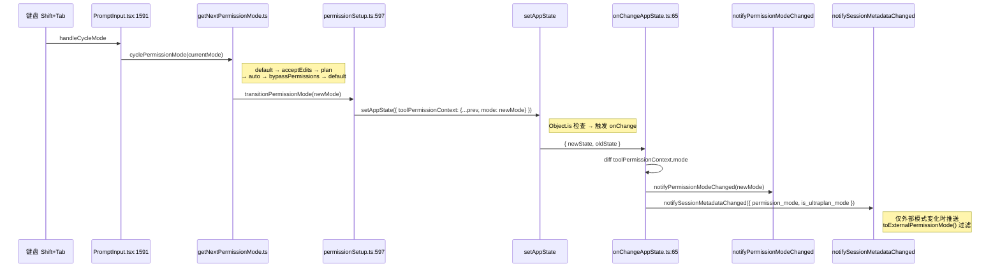

# 安全与权限知识总结

> 这是"总结学习"栏目的第五篇。目标：彻底理解 Claude Code 的**安全与权限系统**——从工具系统 7 步流水线第 4 步 `canUseTool` 的内部实现，到 5 种权限模式、5 层 settings 合并规则、两套独立 AI 分类器、Sandbox 沙箱隔离，以及权限审批 UI 的分派机制。权限系统是 MCP / Hooks / Plugins 的前置依赖，也是 Claude Code "能做什么"边界的最终仲裁者。

---

## 一、安全与权限全貌

### 权限决策主干（单次工具调用视角）

```mermaid
flowchart TD
    A["模型发出 tool_use block\nrunToolUse(tool, input, ctx)"] --> B

    B["useCanUseTool\nsrc/hooks/useCanUseTool.tsx:37\nCanUseToolFn<Input>"] --> C

    C{"forceDecision\n传入？"}
    C -->|"是（EnterPlan/ExitPlan 等流程）"| Z["直接使用传入的 PermissionDecision"]
    C -->|"否"| D

    D["hasPermissionsToUseTool\nsrc/utils/permissions/permissions.ts:473\n外壳：dontAsk 模式 → deny\nauto 模式 → yolo classifier"] --> E

    E["hasPermissionsToUseToolInner\npermissions.ts:1179\n★ 决策树 7 步"]

    subgraph Tree["决策树（严格顺序，找到第一个非 passthrough 就返回）"]
        E --> S1a["Step 1a：显式 deny 规则\n★ bypass 免疫"]
        S1a --> S1b["Step 1b：tool.checkPermissions()\n可返回 passthrough → 继续\n例：BashTool → bashToolHasPermission"]
        S1b --> S1c["Step 1c：内容 ask 子规则\n例：Bash(rm:*) ask\n★ bypass 免疫"]
        S1c --> S1d["Step 1d：checkPathSafetyForAutoEdit\n敏感文件/Windows 路径逃逸\n★ bypass 免疫"]
        S1d --> S1e["Step 1e：显式 allow 规则"]
        S1e --> S1f["Step 1f：mode 语义\nbypassPermissions → allow\nacceptEdits → allow（编辑类）\nauto → yolo classifier"]
        S1f --> S1g["Step 1g：default mode 兜底 → ask"]
    end

    Tree --> R{"PermissionDecision\nbehavior"}
    R -->|"allow"| EX["执行 tool.call()"]
    R -->|"deny"| DN["返回错误消息给模型\ndenialTracking +1"]
    R -->|"ask"| ASK

    subgraph AskFlow["ask 分派（useCanUseTool.tsx 中）"]
        ASK --> BA{"bash 命令？"}
        BA -->|"是"| CL["peekSpeculativeClassifierCheck\n最多等 2s\n高置信 → allow，跳过弹框"]
        BA -->|"否 / 分类器未决"| WK{"worker 类型？"}
        CL -->|"低置信"| WK
        WK -->|"coordinator worker"| CO["handleCoordinatorPermission\n先等自动检查，再弹框"]
        WK -->|"swarm worker"| SW["handleSwarmWorkerPermission\n通过邮箱转发给 leader"]
        WK -->|"主代理"| UI["handleInteractivePermission\n→ PermissionRequest.tsx\n→ 按 tool 类型路由 UI 组件"]
    end
```



### 权限模式切换路径



---

## 二、必须掌握（核心 7 点）

### 1. 权限决策有且只有一个入口

Claude Code 所有工具调用，无论来自 CLI / SDK / 桥接 / Headless 模式，最终都通过同一条路径：

```
useCanUseTool (React Hook 绑定的 CanUseToolFn)
  → hasPermissionsToUseTool (permissions.ts:473)
  → hasPermissionsToUseToolInner (permissions.ts:1179)
```

**为什么重要**：工具级 `checkPermissions`（每个工具自己实现）是 Step 1b，它只是决策树的一个节点，而不是"入口"。即使工具返回 `allow`，Step 1a 的 deny 规则已经优先于它被检查过了。

**关键类型（`src/hooks/useCanUseTool.tsx:37`）**：
```ts
type CanUseToolFn<Input> = (
  tool: ToolType,
  input: Input,
  toolUseContext: ToolUseContext,
  assistantMessage: AssistantMessage,
  toolUseID: string,
  forceDecision?: PermissionDecision<Input>,  // ← 绕过决策树的唯一合法路径
) => Promise<PermissionDecision<Input>>
```

### 2. `bypassPermissions` 的"硬底线"（fail-safe 设计）

这是整个权限系统最重要的安全设计，也是面试中常被问到的问题：

| Step | 能否被 `bypassPermissions` 旁路 | 原因 |
|---|---|---|
| 1a 显式 deny 规则 | **不能** | 用户明确配置的拒绝，不可被模式覆盖 |
| 1b tool.checkPermissions | 取决于工具返回值 | 若返回 `passthrough` 则继续；若返回 deny/allow 则直接采用 |
| 1c 内容 ask 子规则 | **不能** | 高风险命令（`rm -rf`）的内容级别拦截 |
| 1d checkPathSafetyForAutoEdit | **不能** | 敏感文件路径（`.gitconfig`、SSH 密钥）的安全兜底 |
| 1e allow 规则 | — | allow 时提前返回，与 bypass 无关 |
| 1f mode 语义 | — | 这就是 bypass 生效的位置 |
| 1g default ask 兜底 | 可以 | bypass 把这里的 ask 转为 allow |

**记忆口诀**：bypass 旁路的是"没有明确规则时的默认询问"，不是"用户已显式设置的规则"。

### 3. 5 种外部模式 + 2 种内部模式

**外部模式**（`EXTERNAL_PERMISSION_MODES`，`src/types/permissions.ts:15`，可通过 SDK / CCR 协议传输）：

| 模式 | Shift+Tab 循环中 | 语义 |
|---|---|---|
| `default` | ✓ | 按规则正常 ask，无规则时弹框 |
| `acceptEdits` | ✓ | 编辑类工具自动 allow（Step 1f），但 deny/safetyCheck 仍生效 |
| `plan` | ✓ | 只读规划，写类工具被 `Tool.isEnabled()` 禁用 |
| `bypassPermissions` | ✓ | 旁路大多数 ask → allow（见上方硬底线） |
| `dontAsk` | — | 所有 ask 静默转为 deny（headless 友好） |

**内部模式**（仅在 Claude Code 进程内部使用，`toExternalPermissionMode()` 会过滤掉）：

| 模式 | 语义 |
|---|---|
| `auto` | YOLO 模式，走 transcript classifier + iron gate |
| `bubble` | 子代理冒泡，把决定权委托给父代理 |

**循环顺序**（`getNextPermissionMode.ts`）：`default → acceptEdits → plan → auto → bypassPermissions → default`

### 4. `ToolPermissionContext` 是会话级权限的容器

存活于 `AppState.toolPermissionContext`（`src/types/permissions.ts:428`），所有写操作走 `setAppState` → `onChangeAppState`（与第四篇状态管理的副作用漏斗衔接）：

```ts
interface ToolPermissionContext {
  mode: InternalPermissionMode                    // ← 当前权限模式
  alwaysAllowRules: PermissionRuleBySource[]      // ← 按来源分组的 allow 规则
  alwaysDenyRules:  PermissionRuleBySource[]      // ← 按来源分组的 deny 规则
  alwaysAskRules:   PermissionRuleBySource[]      // ← 按来源分组的 ask 规则（内容子规则）
  additionalWorkingDirectories: Set<string>       // ← 附加工作目录（用于路径安全检查）
  isBypassPermissionsModeAvailable: boolean       // ← bypass 是否可用（非 root/sandbox 检查）
  prePlanMode: ToolPermissionContext | undefined  // ← 进入 plan 模式前的快照
  strippedDangerousRules: PermissionRule[]        // ← auto 模式下被剥离的危险 allow 规则暂存
  shouldAvoidPermissionPrompts: boolean           // ← headless 等场景标志
  awaitAutomatedChecksBeforeDialog: boolean       // ← coordinator worker 标志
}
```

**关键操作**：`applyPermissionUpdate(prevContext, update)` 是修改容器的标准函数（`src/utils/permissions/PermissionUpdate.ts:55`），支持 6 种 update 类型（addRules / removeRules / replaceRules / setMode / addDirectories / removeDirectories）。

### 5. `PermissionResult` vs `PermissionDecision`：passthrough 的语义

```
PermissionResult = PermissionDecision | { behavior: 'passthrough', decisionReason? }
```

- **`passthrough`**：**只能在工具级 `checkPermissions` 中返回**，含义是"我没意见，规则系统继续按 Step 1c 往下判断"。工具不应该返回 allow/deny/ask 来影响它没有明确意见的操作。
- **`PermissionDecision`**：最终拿到调用方的类型，包含 allow / deny / ask 三种 behavior 及丰富的 `decisionReason`（10 种：`rule | mode | subcommandResults | permissionPromptTool | hook | asyncAgent | sandboxOverride | classifier | workingDir | safetyCheck | other`）。

**为什么要区分**：如果工具 `checkPermissions` 直接返回 allow，规则系统就不会再检查 Step 1c 的内容 ask 子规则——这可能绕过 `Bash(rm:*)` 这类高风险规则。`passthrough` 明确告诉规则引擎"继续"。

**`TOOL_DEFAULTS.checkPermissions`（`src/Tool.ts:769`）**：工具没有实现 `checkPermissions` 时的默认行为——返回 `{ behavior: 'allow', updatedInput }`，即直接 allow，交由规则系统之后的 Step 判断。注意这与 `passthrough` 不同。

### 6. 5 层 settings 合并 + 三组规则

**层叠顺序**（后面的层覆盖前面，`src/utils/settings/constants.ts:1`）：

```
userSettings      → ~/.claude/settings.json
projectSettings   → <repo>/.claude/settings.json
localSettings     → <repo>/.claude/settings.local.json  (gitignored)
flagSettings      → CLI --settings 旗标
policySettings    → 组织策略（最高优先级，只读）
```

每层的 `permissions` 字段包含三组规则数组（`src/utils/settings/types.ts:39`）：

```ts
{
  allow: string[]  // 例：["Bash(git commit:*)", "Read(/home/**)", "mcp__github"]
  deny:  string[]  // 例：["Bash(rm -rf:*)", "Write(/etc/**)"]
  ask:   string[]  // 内容子规则，例：["Bash(curl:*)"]
}
```

**规则语法**：`ToolName(content:*)` 形式，`*` 是 glob 通配符。MCP 工具支持服务器级匹配：`mcp__github` 匹配所有 `mcp__github__*` 工具（`src/utils/permissions/permissions.ts:238`）。

**"始终允许"UI 选项如何持久化**：用户在权限对话框选择"始终允许"时，调用 `persistPermissionUpdate` → `addPermissionRulesToSettings` → 写入 `localSettings` 或 `projectSettings`（取决于用户选择的 scope）。

### 7. 两套独立的 AI 分类器（极易混淆）

| 维度 | BASH_CLASSIFIER | TRANSCRIPT_CLASSIFIER |
|---|---|---|
| **触发场景** | default 模式下每条 bash 命令 | auto/YOLO 模式 + 需要整体判断时 |
| **输入** | 单条 bash 命令字符串 | 整个对话上下文（transcript） |
| **时机** | ask 分派阶段，弹框**之前**等 2s | `hasPermissionsToUseTool:495` ask 转 auto 时 |
| **实现** | `peekSpeculativeClassifierCheck`（推测性预检） | `yoloClassifier.ts`（fail-closed iron gate） |
| **失败行为** | 低置信 → 继续弹框，不阻断 | fail-closed → 更严格，circuit breaker 触发后 fail-open |
| **核心文件** | `bashPermissions.ts` `executeAsyncClassifierCheck` | `yoloClassifier.ts` + `classifierDecision.ts` |
| **与权限的接口** | `useCanUseTool.tsx:199-253` 宽限期逻辑 | `permissions.ts:495` auto 模式分支 |

**BASH_CLASSIFIER 2 秒宽限期**（`useCanUseTool.tsx:199-253`）：
1. 进入 ask 分支时，异步启动 `executeAsyncClassifierCheck`（推测性检查）。
2. 最多等 2 秒（`peekSpeculativeClassifierCheck`）。
3. 若高置信匹配 → 直接 allow，跳过对话框，`setClassifierApproval(toolUseID)`。
4. 若超时或低置信 → 落到正常弹框流程，但分类器任务继续在后台跑，供下次复用。

**TRANSCRIPT_CLASSIFIER iron gate**：auto 模式的整个 gate 机制受 GrowthBook `isAutoModeGateEnabled` 控制，失败时 fail-closed（比默认更严格），circuit breaker 触发后切换为 fail-open（避免可用性问题）。

---

## 三、应该了解（次要 4 点）

### 1. Plan 模式的 `prePlanMode` 快照机制

**进入 plan 模式**（`packages/builtin-tools/src/tools/EnterPlanModeTool/EnterPlanModeTool.ts`）：
1. `applyPermissionUpdate({ type: 'setMode', mode: 'plan', destination: 'session' })`
2. `prepareContextForPlanMode`（`src/utils/permissions/permissionSetup.ts:1451`）：
   - 保存整个 `ToolPermissionContext` 快照到 `prePlanMode`
   - 若上一模式是 auto，调用 `stripDangerousPermissionsForAutoMode`（剥离 `Bash(*)`、`Bash(python:*)` 等危险 allow 规则到 `strippedDangerousRules`）

**Plan 模式下工具过滤**：写类工具通过 `Tool.isEnabled(toolPermissionContext)` 在 plan 模式下返回 `false`，工具被从 system prompt 的工具列表中移除，模型根本不会调用它们。

**退出 plan 模式**（`ExitPlanModeV2Tool.ts:195`）：
1. 校验 `mode === 'plan'`（非 plan 模式调用直接拒绝）
2. 读取 `prePlanMode` 快照，若用户选择 `acceptEdits` → 恢复到 acceptEdits 模式；`continue` → 恢复到 prePlanMode 的原始模式
3. auto gate 失败时 fallback 到 `default`（避免 gate 不可用时回到 auto）
4. 调用 `restoreDangerousPermissions`（还原被剥离的危险规则）

### 2. Sandbox 与权限的接口点

Sandbox 是 OS 级隔离（不是应用层权限），两者通过 `autoAllowBashIfSandboxed` 这一个字段连接：

```
BashTool.call()
  → shouldUseSandbox(input)  (shouldUseSandbox.ts:130)
     ├── settings.sandbox.enabled
     ├── input.dangerouslyDisableSandbox 覆盖
     └── excludedCommands 匹配
  → 若沙箱化 + autoAllowBashIfSandboxed === true
  → bashPermissions.ts 中将 ask 转为 allow, decisionReason: 'sandboxOverride'
```

**平台支持矩阵**（`sandbox-adapter.ts:532` `isSandboxingEnabled`）：
| 平台 | 支持 | 底层技术 |
|---|---|---|
| macOS | ✓ | seatbelt |
| Linux | ✓ | bubblewrap |
| WSL2 | ✓ | bubblewrap |
| Windows native | ✗ | — |
| WSL1 | ✗ | — |

**Sandbox 只针对 BashTool**——其他工具（FileEditTool、WebFetchTool 等）不走 sandbox 路径。

**Sandbox 网络/文件系统配置**（`src/entrypoints/sandboxTypes.ts`，SDK / settings 共用的 Schema 单一来源）：
```ts
sandbox: {
  enabled: boolean,
  autoAllowBashIfSandboxed: boolean,
  network: { allowedDomains, allowManagedDomainsOnly, allowLocalBinding, ... },
  filesystem: { allowWrite, denyWrite, denyRead, allowRead, allowManagedReadPathsOnly }
}
```

### 3. 权限审批 UI 的分派机制

**`src/components/permissions/PermissionRequest.tsx`** 是 UI 总分发器，按 `tool.name` 路由到对应组件：

```
PermissionRequest
  ├── BashTool        → BashPermissionRequest（显示命令、子命令分解、分类器结果）
  ├── FileEditTool    → FilePermissionDialog（4 个 scope 选项：once/session/local/project/user）
  ├── FileWriteTool   → FilePermissionDialog
  ├── WebFetchTool    → WebFetchPermissionRequest
  ├── EnterPlanMode   → EnterPlanModePermissionRequest
  ├── ExitPlanMode    → ExitPlanModePermissionRequest
  ├── AskUserQuestion → AskUserQuestionPermissionRequest
  ├── Monitor         → MonitorPermissionRequest
  ├── PowerShell      → PowerShellPermissionRequest（含危险模式提示）
  ├── NotebookEdit    → NotebookEditPermissionRequest
  └── 兜底            → FallbackPermissionRequest
```

**"始终允许"选项的 scope**（`FilePermissionDialog/permissionOptions.tsx`）：
- `accept-once`：本次操作
- `accept-session`：本会话（写入 `session` 来源，内存级）
- `accept-permanent-local`：写入 `localSettings`（.claude/settings.local.json，gitignored）
- `accept-permanent-project`：写入 `projectSettings`（.claude/settings.json，git tracked）
- `accept-permanent-user`：写入 `userSettings`（~/.claude/settings.json，全局）

### 4. `denialTracking` 限流机制

**文件**：`src/utils/permissions/denialTracking.ts`（45 行）

```ts
const DENIAL_LIMITS = { maxConsecutive: 3, maxTotal: 20 }
```

- **主代理**：限流状态存在 `AppState.denialTracking`（`AppStateStore.ts:422`）。
- **子代理**：独立的 `localDenialTracking`（避免主/子代理相互影响）。
- 超限后调用 `shouldFallbackToPrompting`：headless 模式抛 `AbortError` 强制停止；交互模式回退到提示用户。
- auto 模式拒绝额外记录到 `recordAutoModeDenial`，并通过 `addNotification` 推送 UI 横幅（`useCanUseTool.tsx:133-148`）。

---

## 四、可暂时跳过

- **两套 classifier 的内部 prompt / API 调用细节**：知道触发时机和失败行为（bash = 低置信继续弹框；auto = fail-closed）即可
- **bash AST 词法解析**（`bashPermissions.ts` 中子命令解析器）：记住"会拆子命令、剥 env 变量前缀（`LD_PRELOAD=...`）、超 50 个子命令放弃精细分析"即可
- **裸 git 仓沙箱防御**（`sandbox-adapter.ts` 中 `detectWorktreeMainRepoPath`）：worktree 路径解析细节
- **每个具体 PermissionDialog 子组件的内部状态机**：先看 `PermissionRequest.tsx` 分派表，用到哪个工具时再深入对应组件
- **`shadowedRuleDetection.ts` 算法**：辅助 UI 提示（"你的 ask 规则被 allow 规则覆盖了"），主流程不依赖
- **MCP channel 推送格式**：`PERMISSION_REPLY_RE = /^\s*(y|yes|n|no)\s+([a-km-z]{5})\s*$/i`（Telegram/iMessage 中继），知道存在 channel 权限机制即可
- **auto mode circuit breaker 的具体阈值**：知道有 circuit breaker，失败后 fail-open 即可
- **`DANGEROUS_FILES` 完整列表**（`dangerousPatterns.ts`）：知道包含 `.gitconfig`、`.bashrc`、SSH 密钥等即可

---

## 五、关键文件清单（必备书签）

### 🔴 决策树核心（4 个，必读）

| 文件 | 必看行号 | 职责 |
|---|---|---|
| `src/utils/permissions/permissions.ts` | `hasPermissionsToUseTool:473`、`hasPermissionsToUseToolInner:1179`、`checkRuleBasedPermissions:1092` | 决策树心脏，7 个 Step 全在这里 |
| `src/types/permissions.ts` | `EXTERNAL_PERMISSION_MODES:15`、`InternalPermissionMode:27`、`PermissionResult:252`、`ToolPermissionContext:428`、`PermissionUpdate:99-132` | 所有类型的单一真相来源 |
| `src/hooks/useCanUseTool.tsx` | `CanUseToolFn:37`、bash 宽限期 `:199-253`、auto deny `:133-148` | React 入口，295 行全文值得通读 |
| `src/Tool.ts` | `checkPermissions:515`、`preparePermissionMatcher:529`、`TOOL_DEFAULTS:769`、`requiresUserInteraction:451` | Tool 接口中的权限契约字段 |

### 🟠 模式与切换（4 个）

| 文件 | 必看位置 | 职责 |
|---|---|---|
| `src/utils/permissions/PermissionMode.ts` | `PERMISSION_MODE_CONFIG`、`toExternalPermissionMode` | 模式配置 + 协议边界映射 |
| `src/utils/permissions/permissionSetup.ts` | `transitionPermissionMode:597`、`prepareContextForPlanMode:1451`、`stripDangerousPermissionsForAutoMode:510` | 模式切换核心 + plan 模式准备 |
| `src/utils/permissions/PermissionUpdate.ts` | `applyPermissionUpdate:55`、`persistPermissionUpdate:222` | 修改 ToolPermissionContext + 写盘 |
| `src/state/onChangeAppState.ts` | `模式变更分支:63-90` | 模式切换副作用汇合点（与第四篇衔接） |

### 🟡 工具级实现样本（4 个）

| 文件 | 职责 |
|---|---|
| `packages/builtin-tools/src/tools/BashTool/bashPermissions.ts` | 最复杂的工具级权限：子命令拆分 + env 剥离 + 50 上限 + sandbox 联动 |
| `packages/builtin-tools/src/tools/BashTool/shouldUseSandbox.ts` | Sandbox 判定（`:130` `shouldUseSandbox`）+ excludedCommands + wrapper 剥离 |
| `packages/builtin-tools/src/tools/EnterPlanModeTool/EnterPlanModeTool.ts` | plan 模式进入 + prePlanMode 快照保存 |
| `packages/builtin-tools/src/tools/ExitPlanModeTool/ExitPlanModeV2Tool.ts` | plan 模式退出（`:195` 校验）+ prePlanMode 还原 + 危险规则恢复 |

### 🟢 存储与加载（3 个）

| 文件 | 职责 |
|---|---|
| `src/utils/settings/types.ts:39` | `PermissionsSchema`：allow / deny / ask / defaultMode / disableBypassPermissionsMode |
| `src/utils/settings/constants.ts:1` | `SETTING_SOURCES` 5 层顺序定义 |
| `src/utils/permissions/permissionsLoader.ts` | 磁盘读写：`addPermissionRulesToSettings` / `deletePermissionRuleFromSettings` / `syncPermissionRulesFromDisk` |

### 🔵 Sandbox（2 个）

| 文件 | 职责 |
|---|---|
| `src/utils/sandbox/sandbox-adapter.ts` | 适配层（985 行）：`isSandboxingEnabled:532` + `convertToSandboxRuntimeConfig:172` + 裸 git 仓防御 |
| `src/entrypoints/sandboxTypes.ts` | Sandbox Schema 单一来源（network + filesystem 配置） |

### ⚪ UI 层（1 个入口 + 方向）

| 文件 | 职责 |
|---|---|
| `src/components/permissions/PermissionRequest.tsx` | UI 总分发器，先看这里，再按需深入具体 Dialog 组件 |
| `src/components/permissions/FilePermissionDialog/permissionOptions.tsx` | 5 种 scope 选项的生成逻辑 |

### 🩶 辅助（3 个）

| 文件 | 职责 |
|---|---|
| `src/utils/permissions/denialTracking.ts` | 限流：`DENIAL_LIMITS = { maxConsecutive: 3, maxTotal: 20 }` |
| `src/utils/permissions/permissionRuleParser.ts` | `"Bash(git commit:*)"` → `{ toolName, ruleContent }` 解析 |
| `src/utils/permissions/shellRuleMatching.ts` | bash 前缀/通配符匹配算法 |

---

## 六、学习建议

**读代码顺序**：

1. **`src/types/permissions.ts:1-260`**（先读类型）—— 识别 5 种模式、3 种 behavior、5 种 result、10 种 reason。不需要读完，先扫一遍建立词汇表
2. **`src/Tool.ts:515`** `checkPermissions` 字段 + **`:769`** `TOOL_DEFAULTS.checkPermissions`（10 行）—— 理解工具自定义权限检查与默认 allow 的差异
3. **`src/utils/permissions/permissions.ts:473-540`** `hasPermissionsToUseTool` 外壳 + **`:1179-1450`** `hasPermissionsToUseToolInner` 决策树 —— 这 270 行是整个权限系统的主干，仔细通读
4. **`src/hooks/useCanUseTool.tsx`**（295 行全文）—— 入口 + bash 宽限期 + UI 分派，理解从决策树结果到用户对话框的完整路径
5. **`packages/builtin-tools/src/tools/BashTool/bashPermissions.ts`** `bashToolHasPermission` —— 最复杂的工具级实现样本，理解 passthrough 的实际用法
6. **`src/utils/permissions/permissionSetup.ts`** 搜索 `transitionPermissionMode` + `prepareContextForPlanMode` —— Plan 模式快照机制和危险规则剥离

**实验动作**：

1. 在 `hasPermissionsToUseToolInner` 的 Step 1a/1b/1c/1d/1e/1f/1g 各加 `console.error('[PERM step]', stepName, behavior)`，运行 `bun run dev`，用 default / acceptEdits / plan / bypassPermissions 四种模式分别执行 `Bash("ls")` / `Edit(...)` / `Read(...)`，观察每次落入哪个 Step
2. 在 `~/.claude/settings.json` 加 `"permissions": { "deny": ["Bash(rm:*)"] }`，切到 `bypassPermissions` 模式后执行 `rm -rf /tmp/test`，验证 deny 规则不被 bypass 旁路（Step 1a 仍然拦截）
3. 在 `useCanUseTool.tsx:199` 宽限期开头加 `console.error('[CLASSIFIER] start peek')` + `:253` 结束加 `console.error('[CLASSIFIER] result', result.behavior)`，执行 `git status` / `ls` / `rm -rf` 等，观察哪些命令走分类器、哪些直接弹框
4. 进入 plan 模式后，用 `AppState.toolPermissionContext.prePlanMode` 打印快照内容，退出后验证模式是否正确还原

---

## 七、与前序知识的衔接

| 前序篇章 | 安全与权限的对应点 |
|---|---|
| **`entry-summary`** 中 `bootstrap STATE` 单例 | `notifyPermissionModeChanged` 写 bootstrap STATE 的 telemetry；CCR/SDK 通知出口在 `src/utils/sessionState.ts` |
| **`core-loop-summary`** 中 `runToolUse` 第 4 步 `canUseTool()` | 本篇详解第 4 步内部 7 个 Step 的执行顺序和跳出条件 |
| **`tool-system-summary`** 的 `Tool.checkPermissions` 字段 | 本篇详解 4 种工具的实现差异（BashTool 最复杂；EnterPlanModeTool 用 ask；`TOOL_DEFAULTS` 用默认 allow；`passthrough` 含义） |
| **`tool-system-summary`** 的"权限门控" keyConcept | `canUseTool` 是工具系统 7 步流水线的第 4 步，本篇展开其内部 7 个子步骤 |
| **`state-management-summary`** 的 `toolPermissionContext` 字段 | 本篇详解 `ToolPermissionContext` 全部 8 个字段（mode / 3 组规则 / additionalDirs / isBypassAvailable / prePlanMode / strippedDangerousRules / shouldAvoid / awaitAutomatedChecks） |
| **`state-management-summary`** 的 `onChangeAppState` 副作用单一漏斗 | 本篇详解"权限模式变更"分支（`:63-90`）：`toExternalPermissionMode → notifyPermissionModeChanged(SDK) + notifySessionMetadataChanged(CCR)` |
| **`state-management-summary`** 的 `denialTracking` 字段（仅提及） | 本篇详解 `DENIAL_LIMITS = { maxConsecutive: 3, maxTotal: 20 }` + 主代理 vs 子代理独立计数 + headless abort 逻辑 |

**关键理解**：工具系统讲的是"一次工具调用的 7 步流水线"，状态管理讲的是"权限上下文的数据结构"，安全与权限讲的是"第 4 步 canUseTool 的内部实现"——三篇合起来，你才有从模型输出 `tool_use` 到工具代码真正执行的完整心智模型。

---

## 八、验证清单（学完后自测）

- [ ] 能不查代码说出 7 个 Step 的顺序，以及 Step 1a/1c/1d 哪三个不被 `bypassPermissions` 旁路，并说出原因（fail-safe 设计）
- [ ] 能解释 `PermissionResult` 比 `PermissionDecision` 多一个 `passthrough`，且 `passthrough` 只能在工具级 `checkPermissions` 中返回，表示"继续规则系统的下一步"
- [ ] 能说出 5 种外部模式和 2 种内部模式，`acceptEdits` 与 `bypassPermissions` 的语义差异（前者只影响 Step 1f 的编辑类工具；后者影响 1f 的 ask → allow 转换）
- [ ] 能解释 `ToolPermissionContext` 中 `prePlanMode` 字段的作用：进入 plan 时保存快照，退出时还原；auto gate 失败时 fallback 到 default 而非原始 auto 模式
- [ ] 能说出 5 层 settings 合并的顺序（user → project → local → flag → policy），以及"始终允许"的 3 种写盘 scope
- [ ] 能解释 `autoAllowBashIfSandboxed` 是 Sandbox 与权限系统的唯一接口点，Sandbox 只针对 BashTool，Windows native + WSL1 不支持
- [ ] 能区分两套 AI 分类器：bash 分类器（单命令 + 2s 宽限期 + 低置信继续弹框）vs transcript 分类器（整上下文 + fail-closed iron gate）
- [ ] 能解释 `denialTracking` 的 `{ maxConsecutive: 3, maxTotal: 20 }` 限制，以及子代理为什么使用独立的 `localDenialTracking`（避免主/子相互影响计数）

---

## 九、后续学习路线

| 篇序 | 主题 | 为什么是下一篇 |
|---|---|---|
| **第六篇** | MCP 协议 | `channelPermissions.ts` / `channelAllowlist.ts`（Telegram 中继权限）现在能读懂；MCP 工具的 `checkPermissions` 返回 `passthrough` 的原因也清楚了 |
| **第七篇** | Hooks 事件钩子 | `PreToolUse` hook 在 Step 1b **之前**注入（可修改 input），`PermissionRequest` hook 在 ask 时**替代**对话框——权限知识让这两个集成点清晰 |
| **第八篇** | Plugins 插件系统 | MCP + Hooks + Skills 的上层封装，插件策略/黑名单（`pluginPolicy.ts`）与权限系统类似 |
| **第九篇** | 上下文工程 | 小篇收尾，闭合 `query.ts` 输入侧（system prompt / CLAUDE.md / memory 注入） |
| **第十篇** | 终端 UI 层（Ink） | 留到最后，此时你已有完整数据流心智模型（entry → state → permissions → tool → UI） |
