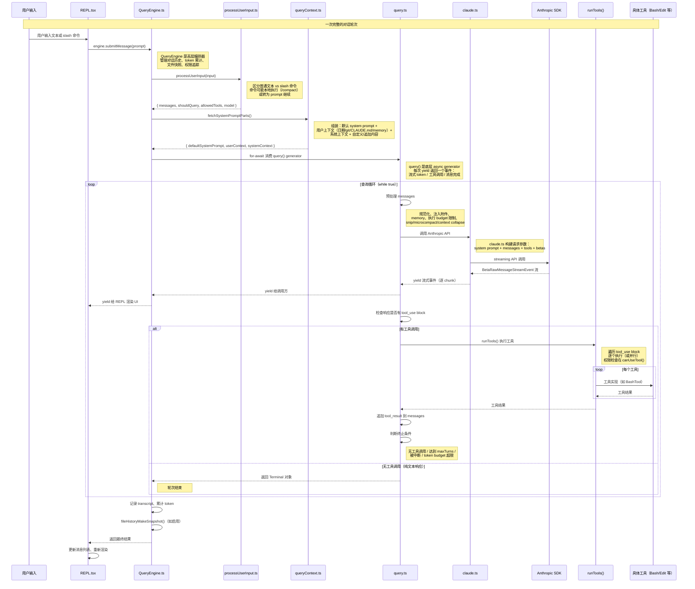

# 核心循环知识总结

> 这是"总结学习"栏目的第二篇。目标：深入理解 Claude Code 的**核心执行引擎**——从用户输入到 API 调用到工具执行再到响应渲染的完整循环。这是整个系统"真正做事"的地方。

---

## 一、核心循环全貌（可交互时序图）

> 下面的时序图展示了**一次完整的对话轮次**：用户输入 → QueryEngine 处理 → query() 循环 → API 调用 → 工具执行 → 响应回传。**点击参与者或消息**可在右侧抽屉看到上下游调用链，支持滚轮缩放、拖动平移。



> 时序图涵盖了**核心执行引擎的 4 层架构**：
> - **REPL 层**：React/Ink 交互界面
> - **QueryEngine 层**：会话级编排（历史管理、权限、快照）
> - **query() 层**：单次轮次的 API + 工具循环
> - **API 层**：Anthropic SDK 调用

---

## 二、必须掌握（核心 6 点）

### 1. 核心循环的 4 层架构

| 层 | 文件 | 职责 |
|---|---|---|
| **REPL 层** | `src/screens/REPL.tsx` | React/Ink 交互界面：用户输入、消息渲染、工具权限弹窗、键盘快捷键 |
| **QueryEngine 层** | `src/QueryEngine.ts` | 会话级编排：维护 `mutableMessages`、处理用户输入、token 累计、文件快照、权限拒绝追踪 |
| **query() 层** | `src/query.ts` | 单次轮次的底层执行：API 调用 + 工具执行循环（async generator） |
| **API 层** | `src/services/api/claude.ts` | 构建请求参数（system prompt、messages、tools、betas）、调用 Anthropic SDK、处理流式响应 |

**关键理解**：每一层都是**异步 generator**，通过 `yield` 向上层传递事件（流式 token、工具调用、消息完成等）。REPL 通过 `for-await` 消费 `QueryEngine.submitMessage()`，QueryEngine 消费 `query()`，query 消费 API 流。

### 2. `QueryEngine.submitMessage()` 的工作流程

`QueryEngine.ts:239` 的 `submitMessage()` 是用户每次输入后调用的入口：

```ts
async *submitMessage(
  prompt: string | ContentBlockParam[],
  options?: { uuid?: string; isMeta?: boolean },
): AsyncGenerator<SDKMessage, void, unknown>
```

**执行步骤**：

1. **处理用户输入**（`utils/processUserInput/processUserInput.ts` 的 `processUserInput()`）：区分普通文本 vs slash 命令。命令可能本地执行（如 `/compact`、`/clear`）或转为 prompt 继续查询。
2. **构建系统 prompt**（`utils/queryContext.ts` 的 `fetchSystemPromptParts()`）：组装默认 system prompt + 用户上下文 + 系统上下文 + 追加内容 + memory mechanics（如有）。
3. **调用 `query()`**（`src/query.ts`）：通过 `for-await` 消费 `query()` generator 返回的消息流。
4. **yield 消息给调用方**：REPL 用来更新 UI。
5. **轮次结束后**：记录 transcript、累计 token、生成文件历史快照。

**关键状态**：
- `mutableMessages: Message[]` — 完整的对话历史（跨轮次累积）
- `totalUsage: NonNullableUsage` — token 累计
- `permissionDenials: SDKPermissionDenial[]` — 权限拒绝记录
- `readFileState: FileStateCache` — 文件读取缓存（用于 undo/diff）

### 3. `query()` 的底层循环

`query.ts:294` 的 `query()` 是**底层 async generator**，负责实际的 API 调用和工具执行：

```ts
export async function* query(
  params: QueryParams,
): AsyncGenerator<
  StreamEvent | RequestStartEvent | Message | TombstoneMessage | ToolUseSummaryMessage,
  Terminal
>
```

**内部循环**（`queryLoop()`，`query.ts:418`）：

```ts
async function* queryLoop(...) {
  while (true) {
    // 1. 预处理 messages（规范化、注入附件、memory）
    // 2. 执行 snip / microcompact / context collapse
    // 3. 调用 API，yield 流式事件
    // 4. 检查是否有 tool_use block
    //    - 有 → runTools() 执行工具 → 结果追加到 messages → 继续循环
    //    - 无 → 返回 Terminal 对象（轮次结束）
  }
}
```

**关键机制**：
- **Auto-compact**：当上下文接近窗口限制时自动压缩历史（`autoCompact.ts`）
- **Snip / Microcompact**：逐消息预算限制、缓存式微压缩
- **Context collapse**：上下文折叠（feature-gated）
- **Langfuse 链路追踪**：创建/结束 trace，记录观测数据
- **命令队列生命周期**：`consumedCommandUuids` 追踪已消费的命令

**终止条件**（返回 `Terminal` 对象）：
- 无工具调用（纯文本响应）
- 达到 `maxTurns` 限制
- 被中断（`abortController.signal.aborted`）
- token budget 超限
- API 错误

### 4. `claude.ts` 的 API 调用

`services/api/claude.ts` 是 Anthropic SDK 的封装层，负责构建请求参数和处理流式响应。

**关键函数**：

- **`createMessageStream()`**：构建请求参数（system prompt、messages、tools、betas），调用 `client.beta.messages.stream()`。
- **`accumulateUsage()`**：累计 token 用量（input_tokens、output_tokens、cache_read_input_tokens 等）。
- **`normalizeMessagesForAPI()`**：将内部 `Message[]` 转换为 SDK 的 `MessageParam[]`。
- **`toolToAPISchema()`**：将内部 `Tool` 定义转换为 SDK 的 `ToolUnion` 参数。

**7 个 provider 的差异**（通过 `getAPIProvider()` 判断）：

| Provider | 特殊处理 |
|---|---|
| `firstParty` | 直接使用 Anthropic SDK |
| `bedrock` | 通过 AWS SDK，需要额外 betas（`getBedrockExtraBodyParamsBetas()`） |
| `vertex` | 通过 Google Cloud SDK |
| `foundry` | 自定义 endpoint |
| `openai` | 通过兼容层（`services/api/openai/`） |
| `gemini` | 通过兼容层（`services/api/gemini/`） |
| `grok` | 通过兼容层（`services/api/grok/`） |

**Beta headers**（通过 `getMergedBetas()` 合并）：
- `context-1m-2025-04-14` — 1M 上下文窗口
- `context-management-2025-06-15` — 上下文管理（microcompact）
- `effort-2025-05-29` — effort 控制
- `fast-mode-2025-04-15` — 快速模式
- `prompt-caching-scope-2025-04-22` — prompt 缓存作用域
- `redacted-thinking-2025-04-22` — 编辑思考块
- `structured-outputs-2025-04-22` — 结构化输出
- `task-budgets-2026-03-13` — 任务预算

### 5. 工具执行流程

**`runTools()`**（`services/tools/toolOrchestration.ts`）负责执行工具：

```ts
export async function runTools(
  toolUseBlocks: ToolUseBlock[],
  context: ToolUseContext,
): Promise<ToolResultBlockParam[]>
```

**执行方式**：
- **串行**：默认，按顺序执行每个工具。
- **并行**：如果工具之间无依赖（通过 `StreamingToolExecutor` 判断），可并行执行。

**权限检查**：
- 每个工具执行前调用 `canUseTool(tool, input, toolUseContext, assistantMessage, toolUseID)`。
- 返回 `{ behavior: 'allow' }` 或 `{ behavior: 'deny', message }`。
- 权限拒绝记录到 `QueryEngine.permissionDenials`。

**工具结果处理**：
- 工具返回 `ToolResultBlockParam[]`（`{ type: 'tool_result', tool_use_id, content, is_error }`）。
- 结果追加到 `messages`，作为下一条 `user` 消息的 `tool_result` block。
- 循环继续，API 看到工具结果后生成下一步响应。

### 6. 流式响应处理

**`BetaRawMessageStreamEvent`** 是 Anthropic SDK 的流式事件类型：

| 事件类型 | 说明 |
|---|---|
| `message_start` | 消息开始，包含 `message` 对象（id、model、usage 等） |
| `content_block_start` | 内容块开始（text、tool_use、thinking 等） |
| `content_block_delta` | 内容块增量（text delta、thinking delta、input_json_delta 等） |
| `content_block_stop` | 内容块结束 |
| `message_delta` | 消息级别的增量（stop_reason、usage） |
| `message_stop` | 消息结束 |
| `ping` | 心跳 |

**`claude.ts` 的处理**：
- 逐 chunk `yield` 给 `query()`，再 `yield` 给 `QueryEngine`，再 `yield` 给 REPL。
- REPL 实时渲染文本增量（`text_delta`）和工具调用进度（`input_json_delta`）。
- `content_block_stop` 时检查是否为 `tool_use` block，若是则等待工具执行。

---

## 三、应该了解（次要 5 点）

### 1. `processUserInput()` 的输入处理

`utils/processUserInput/processUserInput.ts` 负责处理用户输入：

```ts
export async function processUserInput(
  input: string | ContentBlockParam[],
  context: ProcessUserInputContext,
): Promise<{
  messages: Message[];
  shouldQuery: boolean;
  allowedTools?: Tool[];
  model?: string;
  resultText?: string;
}>
```

**处理逻辑**：
- **普通文本**：创建 `UserMessage`，`shouldQuery = true`。
- **Slash 命令**：
  - 本地命令（如 `/compact`、`/clear`）：本地执行，`shouldQuery = false`，返回 `resultText`。
  - 远程命令（如 `/review`）：转为 prompt，`shouldQuery = true`。
- **附件**：处理 `--file` 参数、粘贴的图片、memory 文件等。

### 2. `fetchSystemPromptParts()` 的系统 prompt 构建

`utils/queryContext.ts` 的 `fetchSystemPromptParts()` 构建系统 prompt：

```ts
export async function fetchSystemPromptParts({
  tools,
  mainLoopModel,
  additionalWorkingDirectories,
  mcpClients,
  customSystemPrompt,
}): Promise<{
  defaultSystemPrompt: SystemPrompt;
  userContext: { [k: string]: string };
  systemContext: { [k: string]: string };
}>
```

**组装内容**：
- **默认 system prompt**：`constants/prompts.ts` 的 `getSystemPrompt()`，包含工具描述、使用规则、安全约束等。
- **用户上下文**（`userContext`）：当前日期、git 状态、CLAUDE.md 内容、memory 文件等。
- **系统上下文**（`systemContext`）：内部元数据（版本号、会话 ID 等）。
- **自定义 prompt**：用户通过 `--system-prompt` 或 API 传入的自定义内容。
- **追加内容**：用户通过 `--append-system-prompt` 追加的内容。

### 3. `runTools()` 的并行执行

`services/tools/toolOrchestration.ts` 的 `runTools()` 支持并行执行：

**判断逻辑**：
- 如果所有工具的 `isParallelizable` 为 `true`，且工具之间无依赖（通过 `StreamingToolExecutor` 分析），则并行执行。
- 否则串行执行。

**并行执行的优势**：
- 多个 `FileReadTool` 调用可并行。
- 多个 `BashTool` 调用可并行（如果无依赖）。
- 显著减少长工具链的等待时间。

### 4. Auto-compact 的触发条件

`services/compact/autoCompact.ts` 的自动压缩：

**触发条件**：
- 上下文 token 数超过 `getEffectiveContextWindowSize()` 的 80%。
- 用户启用了 `--auto-compact`（默认启用）。

**压缩策略**：
- 调用 `buildPostCompactMessages()` 生成压缩后的消息列表。
- 压缩后的消息作为 `compact_boundary` 插入。
- API 看到 `compact_boundary` 后只处理压缩后的摘要。

### 5. 文件历史快照

`utils/fileHistory.ts` 的文件历史快照：

**作用**：
- 每次用户输入后，快照当前文件状态。
- 用于 undo/diff（`/undo` 命令）。

**实现**：
- `fileHistoryMakeSnapshot()` 在 `QueryEngine.submitMessage()` 中调用。
- 快照存储在 `AppState.fileHistory`。
- 通过 `FileStateCache` 管理文件状态。

---

## 四、可暂时跳过

以下内容在深入具体功能前可以完全忽略：

- **`StreamingToolExecutor` 的详细实现**：工具并行执行的依赖分析。
- **Langfuse 链路追踪的详细配置**：`createTrace()`、`endTrace()` 的参数。
- **`contextCollapse` 的详细算法**：上下文折叠的具体策略。
- **`snipCompact` 的详细实现**：历史截断的具体逻辑。
- **`microcompact` 的详细实现**：缓存式微压缩的具体策略。
- **7 个 provider 的兼容层实现**：`services/api/openai/`、`services/api/gemini/`、`services/api/grok/` 的内部细节。
- **`processUserInput()` 的所有分支**：各种 slash 命令的处理逻辑。
- **`normalizeMessagesForAPI()` 的详细转换**：内部 `Message[]` 到 SDK `MessageParam[]` 的映射规则。

---

## 五、关键文件清单（必备书签）

| 文件 | 角色 | 必看行号 |
|---|---|---|
| `src/QueryEngine.ts` | 会话级编排 | `submitMessage():239`，`processUserInput()`，`fetchSystemPromptParts()` |
| `src/query.ts` | 单次轮次执行 | `query():294`，`queryLoop():418`，终止条件判断 |
| `src/screens/REPL.tsx` | React/Ink 交互界面 | 全文（~4500 行），重点看 `useQueryEngine()` hook |
| `src/services/api/claude.ts` | API 客户端 | `createMessageStream()`，`accumulateUsage()`，`normalizeMessagesForAPI()` |
| `src/services/tools/toolOrchestration.ts` | 工具执行 | `runTools()` |
| `src/utils/processUserInput/processUserInput.ts` | 输入处理 | `processUserInput()` |
| `src/utils/queryContext.ts` | 系统 prompt 构建 | `fetchSystemPromptParts()` |
| `src/services/compact/autoCompact.ts` | 自动压缩 | `calculateTokenWarningState()`，`getEffectiveContextWindowSize()` |
| `src/utils/fileHistory.ts` | 文件历史快照 | `fileHistoryMakeSnapshot()` |
| `src/constants/prompts.ts` | 默认 system prompt | `getSystemPrompt()` |

---

## 六、学习建议

**读代码顺序**：

1. **先读 `QueryEngine.ts` 的 `submitMessage()`**：理解高层编排流程。
2. **再读 `query.ts` 的 `queryLoop()`**：理解底层循环逻辑（API 调用 → 工具执行 → 循环）。
3. **然后读 `claude.ts` 的 `createMessageStream()`**：理解 API 请求的构建。
4. **最后读 `REPL.tsx`**：理解 UI 如何消费 `QueryEngine` 的消息流。

**配合动作**：

1. **打开 dev mode**（`bun run dev`），实际跑一轮对话，观察日志里 `query()` 的循环过程。
2. **在 `QueryEngine.ts:239` 打断点**，看一次完整 `submitMessage()` 的执行。
3. **在 `query.ts:418` 打断点**，看 `queryLoop()` 的每次迭代。
4. **在 `claude.ts` 的 `createMessageStream()` 打断点**，看 API 请求参数的构建。

**调试技巧**：

- 使用 `CLAUDE_CODE_DEBUG=1` 启用详细日志。
- 使用 `CLAUDE_CODE_VERBOSE=1` 启用 verbose 模式。
- 查看 `~/.claude/logs/` 下的日志文件。

---

## 七、与入口知识的衔接

| 入口知识 | 核心循环的对应 |
|---|---|
| `launchRepl(root, initialState, sessionConfig)` | REPL 层开始工作 |
| `bootstrap/state.ts` 的 `sessionId`、`cwd` | QueryEngine 的 `config.cwd`、`getSessionId()` |
| `enableConfigs()` 闸门 | `fetchSystemPromptParts()` 读取 CLAUDE.md、memory 等 |
| `AppState.tsx` 的 `messages`、`tools` | QueryEngine 的 `mutableMessages`、`tools` |
| `init()` 的 20 步初始化 | `QueryEngine.submitMessage()` 前的准备 |

**关键理解**：入口知识是"启动后到达哪里"，核心循环知识是"到达后做什么"。两者共同构成了 Claude Code 的完整启动和执行流程。
