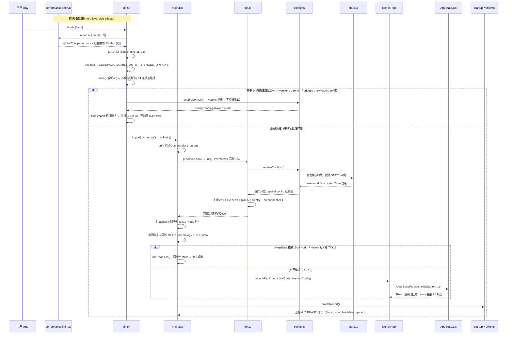

# 入口知识总结

> 这是"总结学习"栏目的第一篇。目标：把 `cli.tsx` + `main.tsx` + 6 个支撑文件的核心知识按**必须掌握 / 应该了解 / 可暂时跳过**三层整理，帮你快速建立启动链的完整心智模型。

---

## 一、启动链全貌（可交互时序图）

> 下面的时序图由 `SequenceCanvas` 渲染：**点击参与者或消息**可在右侧抽屉看到上下游调用链，**参与者节点会自动链接到源码文件**（鼠标悬停查看路径），支持滚轮缩放、拖动平移、全屏查看。



> 时序图涵盖了**两条主路径**（14 条快速路径 vs 默认路径）和**两条子分支**（Headless vs 交互 REPL）。每条快速路径的具体入口模块见下文「14 条快速路径速查表」。

---

## 二、必须掌握（核心 8 点）

### 1. `cli.tsx` 是"分流器"，不是程序逻辑

**`src/entrypoints/cli.tsx`** 只做一件事：按优先级扫描 `argv`，匹配到快速路径就动态 `import` 对应模块然后 `return`，**只有默认路径**（无任何匹配）才会 `import('../main.jsx')` 加载完整 CLI。

这个设计的核心价值是**零成本快路径**：`--version` 完全不需要加载任何模块（RSS < 5MB vs 完整加载的 500MB+）；`autonomy` 状态查询也无需拉起 React/Ink。

关键位置：`cli.tsx:91`（`--version` 快速路径）、`cli.tsx:403`（默认路径 import main）。

### 2. `main.tsx` 是 Commander 程序 + 一个超大 .action()

文件三层结构：

| 层 | 行范围 | 内容 |
|---|---|---|
| 顶层副作用 | 1–46 | `profileCheckpoint` + MDM raw read + keychain 预热（利用 import 时间窗并行） |
| `main()` | 805–1126 | argv 早期重写（cc:// / ssh / assistant 子命令必须在 Commander 解析前处理）+ `isNonInteractive` 判定 |
| `run()` | 1142–5579 | Commander program 构建 → `preAction` → 主 `.action()` 处理器（3000+ 行）→ 50+ 子命令注册 → `parseAsync()` |

### 3. `init()` 在 Commander `preAction` 内调用，且 memoized 只跑一次

`src/entrypoints/init.ts` 导出的 `init()` 被 `lodash-es/memoize` 包裹。无论用户敲 `claude`、`claude mcp serve` 还是 `claude doctor`，第一次进入任意 action 之前都会确保全局基建就绪；第二次调用瞬时返回。

**`--help` 不触发 preAction**，所以显示帮助时完全不做重型初始化。

### 4. `enableConfigs()` 是"允许读配置"的闸门

`src/utils/config.ts` 中有一个模块级布尔 `configReadingAllowed`。`enableConfigs()` 把它翻成 `true`，**同时立刻解析一次 global config 文件**（`throwOnInvalid=true`），让 JSON 格式错误尽早暴露并走 `InvalidConfigDialog`。

任何 `getConfig()` / `getCurrentProjectConfig()` 调用在 `configReadingAllowed === false` 时都会直接抛错（模块 top-level 不准读配置，防止读时机不可控）。因此，**每条会继续执行的快速路径都必须先调 `enableConfigs()`**。

`--version` 是唯一不调用的快速路径（注释："perf-sensitive, no enableConfigs()"）。

### 5. `performanceShim.ts` 必须是 cli.tsx 第一个 import

JSC（Bun 的 JS 引擎）的原生 `Performance` 对象把 marks/measures 存在 **C++ Vector** 里：不可被 GC 回收、`clearMarks()` 不缩容。长会话（daemon、`/loop`）会累积数百 MB 死容量。

shim 的解决方案：`mark` / `measure` / `getEntries*` 改用 JS `Map`（可 GC）；`performance.now()` 仍委托原生（零开销）；`markResourceTiming` 存根（Node v22 的 undici 每次 fetch 都会调它）。

**必须第一个 import 的原因**：React reconciler 和 OTel instrumentation 在它们各自 module 的 top-level 就会捕获 `globalThis.performance` 引用——一旦它们先加载，shim 再覆盖 `globalThis.performance` 也没用。

`cli.tsx:5`：`import '../utils/performanceShim.js';` —— 文件第一行 import。

### 6. `MACRO.*` 是 build-time 字符串替换 + cli.tsx runtime fallback

**定义源头**：`scripts/defines.ts` 的 `getMacroDefines()`，集中管理 `VERSION`、`BUILD_TIME`、`FEEDBACK_CHANNEL` 等常量。

**三种注入方式**（共用同一份定义）：

| 场景 | 注入手段 |
|---|---|
| `bun run dev` | `scripts/dev.ts` 通过 `bun -d` flag 注入 |
| `bun run build` | `Bun.build({ define: getMacroDefines() })` 编译期字符串替换 |
| Vite build | `scripts/vite-plugin-feature-flags.ts` 等价处理 |

**Runtime fallback**（`cli.tsx:11–21`）：直接 `bun src/entrypoints/cli.tsx` 跑时没有 defines 注入，`typeof globalThis.MACRO === 'undefined'` 则回填占位对象，让源码可以直接运行而不崩溃。

### 7. Feature flag = `feature('X')` + Bun 编译期 DCE

`import { feature } from 'bun:bundle'` 中的 `feature` 是 Bun 内置虚拟模块的导出。编译时 Bun 静态分析每个 `feature('X')`：在 `DEFAULT_BUILD_FEATURES` 或 `FEATURE_X=1` 环境变量里的 flag → 替换为 `true`；否则 → 替换为 `false`，整条 `if` 分支被 dead-code elimination 删除。

**关键限制**：`feature()` **只能直接出现在 `if` 条件或三元表达式的条件位置**，不能赋值给变量、不能放在 `&&` 链里。这是 Bun 编译器的要求，不是代码风格偏好。

```ts
// ✅ 正确
if (feature('VOICE_MODE')) { ... }
const provider = feature('VOICE_MODE') ? realProvider : noopProvider;

// ❌ 错误（运行时才能确定，DCE 不会生效）
const hasVoice = feature('VOICE_MODE');
if (hasVoice) { ... }
```

这套机制使得 ant 内部构建和对外发布构建可以共用同一套代码，外部构建里整个 Voice / Bridge / Daemon 等模块会被完全删除。

### 8. 两套并行状态系统的分工

| 维度 | `src/bootstrap/state.ts` | `src/state/AppState.tsx` |
|---|---|---|
| **载体** | 模块级 `const STATE` 单例 | React Context + Zustand-like store |
| **生命周期** | 进程级（import 即创建） | REPL 挂载后才活 |
| **何时可用** | 任何 import 链路里（init 期间就可用） | 只在 `<AppStateProvider>` 子树内 |
| **典型字段** | `sessionId`、`cwd`、`totalCostUSD`、`modelUsage`、telemetry 计数器 | `messages`、`tools`、`toolPermissionContext`、主循环模型 |
| **谁会读** | tools、API client、MCP、init.ts、QueryEngine | React 组件、REPL screen |
| **修改方式** | `setX()` / `addToY()` 直接函数 | `useSetAppState()` / `store.setState(prev => ...)` |

**交接点是 `launchRepl`**：它从 `bootstrap/state.ts` 读出已写好的 CLI 参数（cwd、模型选择、客户端类型等），作为 `initialState` 传给 `<AppStateProvider>`，React 层接管之后 UI 字段走 context，但 telemetry/cost 这类整个生命周期都只在 `bootstrap/state.ts`。

文件头里反复写了 `DO NOT ADD MORE STATE HERE`——进程级可变状态是测试和并发的敌人，只有真正需要"跨 React 边界 + 启动期访问"的字段才能放这里。

---

## 三、应该了解（次要 5 点）

### 1. REPL vs Headless 分发逻辑

`isNonInteractive` 的判定逻辑（`main.tsx` 约 1027 行）：

```
hasPrintFlag          // -p / --print
|| hasInitOnlyFlag    // --init-only
|| hasSdkUrl          // SDK URL 模式
|| (!forceInteractive && !process.stdout.isTTY)  // 非 TTY 环境
```

**Headless（`-p`）路径的特殊优化**：`-p` 模式在 `run()` 里会跳过 5000+ 行子命令注册（`main.tsx:4717`），节省约 65ms 模块加载时间，然后直接走 `runHeadless()`（来自 `src/cli/print.js`）。

**交互路径**：先通过 `showSetupScreens()` 完成 trust dialog / onboarding，然后根据 `--continue` / `--resume` / `--teleport` / cc:// / ssh / assistant 等条件分支，最终汇聚到 `launchRepl(root, {...}, sessionConfig)`。

### 2. 14 条快速路径速查表

| # | 触发条件 | 入口模块 | 是否调 enableConfigs |
|---|---|---|---|
| 1 | `--version` / `-v` / `-V` | 内联打印 | 否 |
| 2 | `--dump-system-prompt` | `constants/prompts.js` | 是 |
| 3 | `--claude-in-chrome-mcp` | `claudeInChrome/mcpServer.js` | 否 |
| 3b | `--chrome-native-host` | `claudeInChrome/chromeNativeHost.js` | 否 |
| 3c | `--computer-use-mcp` | `computerUse/mcpServer.js` | 否 |
| 4 | `--acp` | `services/acp/entry.js` | 否 |
| 5 | `weixin` | `@claude-code-best/weixin` | 是 |
| 6 | `--daemon-worker[=kind]` | `daemon/workerRegistry.js` | 否 |
| 7 | `remote-control`/`rc`/`bridge` | `bridge/bridgeMain.js` | 是 |
| 8 | `daemon` | `daemon/main.js` | 是 |
| 9 | `autonomy` | `cli/handlers/autonomy.js` | 否 |
| 10 | `--bg`/`--background` | `cli/bg.js` | 是 |
| 11 | `job` / `new` / `list` / `reply` | `cli/handlers/templateJobs.js` | 否 |
| 12 | `environment-runner` | `environment-runner/main.js` | 否 |
| 13 | `self-hosted-runner` | `self-hosted-runner/main.js` | 否 |
| 14 | `--tmux` + `--worktree` | `utils/worktree.js` | 是 |

### 3. 关键子命令一览

| 子命令 | 作用 |
|---|---|
| `mcp serve/add/remove/list/get` | MCP 服务器生命周期管理 |
| `server` | Direct Connect HTTP/Unix server（feature-gated） |
| `ssh <host>` | SSH 远端运行（argv 重写到默认 action） |
| `open <cc-url>` | Direct Connect headless 入口 |
| `auth login/status/logout` | 认证管理 |
| `plugin install/marketplace` | 插件生命周期 + Marketplace |
| `agents` | 列出已配置 agent |
| `auto-mode` | Transcript classifier 规则查看 |
| `autonomy` | 自动化任务状态管理 |
| `doctor` | 安装健康检查 |
| `update` | 更新 ccb |
| `install` | 安装 native build |
| `task` | 任务管理（ant-only） |
| `completion` | shell 补全脚本生成 |

### 4. `startupProfiler` 的工作方式

`SHOULD_PROFILE` 在模块加载时就决定（`process.env.CLAUDE_CODE_PROFILE_STARTUP=1` 或命中 Statsig 采样，外部用户 0.5%）。**未命中时 `profileCheckpoint` 是零成本 no-op**（直接 return）。

4 个 PHASE 由"开始/结束 checkpoint 对"计算时差：

| PHASE | 开始 checkpoint | 结束 checkpoint |
|---|---|---|
| `import_time` | `cli_entry` | `main_tsx_imports_loaded` |
| `init_time` | `init_function_start` | `init_function_end` |
| `settings_time` | `eagerLoadSettings_start` | `eagerLoadSettings_end` |
| `total_time` | `cli_entry` | `main_after_run` |

`profileReport()` 在启动结束时把这 4 个时长发给 Statsig，并可选写入 `~/.claude/startup-perf/<sessionId>.txt`。

### 5. 遥测上报的两个关键点

- **`logTenguInit()`**（`main.tsx:5581`）：在主 `.action()` handler 末尾（trust 已建立后）异步上报启动事件，包含 model/provider/mode/mcpServers/plugins 等元数据。REPL 和 `-p` 模式各调一次。
- **`logSessionTelemetry()`**（`main.tsx:448`）：skill/plugin 的 per-session 遥测，同样 REPL/-p 双路径各调一次。

---

## 四、可暂时跳过

以下内容在深入具体功能前可以完全忽略，不影响理解启动链的核心逻辑：

- **主 `.action()` 处理器（1513–4582 行）的 11 个分支细节**：continue / cc:// / SSH / assistant / teleport / ANT resume / resume file / resume sessionId / launchResumeChooser 等，按需再读。
- **MCP 配置解析与 enterprise policy 过滤**：`parseMcpConfig*`、`filterMcpServersByPolicy`、`fetchClaudeAIMcpConfigsIfEligible` 等，属于 MCP 模块的知识。
- **7 个 provider 差异**：firstParty / bedrock / vertex / foundry / openai / gemini / grok，属于 API 通信层的知识。
- **bridge / daemon / teleport / ACP / Direct Connect 协议层**：各自有完整章节。
- **Plugin / Skill / Marketplace 加载机制**：属于可扩展性章节。
- **KAIROS / Assistant / Agent Swarms 等实验性功能**：属于高级模式章节。
- **11 个 config migration 的细节**（`runMigrations`，`main.tsx:509`）：按需查阅。

---

## 五、关键文件清单（必备书签）

| 文件 | 角色 | 必看行号 |
|---|---|---|
| `src/entrypoints/cli.tsx` | 分流器 | 全文（~415 行），`main():86`，快速路径 `91–388` |
| `src/main.tsx` | Commander 程序 | `main():805`，`run():1142`，`preAction:1166`，主 action `1513` |
| `src/entrypoints/init.ts` | 一次性全局初始化 | memoize 包裹的 `init()`，逐步读 20 步初始化 |
| `src/utils/performanceShim.ts` | JSC Vector 内存泄漏修复 | 末尾自动安装（`line 169` 附近） |
| `src/utils/startupProfiler.ts` | 启动埋点 | `profileCheckpoint`，`profileReport`，`PHASE_DEFINITIONS` |
| `src/utils/config.ts` | 配置读取闸门 | `enableConfigs():1521`，`configReadingAllowed` 模块变量 |
| `scripts/defines.ts` | MACRO 中央定义 | `getMacroDefines()`，当前 VERSION |
| `build.ts` | 构建 + feature DCE | feature 解析（行 13–16），`import.meta.require` 替换 |
| `src/bootstrap/state.ts` | 进程级 STATE 单例 | `getInitialState()`，`DO NOT ADD MORE STATE` 注释 |
| `src/state/AppState.tsx` | React UI 状态 | `AppStateProvider`，`useAppState`，VoiceProvider DCE 技巧 |
